```{r setup, echo = FALSE, include=FALSE}
library(knitr)
knitr::opts_chunk$set(collapse=TRUE, message=FALSE, warning=FALSE, comment="#>",
                      out.width = "800px", echo = FALSE)
```

Este trabajo se distribuye bajo una licencia <a href="https://creativecommons.org/licenses/by-nc-sa/4.0/" target="_blank">CC-BY-NC-SA 4.0</a>.

```{r, out.width="25%", fig.align='center'}
knitr::include_graphics("vignette_img/logo.png")
```

# Prefacio

Bienvenidos a la viñeta de *Wallace EcoMod v2.0*. Esta viñeta fue escrita específicamente para la versión 2.0. Si usted está usando una versión diferente puede que algunas cosas no coincidan. Haga clic <a href="https://wallaceecomod.github.io/wallace/articles/tutorial-v1.html" target="_blank">aquí</a> para la viñeta de la versión 1.0 (en inglés) y <a href="https://wallaceecomod.github.io/wallace/articles/tutorial-v2.html" target="_blank">aquí</a> para ver esta viñeta en inglés.

Anticipamos que esta viñeta (y otras en el futuro) para el paquete `wallace` serán actualizadas o se les agregarán apéndices de manera regular de acuerdo al desarrollo continuo del paquete.

En esta viñeta encontrará los nombres de las pestañas, botones y opciones en inglés como las puede ver en su interfaz gráfica y su respectiva traducción al español dentro de corchetes cuadrados ([ ]).

# <a id="Intro"></a>Introdución

*Wallace* es una interfaz gráfica de usuario (GUI por sus iniciales en inglés) basada en R (paquete de R wallace) para el modelado ecológico que se concentra actualmente en la construcción, evaluación y visualización de modelos de nicho y de distribución de especies. Nos referiremos a estos modelos como modelos de distribución de especies (MDEs) y no los explicaremos en detalle aquí. A lo largo de la lectura, le indicaremos algunas fuentes de información más detallada dentro de la aplicación (por ejemplo las pestañas que contienen los textos guía de componentes y módulos, **Component Guidance** y **Module Guidance** en la aplicación).

*Wallace* tiene muchas características que creemos lo convierten un buen ejemplo de la siguiente generación de programas científicos, ya que es: 1) asequible, 2) abierto, 3) expandible, 4) flexible, 5) interactivo, 6) instructivo y 7) reproducible.

La aplicación, construida con un paquete de `R` llamado `shiny`, cuenta con un mapa interactivo que permite acercarse, alejarse, y moverse en el mapa, y tiene también gráficas y tablas dinámicas. Los datos para los modelos pueden ser descargados de bases de datos en línea o cargados por el usuario. La mayoría de resultados pueden ser descargados, incluyendo la opción de guardar el código de R para reproducir sus análisis. Para más detalles, incluyendo sobre MDEs, por favor diríjase a nuestra publicación inicial en *Methods in Ecology and Evolution*^1^ y nuestra publicación de seguimiento en *Ecography*^2^.

1.  Kass, J.M., Vilela, B., Aiello-Lammens, M.E., Muscarella, R., Merow, C., Anderson, R.P. (2018). *Wallace*: A flexible platform for reproducible modeling of species niches and distributions built for community expansion. *Methods in Ecology and Evolution*, 9(4),1151-1156. <https://doi.org/10.1111/2041-210X.12945>

2.  Kass, J.M., Pinilla-Buitrago, G.E, Paz, A., Johnson, B.A., Grisales-Betancur, V., Meenan, S.I., Attali, D., Broennimann, O., Galante, P.J., Maitner, B.S., Owens, H.L., Varela, S., Aiello-Lammens, M.E., Merow, C., Blair, M.E., Anderson R.P. (2022). *wallace* 2: a shiny app for modeling species niches and distributions redesigned to facilitate expansion via module contributions. *Ecography*, 2023(3), e06547. <https://doi.org/10.1111/ecog.06547>.

La página principal del proyecto *Wallace* tiene los enlaces a nuestro grupo de Google, el correo electrónico oficial, la página de CRAN con la versión estable, y la página de desarrollo en GitHub. *Wallace* también tiene un canal de <a href="https://www.youtube.com/channel/UCDSLCE5bmw12B7oqmlKk7rg" target="_blank">YouTube</a> con diversos tutoriales en video y seminarios grabados en varios idiomas.

Si usted utiliza *Wallace* en sus cursos nos encantaría conocer su experiencia. Por favor tómese un momento para completar esta corta encuesta (en inglés o en español)- <a href="https://docs.google.com/forms/d/e/1FAIpQLSdR4qVprBBpyEZwF4sAurjKuXrxggEA7jWnINenltnUY3nWnA/viewform?usp=sf_link" target="_blank">Taller externo y encuesta curricular de Wallace</a>.

# <a id="Setup"></a>Configuración {#setup}

### Instalación del paquete

Para que `wallace` funcione usted debe estar usando la versión 3.5.0 o posterior de R. Descargue para <a href="https://cran.r-project.org/bin/windows/base/" target="_blank">Windows</a> o <a href="https://cran.r-project.org/bin/macosx/" target="_blank">Mac</a> aquí.

Para instalar y cargar *Wallace v2.0*, abra la interfaz gráfica de R o RStudio y ejecute el siguiente código. Es el único código que debe ejecutar para usar `wallace`.

```{r, eval = FALSE, echo = TRUE}
# Instalar Wallace desde CRAN
install.packages("wallace")

# o instalar Wallace desde GitHub
install.packages("remotes")
remotes::install_github("wallaceEcoMod/wallace")

# Cargar Wallace
library(wallace)

# Ejecutar Wallace
run_wallace()
```

La interfaz gráfica de *Wallace* GUI se abrirá en su explorador predeterminado, y la consola de R estará ocupada mientras `wallace` está en ejecución.

La consola de R muestra mensajes sobre paquetes de R o mensajes de error en caso de complicaciones, que incluyen información valiosa para la solución de problemas. Si planea hacer alguna pregunta en el grupo de Google (preferible) o por correo, por favor incluya estos mensajes de error de la consola.

Si usted quiere utilizar la consola de R mientras está ejecutando `wallace`, debe abrir otra sesión de R, o alternativamente una ventana de la Terminal (MacOS-Linux) o el Símbolo del sistema (Windows) e iniciar R. A continuación podrá ejecutar las líneas anteriores.

```{r, out.width="50%"}
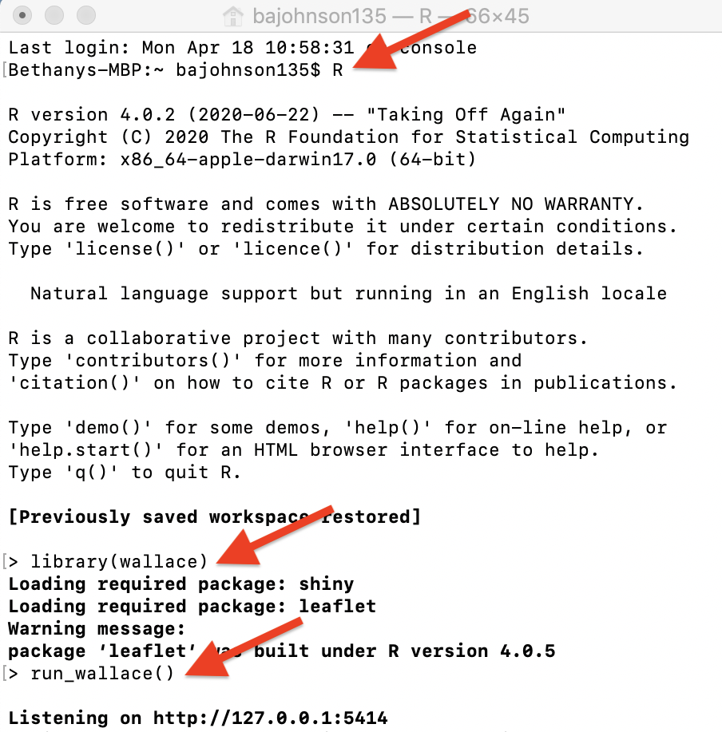
```

Un ejemplo usando la Terminal en MacOS.

Para salir de *Wallace*, use la tecla 'Escape' desde la consola de R y cierre la ventana del explorador, o haga clic en el botón de salida en la esquina superior derecha de la interfaz gráfica. Nota: Si usted cierra la ventana del explorador donde está ejecutando *Wallace*, **su sesión será terminada y todo el progreso se perderá**. Vea [Guardar y Cargar Sesión](#Save) para información sobre cómo guardar su trabajo y restablecer sus análisis.

### *Configurando la versión Java de Maxent*

*Wallace v2.0* incluye dos opciones para realizar modelos de Maxent: maxnet y maxent.jar. El primero, es una implementación de Maxent en R y ajusta el modelo usando el paquete glmnet. Esta es la implementación predeterminada y no requiere el uso de Java (ver Phillips et al. 2017). El segundo, que es la implementación original en Java, ejecuta la función maxent() en el paquete dismo, que a su vez utiliza las herramientas del paquete rJava. Cuando se usa dismo para ejecutar maxent.jar, el usuario debe asegurarse de poner el archivo maxent.jar file en la carpeta /java dentro de la carpeta del paquete dismo. Usted puede descargar Maxent <a href="https://biodiversityinformatics.amnh.org/open_source/maxent/" target="_blank">aquí</a> y encontrar el archivo maxent.jar en la carpeta de descargas. Usted puede encontrar la ruta a dismo /java ejecutando system.file('java', package="dismo") en la consola de R. Simplemente copie el archivo maxent.jar y peguelo en esta carpeta. Si trata de ejecutar Maxent en Wallace sin el archivo en la carpeta correcta, aparecerá un mensaje de advertencia en la ventana de registro y Maxent no se ejecutará. También, si tiene problemas para instalar rJava y hacerlo funcionar, existe un texto de ayuda para solucionar problemas en el archivo <a href="https://github.com/wallaceEcoMod/wallace/blob/master/README.md" target="_blank">README</a> del repositorio de Wallace en Github.

# <a id="Orientation"></a>Orientación {#orientation}

```{r, fig.align = 'center'}
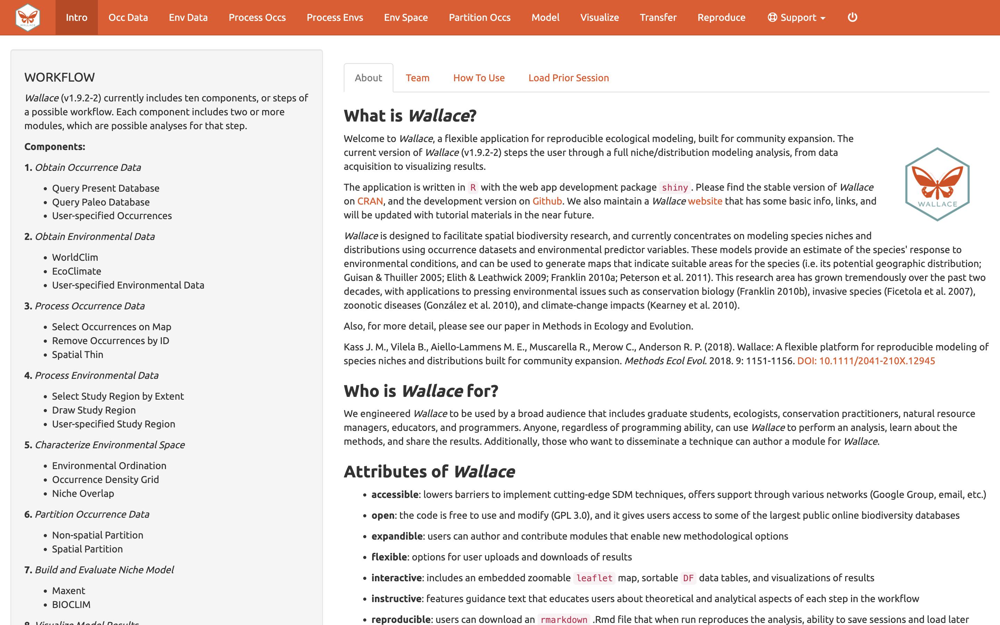
```

Empezaremos con una orientación sobre la interfaz de *Wallace*. Después de ejecutar `run_wallace()`, *Wallace* abre en el explorador la página de **Intro** [Introducción]. La pestaña "About" [ "Acerca de" ] contiene información de contexto sobre el programa. La pestaña "Team" ["Equipo"] tiene detalles sobre los desarrolladores y colaboradores que contribuyeron a *Wallace*. La pestaña de "How to Use" ("Cómo usarlo") tiene un breve manual de usuario. Este manual es una versión resumida de este tutorial sin el ejemplo. La pestaña "Load Prior Session" ["Cargar sesión anterior"] es para cargar una sesión anterior, este tema lo trataremos [más adelante](#Save).

En la parte superior, en el panel naranja están los **Components** [Componentes], que representan los pasos del análisis. Cada uno de estos botones de componentes abren el paso correspondiente. Dentro de cada componente hay varios *Módulos*, los cuales son opciones de análisis discretas dentro de los componentes. A la izquierda, en el panel gris, está el flujo de trabajo de *Wallace* o WORKFLOW, que resalta la versión utilizada, los componentes (numerados), y los módulos incluídos actualmente (con puntos de enumeración).

Haga clic en el botón del componente **Occ Data**, seleccione un módulo y consulte el esquema aquí abajo que muestra las diferentes partes de la interfaz de *Wallace*.

```{r, fig.align = 'center'}
knitr::include_graphics("vignette_img/orientation_2.png")
```

(**1**) Estos son los componentes. Usted irá visitandolos secuencialmente. *Wallace v2* incluye ahora un botón de Soporte (**1a**), esté contiene enlaces al grupo de Google, correo electrónico, sitio web y la página de Github para reportar problemas. También al botón de salida (**1b**), que finalizará la sesión.  

(**2**) Esta es la barra de herramientas con todos los controles de la interfaz para el usuario, como botones, entradas de texto, etc. Usted puede ver que el módulo *Query Database (Present)* [Consultar base de datos (Presente)] está seleccionado actualmente. Verá que otros dos módulos existen para este componente: *Query Database (Paleo)* [Consultar base de datos (Paleo)] y *User-specified* [Especificado por el usuario]. Este último módulo le permite cargar sus propios datos de ocurrencia. Intente escoger este y vea cómo la barra de herramientas cambia, vuelva a hacer clic en *Query Database (Present)* [Consultar base de datos (Presente)].  
Tanto el **Componente** como el *Módulo* tienen botones '?' al lado del texto del título. Hacer clic en estos botones lo enviará a los textos guía respectivos. Dentro de esta barra de herramientas puede encontrar el nombre del módulo y los paquetes de R que utiliza (**2a**), también el panel de control para el módulo seleccionado (**2b**). Los módulos pueden recibir aportes de otros investigadores y desarrolladores; los links a CRAN y a su documentación están abajo.

(**3**) El lado derecho es el espacio de visualización. Cualquier función utilizada generará un mensaje en la ventana de registro (**3a**). Esta ventana también mostrará mensajes de error. *Wallace v2* permite ahora que el usuario cargue múltiples especies. Si múltiples especies están cargadas, puede cambiar la especie seleccionada usando el menú desplegable de especies (**3b**). El espacio de visualización incluye múltiples pestañas (**3c**), incluyendo un mapa interactivo, la tabla de ocurrencias, los resultados, los textos de guía de módulo y componente, y una pestaña para guardar las salidas y la sesión actual.

En este punto del análisis, no existen resultados, y usted no tiene datos para la tabla, pero puede ver el texto guía para el **Component** y el *Module* [**Componente** y *Módulo*]. Este texto fue escrito por los desarrolladores para preparar a los usuarios para cada componente y módulo de forma *teórica* (¿por qué debería usar las herramientas?) y *metodológica* (¿qué hacen las herramientas?). El texto guía también tiene una lista de referencias de artículos científicos para una lectura más detallada. Por favor acostumbrese a consultarlos antes de realizar cualquier análisis ---y discutirlos con sus pares---pues esto le dará un fundamento más sólido para avanzar.

La siguiente pestaña en el espacio de visualización es **Save** [Guardar]. En cualquier momento a lo largo del flujo de trabajo, seleccionar "Save session" [Guardar sesión] en esta pestaña guardará el progreso como un archivo .rds. Este archivo puede ser cargado de nuevo en wallace para continuar el análisis. Si en cualquier momento durante la viñeta usted necesita una pausa, avance a [Guardar y Cargar Sesión](#Save) para aprender como salvar y cargar su sesión de *Wallace*. En esta pestaña también podrá descargar y guardar sus resultados. El código de la sesión, los metadatos, y las citas de los paquetes pueden ser descargados en el **Componente: Reproduce** [Reproducir].

Ahora empecemos nuestros análisis.

Vamos a modelar los rangos de dos especies de mamíferos del género *Bassaricyon*, que son miembros de la familia Procyonidae que incluye a los mapaches. *Bassaricyon neblina*, conocido como el olinguito, que se encuentra en las áreas montanas tropicales en el oeste de Colombia y Ecuador en América del Sur. Este olinguito fue reconocido como una especie nueva en el 2013 cuando fue identificado a partir de especímenes de museo, y es actualmente una especie de preocupación listada como "casi amenazada" por la UICN (Helgen et al. 2020). *Bassaricyon alleni*, conocido como el olingo de las tierras bajas del este, es un pariente del olinguito con un rango de distribución más grande a lo largo del norte de América del Sur; actualmente se encuentra listado como "Preocupación menor" por la UICN (Helgen et al. 2016).

# <a id="Occ"></a>Obtener datos de ocurrencia

Asegúrese de estar en el primer componente (**Obtain Occurrence Data** [Obtener datos de ocurrencia]) y haga clic para leer el texto de guía del componente. Hay tres módulos disponibles para obtener datos de ocurrencias: *Query Database (Present)* [Consultar base de datos (presente)], *Query Database (Paleo)* [Consultar base de datos (Paleo)], y *User-Specified* [Datos del usuario]. Escoja un módulo y haga clic en el texto guía del módulo. Note que el texto guía del módulo cambia cuando selecciona otro de los tres módulos. Lea estas guías para entender mejor cómo los datos de ocurrencia se obtienen comúnmente y cómo `wallace` los implementa.

```{r, fig.align = 'center'}
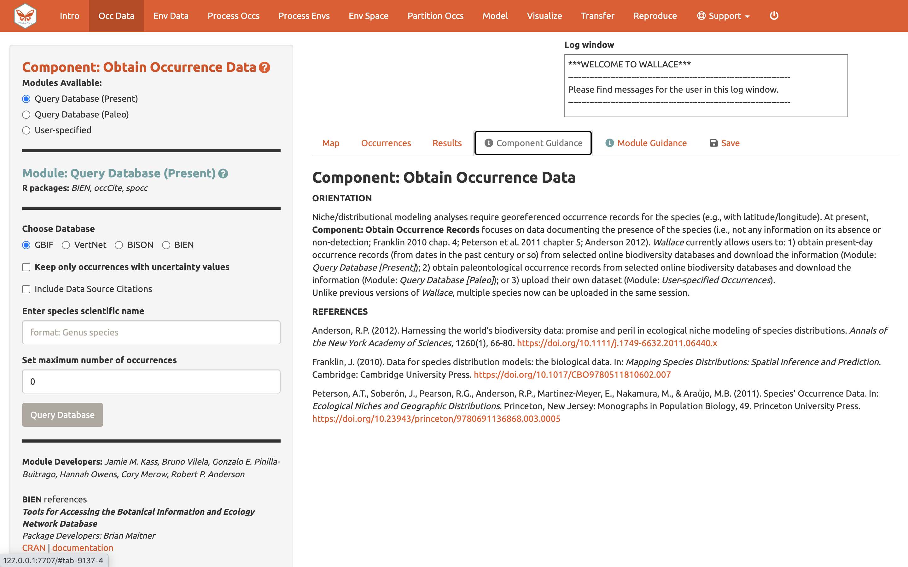
```

```{r, fig.align = 'center'}
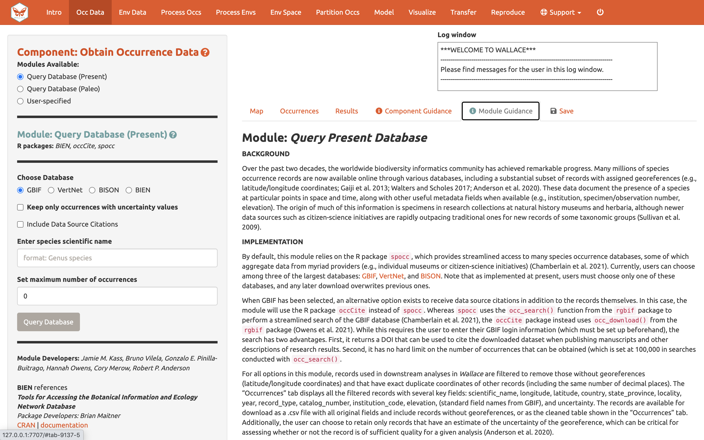
```

Procedemos a obtener datos de ocurrencia. Usaremos ocurrencias del presente (en contraste con los del pasado obtenidos mediante datos fósiles, etc.) y por lo tanto usaremos el módulo: *Query Database (Present)*[Consultar base de datos (presente)]. Hay una selección de bases de datos para escoger, como también una opción para obtener solo las ocurrencias con información sobre la incertidumbre de las coordenadas (esto puede ser útil para filtrar más adelante). Si usted tiene un ID de usuario de GBIF, marcar la casilla "Include Data Source" [Incluir fuente de los datos] le permitirá iniciar sesión con su nombre de usuario y contraseña. Para que esto funcione, debe instalar el paquete de R occCite antes de ejecutar Wallace. Dado que `occCite` es un paquete sugerido, este no será instalado automáticamente como otras dependencias.

Escoja GBIF (the Global Biodiversity Information Facility---una de los más grandes repositorios para datos de biodiversidad), deje la casilla de incertidumbre sin marcar, escriba *Bassaricyon neblina* en la casilla del nombre científico, ponga el máximo de ocurrencias en 200, y haga clic en **Query Database** [Consultar base de datos].

Después de completar la descarga, la ventana de registro tendrá la información de los análisis realizados. Su búsqueda deberá retornar al menos 58 registros (números encontrados al momento de escribir esta guía), pero después de tener en cuenta los registros sin coordenadas (latitud, longitud) y eliminar registros duplicados, deberían quedar al menos 43. Esta especie tiene relativamente pocos registros, entonces poner el máximo en 200 es suficiente, pero para modelar con especies con muchos datos, 200 puede no ser un número adecuado para muestrear el rango conocido y el número máximo puede ser aumentado. \*\**Los números pueden ser diferentes a medida que se añaden más registros a GBIF*.

```{r, fig.align = 'center'}
knitr::include_graphics("vignette_img/occs_3.png")
```

Ahora haga clic sobre la pestaña "Occurrences" [Ocurrencias] para obtener más información sobre los registros. Los desarrolladores escogieron los campos que son mostrados basados en su relevancia general para los estudios sobre el rango de distribución de las especies. Note que puede descargar la tabla completa con todos los campos originales.

```{r, fig.align = 'center'}
knitr::include_graphics("vignette_img/occs_4.png")
```

Haga clic en la pestaña "Save" [Guardar]. La primera casilla le permite descargar su sesión. Está disponible en todos los componentes y módulos (Vea [Guardar y Cargar Sesión](#Save) para más detalles). Las opciones de descarga debajo de la casilla de "Save Session" cambian de acuerdo al componente seleccionado. Aquí, puede obtener un archivo .csv con los registros adquiridos. La primera opción descargará la base de datos original con todos los campos para todos los registros descargados (pre-filtrado). La segunda opción descarga la tabla actual. La tercera opción, "Download all data" [Descargar todos los datos], no está disponible en este punto pero esto cambiará después de incluir la segunda especie.

*Nota para usuarios de Chrome: Si el mapa no está cargando correctamente después de descargar un objeto, específicamente si el cuadrante de la esquina carga pero el resto del mapa está gris, cerrar la barra de descarga en la parte inferior de la página debería reiniciar el mapa y arreglar el problema.*

```{r, fig.align = 'center'}
knitr::include_graphics("vignette_img/occs_5.png")
```

Una mejora importante en *Wallace v2.0* sobre versiones anteriores es la posibilidad de analizar múltiples especies (por separado) en la misma sesión. Vamos a añadir otra especie para modelar.

Aparte de GBIF, usted puede consultar otras bases de datos para obtener registros de ocurrencias de especies como Vertnet (para datos de vertebrados), y la nueva adición BIEN (para datos botánicos). En el segundo módulo, *Query Database (Paleo)* [Consultar base de datos (Paleo)], puede consultar las bases de datos de PaleobioDB para registros fósiles seleccionando un intervalo de tiempo y especies. Puede que sea necesario descargar paquetes específicos antes de ejecutar Wallace para usar estas bases de datos (p. ej., `BIEN` y `paleobioDB`).

Si usted tiene sus propios datos de ocurrencias, los puede importar usando el tercer módulo, *User-specified* [Especificado por el usuario]. Su archivo de ocurrencias debe ser un .csv con las columnas "scientific_name", "longitude", y "latitude". Estas columnas deben ser nombradas explícitamente y en inglés. Puede haber otras columnas pero estas deben ser las tres primeras. También tiene la opción de especificar el delimitador y separador de su archivo.

Vamos a continuar con los datos de ocurrencia de GBIF. Busque a *Bassaricyon alleni* (de tierras bajas del este) en la base de datos, manteniendo el máximo en 200. Esto debería retornar al menos 81 registros y después de limpiarlos deberían quedar al menos 42 registros. Puede haber notado que la ventana de registro se ha actualizado, pero el mapa sigue igual. El mapa no va a cambiar automáticamente, porque *Bassaricyon neblina* está seleccionado aún en el menú de Especies. Cambié la especie a *Bassarricyon alleni* para mostrar el mapa de sus registros.

```{r, fig.align = 'center'}
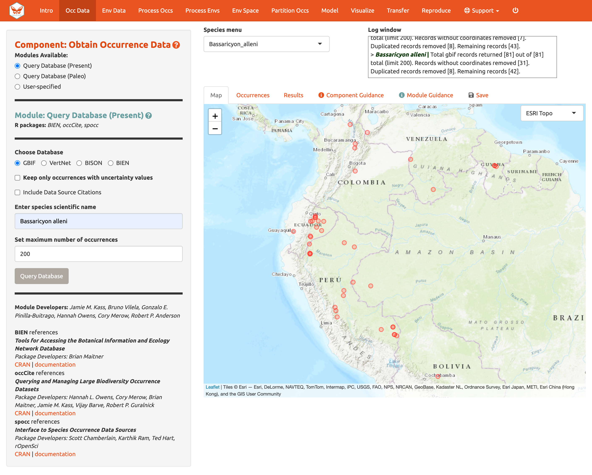
```

Haga clic otra vez en la pestaña "Save" [Guardar]. Note que la tercera opción ya está disponible.

# <a id="Env"></a>Obtener datos ambientales

Ahora, necesitará obtener variables ambientales para el análisis. Los valores de las variables son extraídos para los registros de ocurrencia, y esta información se proporciona al modelo. Estos datos están en formato ráster, que significa simplemente una cuadrícula donde cada celda especifica un valor. Los rásteres pueden ser visualizados como cuadrículas de color en mapas (esto lo veremos más adelante). Haga clic en el componente **Env Data**. El primer módulo, *WorldClim Bioclims*, le permite descargar variables bioclimáticas de <a href="https://www.worldclim.org/" target="_blank">WorldClim</a>, una base de datos global de superficies climáticas interpoladas derivadas a partir de datos de estaciones meteorológicas disponibles en diferentes resoluciones. La interpolación es mejor en áreas con más estaciones meteorológicas (especialmente en países desarrollados), y existe mayor incertidumbre en áreas con menos estaciones. Las variables bioclimáticas son resúmenes de temperatura y precipitación que han sido sugeridas como variables con un significado biológico general. Usted tiene la opción de especificar un subconjunto de las 19 variables para usar en el análisis.

El segundo módulo, *ecoClimate*, es un módulo incluído en v2 que incluye reconstrucciones paleoclimáticas. Este da acceso a capas del proyecto PMIP3 -- CMIP5 de <a href="https://www.ecoclimate.org/" target="_blank">ecoClimate</a>. Los usuarios pueden escoger entre diferentes Modelos Atmosféricos Oceánicos de Circulación General y escoger un escenario temporal para usar. Todas las capas de ecoClimate tienen una resolución de 0.5 grados, mientras que WorldClim permite opciones de resolución de 30 arcsec, 2.5 arcmin, 5 arcmin, o 10 arcmin.

El tercer módulo, *User-specified* [Especificado por usuario], es para cargar sus propios rásteres en Wallace. Estas pueden ser variables continuas, numéricas, o categóricas para proporcionar al modelo.

Vamos a usar WorldClim. La primera vez que usted use *Wallace*, estos datos serán descargados a una carpeta temporal en su disco duro; después de esto, serán simplemente cargadas desde esta carpeta local (esto será más rápido que descargarlas de internet). Usted también tiene la opción de guardarlas en memoria para un procesamiento más rápido --esto guarda los datos temporalmente como un RasterBrick en su RAM para que *Wallace* pueda tener acceso. Los rásteres en resoluciones más finas tomarán más tiempo en ser descargados. Los datos de resolución más fina, (30 arcsec) se entregan en grandes cuadrículas globales cuando se descargan a través de R usando el paquete raster (que wallace usa) y una sola cuadrícula que corresponde al centro del mapa será descargada. Seleccione resolución de 30 arcsec y la latitud y longitud del centro del mapa le será entregada. Para visualizar que tan bien la cuadrícula cubre los puntos de ocurrencia, haga clic en la casilla "30 arcsec tile" y en la esquina inferior izquierda del mapa. Los puntos fuera de la cuadrícula serán excluidos; puede requerir disminuir el zoom para verlo en su totalidad.

```{r, fig.align = 'center'}
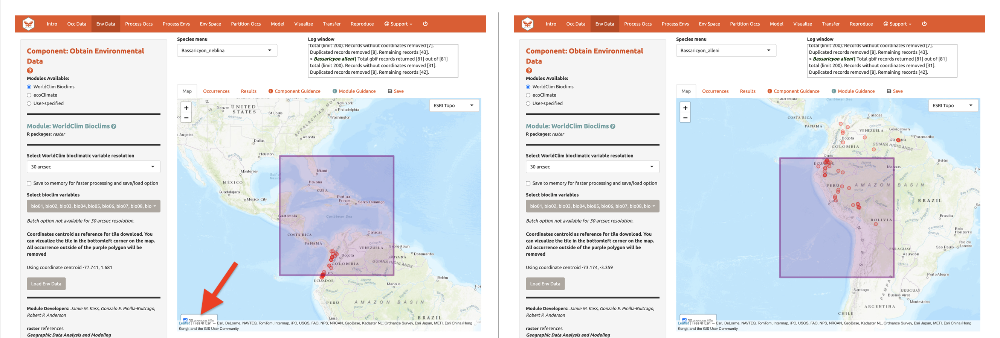
```

Aunque usted podría descargar los rásteres globales a resolución de 30 arcsec (muy pesados) del sitio web de WorldClim y cargarlos en Wallace (preferiblemente despues de cortarlas utilizando un programa de SIG o en R), vamos a escoger las variables bioclimáticas con resolución de 2.5 arcmin que Wallace entrega de forma global para cubrir todos nuestros puntos de ocurrencia, y vamos a dejar las 19 variables marcadas. Note que las decisiones tomadas aplicarán solo para la especie seleccionada en el Menú de especies, a no ser que la casilla "Batch" esté marcada.

La casilla de "Batch" hará el análisis que usted ha definido en el módulo para todas las especies cargadas. Usted notará que esta opción aparece en muchos de los módulos. Si quiere realizar análisis individuales para cada especie (en este caso diferentes variables ambientales), deje la casilla "Batch" sin marcar. Nota: la opción por lotes (batch) no está disponible para la resolución de 30 arcsec dado que puede requerir cargar diferentes cuadrantes.

Marque la casilla Batch y Load Env Data [Cargar datos ambientales].\
Note que aparece una barra de progreso en la esquina inferior derecha.

```{r, fig.align = 'center'}
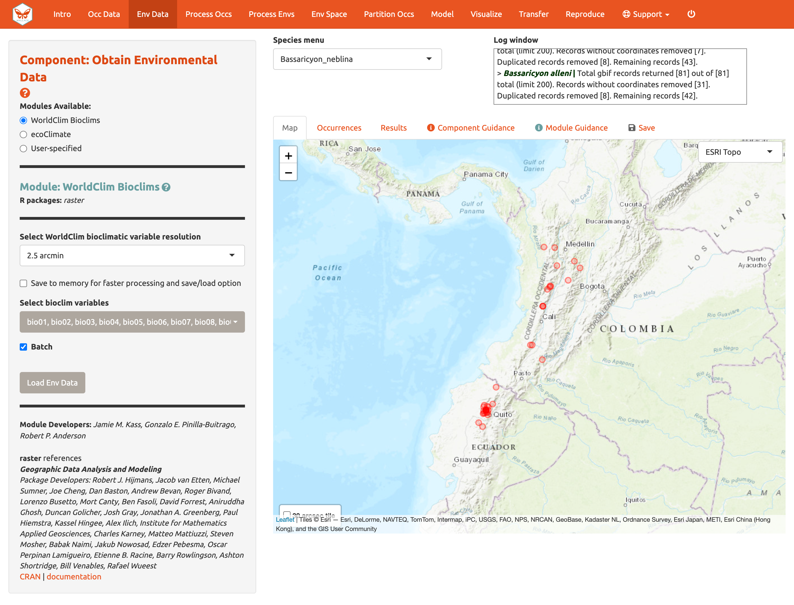
```

Después de cargar los rásteres, la pestaña de "Results" [resultados] mostrará información de resumen sobre estos (p. ej., resolución, extensión, número de celdas, etc.). Adicionalmente a la descarga de los rásteres, *Wallace* eliminará cualquier ocurrencia que no tenga valores ambientales (es decir puntos que no se sobrelapan con celdas con datos en los rásteres).

```{r, fig.align = 'center'}
knitr::include_graphics("vignette_img/env_3.png")
```

Puede descargar sus variables ambientales en la sección Download Data [Descargar datos] de la pestaña "Save" [Guardar].

# <a id="Proc"></a>Procesar datos de ocurrencias

El siguiente componente, **Process Occs**, le da acceso a algunas herramientas para limpieza de datos. Los datos que usted descargó de GBIF son brutos, y casi siempre tendrán algunos puntos erróneos. Conocimientos básicos sobre el rango de la especie de interés pueden ayudarnos a eliminar los errores más obvios. Para bases de datos como GBIF que acumulan grandes cantidades de datos provenientes de diferentes fuentes, hay inevitablemente algunas localidades dudosas. Por ejemplo, las coordenadas pueden corresponder a la ubicación del museo en vez de la localidad de colecta, o la latitud y longitud pueden estar invertidas. Para eliminar estos registros evidentemente errados, seleccione solo los puntos que usted quiere conservar en el análisis con el módulo *Select Occurrences On Map* [Seleccionar ocurrencias en el mapa]. Alternativamente, usted puede también remover registros específicos usando el ID en el módulo *Remove Occurrences by ID* [Eliminar ocurrencias por ID]. Incluso después de eliminar los puntos problemáticos, los que quedan pueden estar agrupados a causa de sesgos de muestreo. Esto conduce muchas veces a una autocorrelación espacial inflada artificialmente lo cual puede sesgar la señal ambiental para los datos de ocurrencias que el modelo va a intentar ajustar. Por ejemplo, pueden existir agrupaciones de puntos cerca de las ciudades porque los datos provienen en su mayoría de ciencia ciudadana con personas que viven cerca o alrededor de ciudades. O, los puntos pueden concentrarse alrededor de vías pues los biólogos de campo que los tomaron estaban haciendo observaciones mientras manejaban o accedían a las localidades de muestreo usando esa ruta. El último módulo, *Spatial thin* [Adelgazado especial] va a ayudar a reducir los efectos del sesgo de muestreo. A diferencia de otros componentes, en **Process Occs** los módulos no son excluyentes y pueden ser usados en cualquier orden.

Asegúrese de que *Bassaricyon alleni* está en el menú de especies. Vamos a practicar usando los dos primeros módulos con esta especie. En el primer módulo, vamos a usar la herramienta de dibujo de polígonos para seleccionar las ocurrencias . La herramienta de dibujo de polígono es útil para dibujar extensiones y la veremos también en otros módulos más adelante.

Haga clic en el ícono de polígono en la barra de herramientas del mapa.

```{r, fig.align = 'center', out.width="50%"}
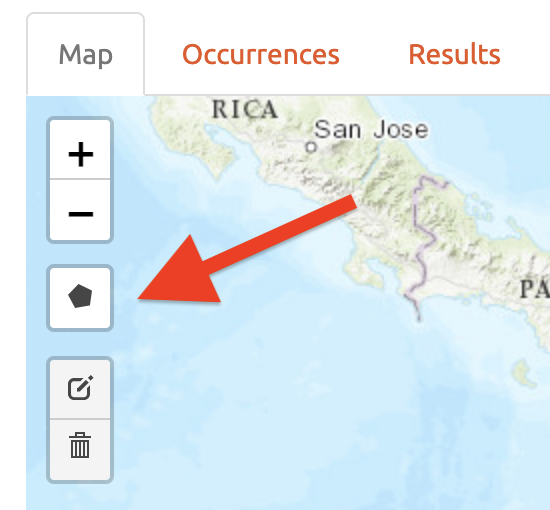
```

Esto abre la herramienta de dibujo. Haga clic para empezar a dibujar ---cada clic conecta con el anterior por medio de una línea. Dibuje un polígono alrededor de América del Sur, omitiendo los registros de Bolivia. Si comete un error dibujando, puede dar clic en "Delete last point" [Eliminar el último punto] o "Cancel" [Cancelar] para volver a empezar. Para terminar de dibujar, haga clic de nuevo en el primer punto que realizó, o haga clic en "Finish" [Finalizar] en la barra de herramientas de dibujo. Esto termina el polígono para usar en los análisis. Ahora haga clic en "Select Occurrences" [Seleccionar Ocurrencias] y va a ver que el punto en Bolivia desaparece. Para eliminar el polígono con sombreado azul, haga clic en el ícono de papeleras y haga clic en "Clear All" [Limpiar todo]. Si no está contento o cometió un error, el botón rojo "Reset" [Restablecer] en la interfaz del módulo revierte la sesión a los puntos originales. Dado que se eliminó el registro de Bolivia de forma arbitraria, haga clic en restablecer para volver al conjunto de datos original.

```{r, fig.align = 'center'}
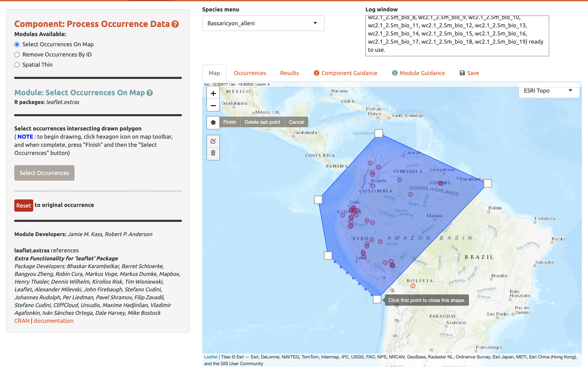
```

Ahora vamos a eliminarlo de nuevo, esta vez usando el segundo módulo, *Remove Occurrences by ID* [Eliminar ocurrencias por ID]. Haga clic en el registro de Bolivia. Va a aparecer información sobre el registro empezando con el OccID. En este caso es OccID #18 (puede ser un número diferente para usted). Otra información de la tabla de atributos va a estar disponible. Por ejemplo, el registro no tiene información (NA) sobre el código de la institución, estado/provincia, o base. Dado que conocemos el número de OccID, podemos encontrar la información completa asociada en la pestaña de Ocurrencias. Haga clic ahí y encuentre el registro. Aquí podemos ver que se trata de un espécimen preservado del Museum of Southwestern Biology (MSB). Regrese al mapa. Ingrese "18" en el ID para ser removido y haga clic en "Remove Occurrence" [Eliminar ocurrencia]. Usted verá que una vez más el punto desaparece. Haga clic en restablecer para recuperarlo.

```{r, fig.align = 'center'}
knitr::include_graphics("vignette_img/poccs_3.png")
```

A continuación, haga clic en el módulo *Spatial Thin* [Filtrado espacial]. Esto le permite intentar reducir los efectos del sesgo espacial al ejecutar una función de adelgazamiento de los puntos para filtrar los que se encuentran a una distancia menor el uno del otro que una distancia definida por el usuario. Vamos a usar "10 km" como un ejemplo y adelgazar para cada especie por separado usando otra vez la opción "Batch".

```{r, fig.align = 'center'}
knitr::include_graphics("vignette_img/poccs_4.png")
```

Ahora nos hemos quedado con 35 puntos para *Bassaricyon alleni* y 21 para *Bassaricyon neblina* (sus números pueden ser diferentes). Puede hacer zoom para ver lo que hizo la función. Los puntos rojos fueron retenidos mientras que los puntos azules fueron removidos. Descargue los conjuntos de datos procesados como un archivo .csv haciendo clic en la pestaña “Save” [Guardar]. Recordatorio: los datos descargados son solo para la especie seleccionada actualmente en el menú.  

# <a id="ProcEnv"></a>Procesar datos ambientales

Ahora tenemos que elegir la extensión de estudio para modelar. Esto definirá la región de la cual los puntos de “background” [fondo] serán seleccionados para el ajuste del modelo. Se supone que los puntos de fondo deben muestrear los ambientes en la totalidad del área disponible para la especie de estudio. Métodos como Maxent son conocidos como técnicas de presencia-fondo porque comparan los valores de las variables predictoras para los puntos de fondo con los de los puntos de ocurrencia (a diferencia de las técnicas de presencia-ausencia que requieren datos de ausencia). Al tomar decisiones sobre la extensión del estudio, queremos evitar áreas a las cuales históricamente la especie no ha podido moverse —por ejemplo, regiones más allá de una barrera física como una cadena montañosa o un gran río que la especie no puede cruzar. Incluir estas áreas puede enviar una señal errónea al modelo de que esas áreas no son idóneas ambientalmente. Al igual que para cada paso del análisis, por favor vea el texto guía relevante para más detalles.  

Aquí, usted puede explorar las diferentes opciones para delimitar la extensión del estudio. Cada módulo tiene dos pasos: 1) escoger la forma de la extensión del fondo, y 2) muestrear los puntos de fondo. Para empezar, vaya al módulo Select Study Region [Seleccionar la región de estudio]. Baje a “Step 1” [Paso 1], intente diferentes opciones y vea cómo cada una dibuja la forma del fondo. Intente aumentar y disminuir la zona de amortiguamiento (“buffer”) para ver cómo afecta la forma. Ahora seleccione la especie *B. neblina* en el menú de especies y en el módulo *Select study region* [seleccionar región de estudio] escoja la opción minimum convex polygon [polígono mínimo convexo]. Usaremos una zona de amortiguamiento de  0.7° de distancia. Ahora cambie la especie a *B. alleni* y use una zona de point buffers [amortiguamiento de puntos] con una distancia de 0.7°.  

```{r, fig.align = 'center'}
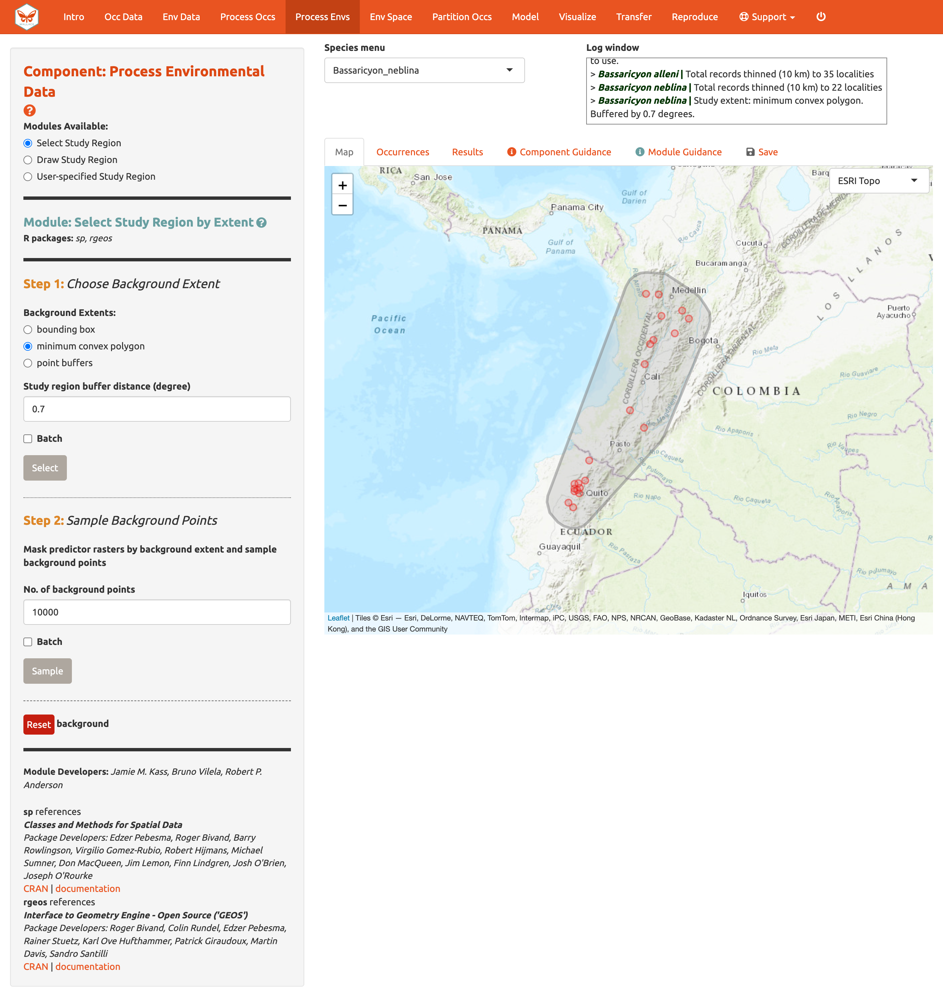
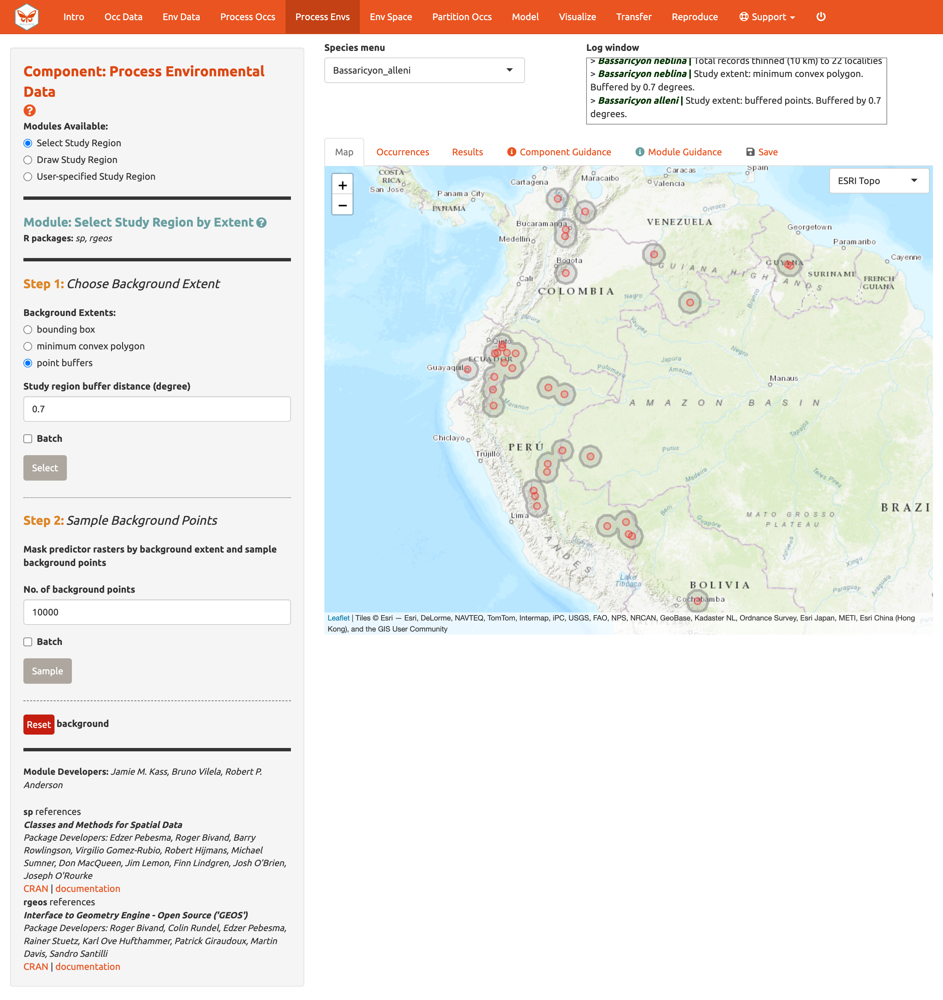
```

Alternativamente, puede dibujar su propio polígono (use la misma herramienta para dibujar polígonos que probamos en el **Componente: Process occs**). Si tiene un archivo especificando la extensión del fondo, puede cargarlo usando el módulo *User-specified Study Region* [Región de estudio especificada por el usuario]. Este módulo puede aceptar un shapefile (debe incluir los archivos .shp, .shx, and .dbf) o un archivo .csv con las coordenadas de los vértices del polígono con los campos en el siguiente orden: longitud, latitud. Note que el polígono que usted dibuje o la forma que usted cargue debe contener todos los puntos de ocurrencia.  

A continuación, complete el “Step 2” [Paso 2] , el cual corta los rásteres al área de estudio y muestrea los puntos de fondo. Establezca el número de puntos de fondo en 10,000 (muestras más grandes pueden ser apropiadas para áreas de estudio más grandes o para resoluciones más finas;  vea el texto guía  del componente), marque la casilla “Batch”, y haga clic en el botón “Sample” [Muestrear].  

```{r, fig.align = 'center'}
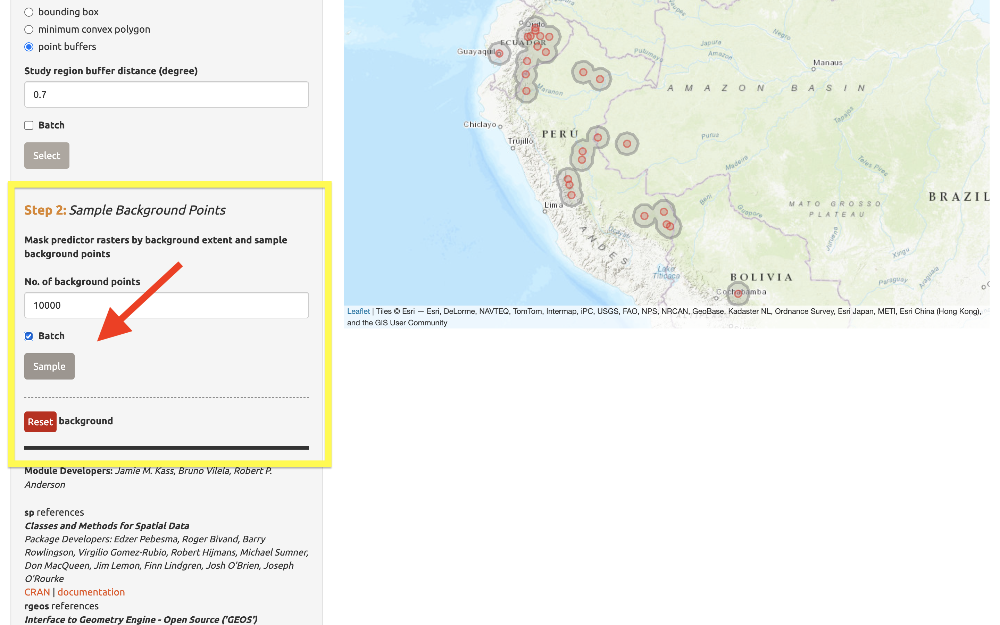
```

Puede encontrar que pedir 10,000 puntos de fondo excede el número de celdas disponibles en el área de fondo. El número de puntos disponibles le será dado en la ventana de registro, y ese número puede ser usado en vez de 10,000.  

Un archivo .zip de los rásteres cortados (p. ej., los datos ambientales cortados al área de fondo que usted acaba de 
crear) estarán disponibles para descargar en la pestaña de “Save” [Guardar]. Asegúrese de cambiar de especies en el menú para descargar un archivo para cada una.  

# <a id="Espace"></a>Caracterizar el espacio ambiental

El **Componente: Characterize Environmental Space** [Caracterizar el espacio ambiental] contiene análisis para múltiples especies y es opcional. A diferencia de otros componentes que le permiten usar los módulos en cualquier orden, los módulos dentro de **Characterize Environmental Space** [Caracterizar el espacio ambiental] son secuenciales y deben ser utilizados en orden (usted no puede usar el módulo *Occurrence Density Grid* [Grilla de Densidad de Ocurrencias] sin utilizar primero el módulo *Environmental Ordination* [Ordenación Ambiental]).  

Antes de empezar el análisis con el *Módulo: Environmental Ordination* [Ordenación Ambiental], debe seleccionar dos especies para trabajar. Si tiene más de dos especies cargadas, seleccione dos del menú de especies. Dado que solo tenemos dos cargadas, haga clic en el menú de especies y seleccione la segunda especie. Ambos nombres aparecerán en la caja de manera simultánea—actualmente esta funcionalidad solo está disponible para el componente **Characterize Environmental Space** [Caracterizar el espacio ambiental].  

```{r, fig.align = 'center'}
knitr::include_graphics("vignette_img/espace_1.png")
```

El Módulo: *Environmental Ordination* [Ordenación Ambiental], permite realizar un Análisis de Componentes Principales (PCA por sus siglas en inglés), el cual maximiza la variación contenida en las variables predictoras en menos variables.  Para realizar un PCA, seleccione las variables disponibles para ambas especies marcando o no marcando las variables bioclimáticas. Escoja entre “Occurrences Only” [Solo ocurrencias] o “Occurrences & Background” [Ocurrencias y Fondo] para la selección de gráficas y determine los componentes para los ejes x y y. La gráfica de dispersión del PCA [PCA scatter plot] aparecerá en la pestaña de Results [resultados].  

```{r, fig.align = 'center'}
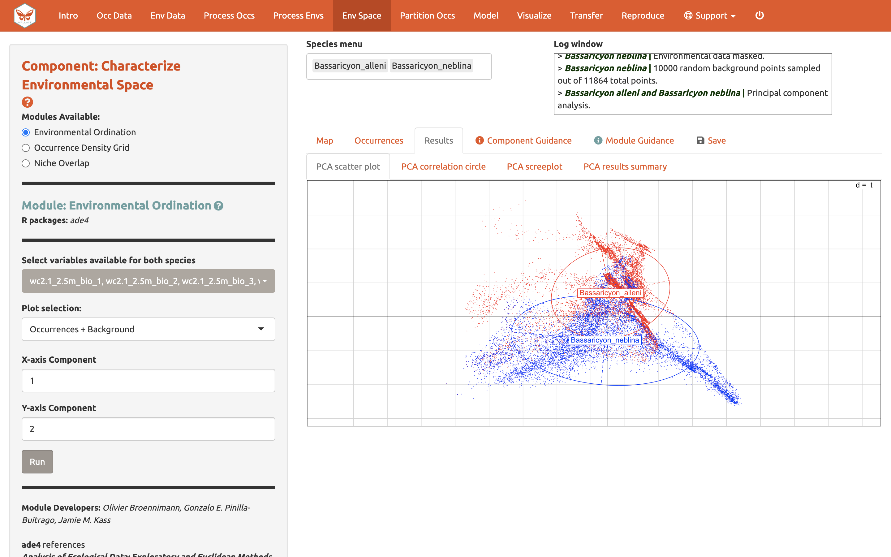
```

También puede ver el PCA correlation circle [círculo de correlación del PCA], PCA scree plot [gráfica de sedimentación], y el resumen de los resultados del PCA [PCA results summary]. Para más información sobre estas estadísticas y cómo evaluar los resultados, consulte el texto guía.  

```{r, fig.align = 'center'}
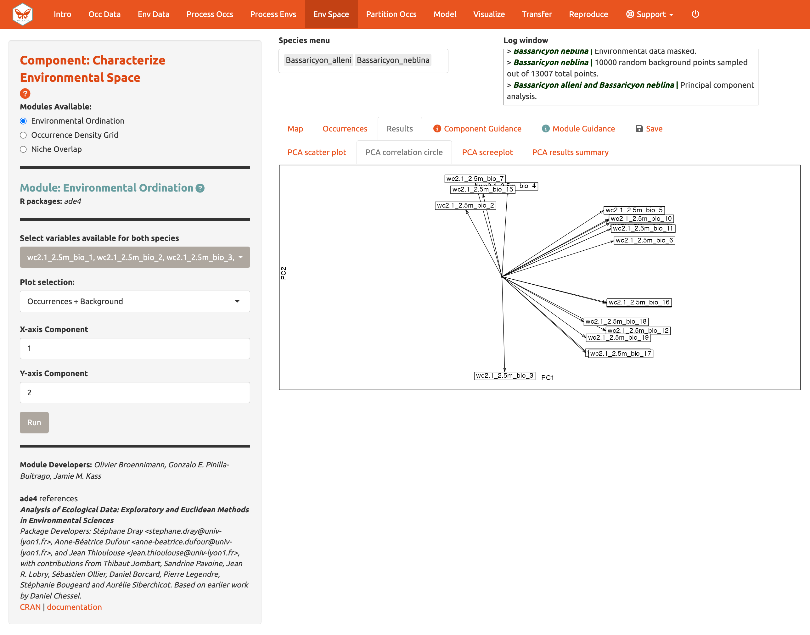
```

```{r, fig.align = 'center'}
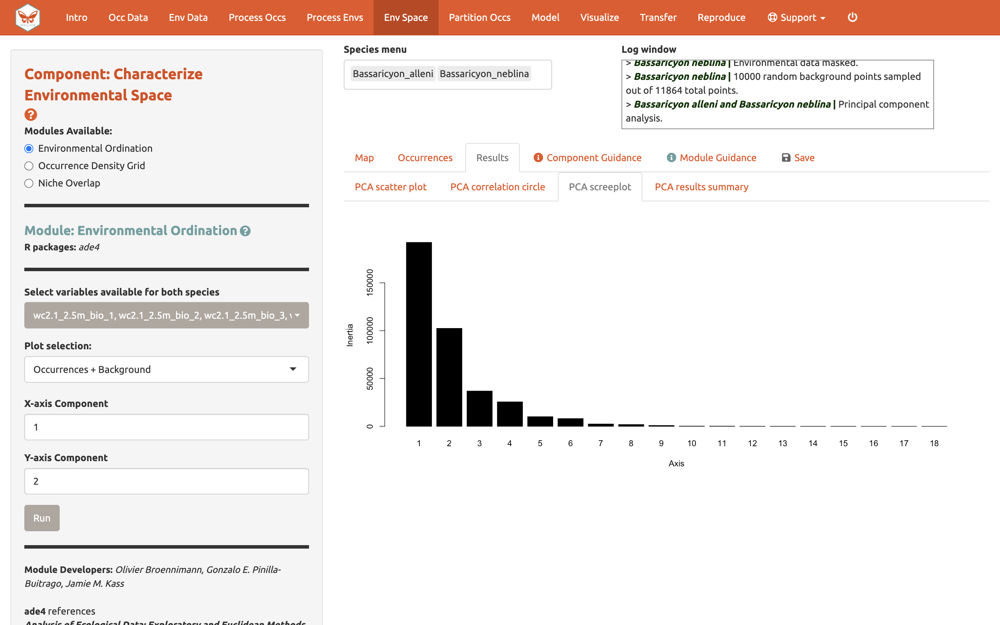
```

```{r, fig.align = 'center'}
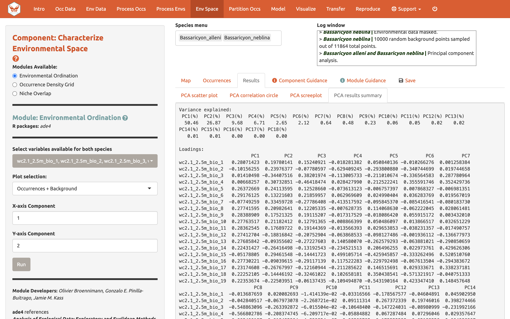
```

Ahora, ejecute el módulo *Occurrence Density Grid* [Grilla de densidad de ocurrencia]. Este calcula y grafica cual es la parte del espacio ambiental que está más densamente ocupada por cada especie y la disponibilidad de condiciones ambientales presentes en el rango del fondo. Las áreas más oscuras representan mayor densidad de ocurrencia. Las áreas dentro de las líneas sólidas representan las condiciones ambientales disponibles en el rango del fondo, las áreas dentro de las líneas punteadas representan el 50% de las más frecuentes.  

```{r, fig.align = 'center'}
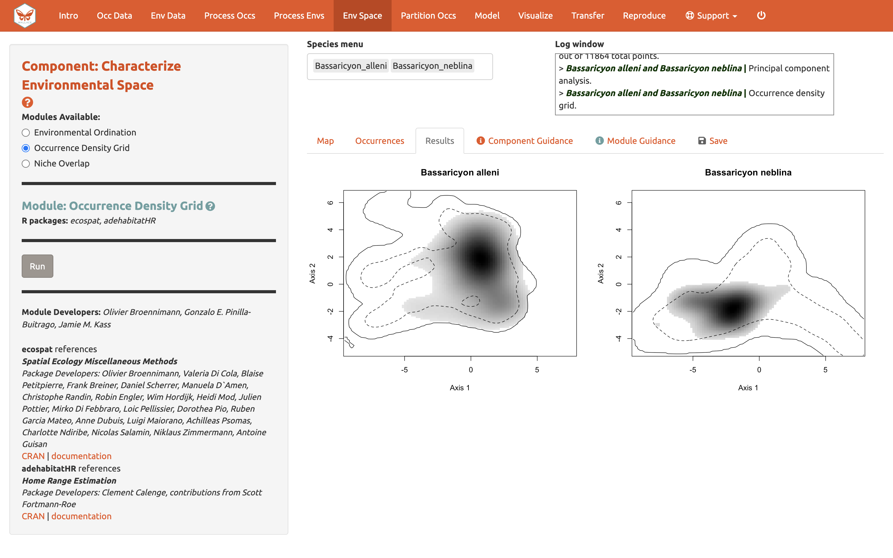
```

Ahora calcule el Niche overlap [Sobrelape de nicho]...  

```{r, fig.align = 'center'}
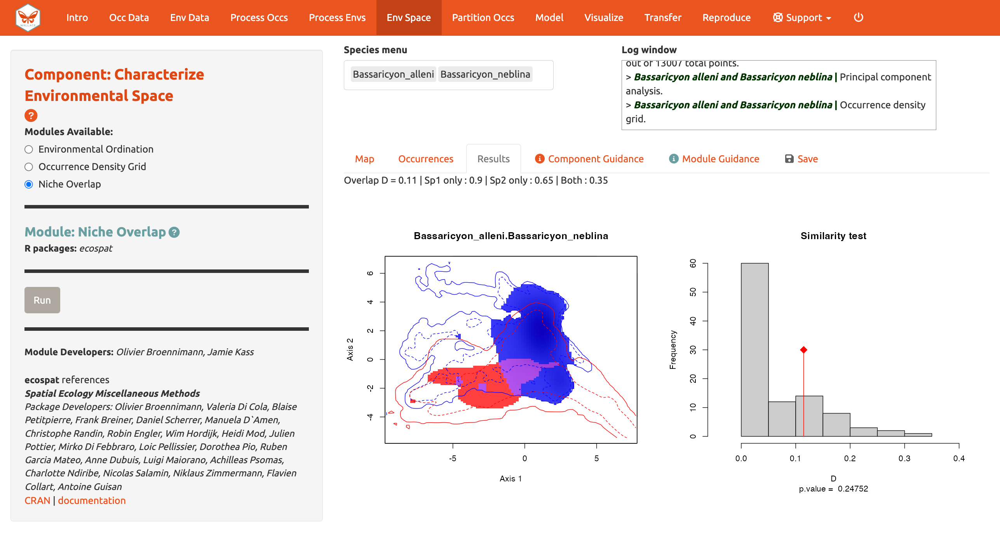
```

Esta cuantificación del sobrelape de nicho está basada en las densidades de ocurrencia y fondo en el espacio ambiental disponible estimado en el Módulo: *Occurrence Density Grid* [Grilla de densidad de ocurrencia]. Este sobrelape está cuantificado usando la métrica de Schoener’s D. Las condiciones ambientales ocupadas por el nicho de la especie 1 se muestran en azul y las condiciones ambientales ocupadas por el nicho de la especie 2 en rojo. Las condiciones ambientales ocupadas por ambas especies, o el sobrelape, aparecen en morado. En el Similarity Test [Test de Similitud], si el sobrelape observado (línea roja) es superior al 95% de los sobrelapes simulados (valor-p \< 0.05), podemos considerar que las dos especies son más similares que lo esperado en un escenario al azar que no es lo que vemos aquí. De nuevo, consulte el texto guía del módulo para obtener ayuda para entender e interpretar los resultados.

Descargue los resultados del PCA (.zip), grilla de densidad (.png), y gráfica de sobrelape (.png) de la pestaña “Save” [Guardar].  

# <a id="Part"></a>Dividir Ocurrencias

Aún no hemos construido modelos, pero antes de hacerlo, vamos a tomar decisiones sobre cómo dividir nuestros datos para la evaluación. Para poder determinar la habilidad predictiva del modelo, en teoría usted necesita datos independientes para evaluarlo. Cuando no existen conjuntos de datos independientes, una solución es dividir sus datos en subconjuntos que asumimos son independientes los unos de los otros, después, se construyen modelos secuencialmente usando todos los subconjuntos menos uno y se evalúa el rendimiento del modelo con el subconjunto que se dejó por fuera. Esto se conoce como validación cruzada en *k*-grupos (*k*-fold cross-validation, dónde *k* es el número total de subconjuntos, o ‘grupos’) Esto es muy prevalente en estadística, especialmente en los campos de aprendizaje automático y ciencia de datos. Después de que se completa este ejercicio de construcción secuencial de modelos, *Wallace* promedia las estadísticas de rendimiento del modelo sobre todas las iteraciones y finalmente construye un modelo usando **todos** los datos.

Existe mucha literatura alrededor de cuál es la mejor forma de dividir datos para la evaluación de modelos. Una opción, es simplemente dividir los datos de manera aleatoria, pero con datos espaciales corremos el riesgo de que los grupos no sean espacialmente independientes los unos de los otros. El método de “jackknife” (“dejar uno afuera”) es recomendado para especies con tamaños de muestreo pequeños y se usó previamente para modelar la distribución de *Bassaricyon neblina* (<a href="https://doi.org/10.1093/jmammal/gyy012" target="_blank">Gerstner et al. 2018</a>) pero puede usar muchos recursos computacionales y tener largos tiempos de procesamiento.

Otra opción es realizar particiones espaciales—por ejemplo, dibujando líneas en el mapa para dividir los datos. La división espacial con validación cruzada de *k*-grupos fuerza al modelo a predecir en áreas distantes de las áreas usadas para entrenar el modelo (note que Wallace también excluye los puntos de fondo de las regiones que corresponden a la partición no utilizada). Para *Bassaricyon alleni*, las condiciones ambientales en Colombia y Ecuador pueden diferir considerablemente de las condiciones en Bolivia. Si en promedio el modelo hace predicciones precisas en los datos divididos y retenidos espacialmente, este tiene potencialmente una alta transferibilidad, es decir, que puede transferirse a nuevos valores de las variables predictoras (dado que áreas alejadas geográficamente son usualmente más diferentes ambientalmente que áreas más cercanas). Como siempre, por favor vea el texto guía para más detalles sobre todos los tipos de particiones ofrecidos en *Wallace*.  Aquí tenemos un ejemplo de jackknife (*k* = n), que asigna cada punto a su propia partición, entonces el número de grupos es igual al número total de ocurrencias. 

```{r, fig.align = 'center'}
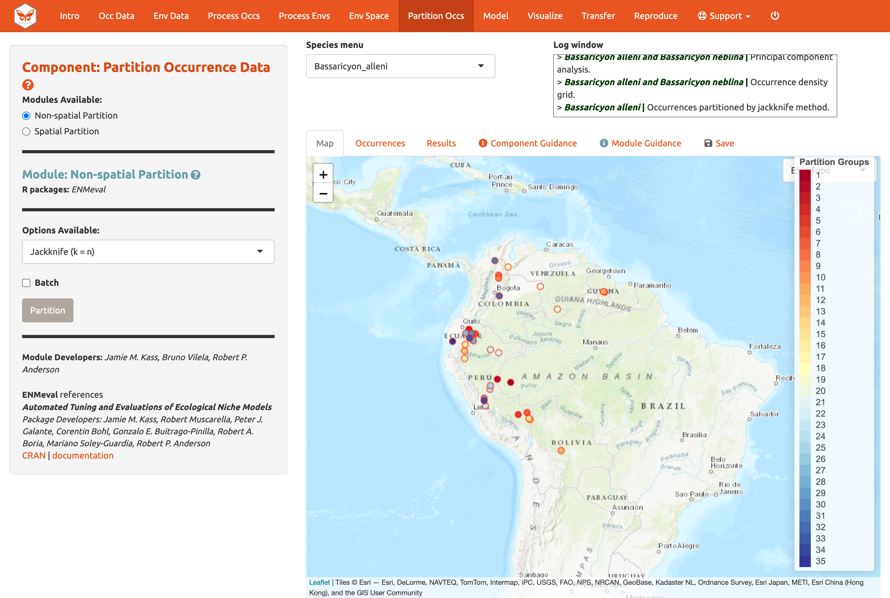
```

Ahora aquí está un ejemplo de división espacial, esta asigna cada punto a uno de las cuatro particiones espaciales separadas. 

```{r, fig.align = 'center'}
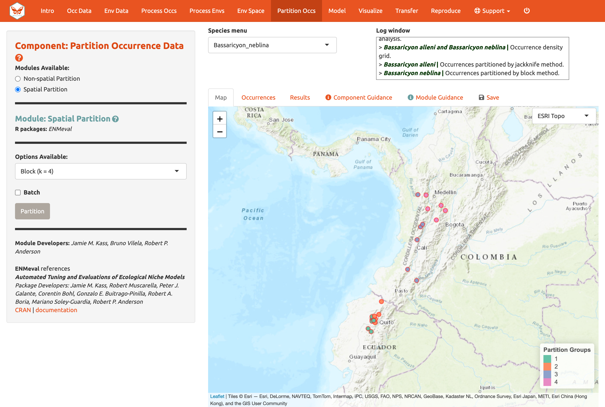
```

Vamos a usar este último método para una computación más rápida, pero se recomienda leer el texto guía y otra literatura –– ¡y hablar con sus pares!—para tomar decisiones informadas sobre los métodos de partición.  

Divida las ocurrencias para ambas especies usando el Módulo: *Spatial Partition* [Partición Espacial] y la opción Block (*k* = 4).

# <a id="Save"></a>Guardar y Cargar Sesión

Antes de empezar a modelar, vamos a explorar una de las grandes características de Wallace v2, esta es la habilidad de parar y guardar su progreso para continuar más tarde. Si quiere saltarse este paso (y arriesgarse a perder todo su trabajo excepto los datos y resultados que haya descargado si ocurre algún error), puede avanzar a la sección [Modelar](#Model).

Haga clic en ‘Save Session’ [Guardar Sesión] en la pestaña “Save” [Guardar]. Esta pestaña está disponible desde cualquiera de los Componentes. Esta opción guardará su progreso en un archivo RDS (.rds), un tipo de archivo utilizado para guardar objetos de R. Después de guardar, puede hacer clic en el símbolo de detener en la esquina superior derecha o cerrar la ventana del explorador y salir de R/RStudio. *Nota: si la sesión de Wallace se cierra antes de guardar los resultados y/o la sesión todo el trabajo se perderá.*  

Cuando esté listo para reanudar la sesión, vuelva a cargar Wallace.  

```{r, eval = FALSE, echo = TRUE}
library(wallace)
run_wallace()
```

En el componente **Intro**, use la pestaña “Load Prior Session” [Cargar sesión previa] para importar su archivo de sesión .rds.

```{r, fig.align = 'center'}
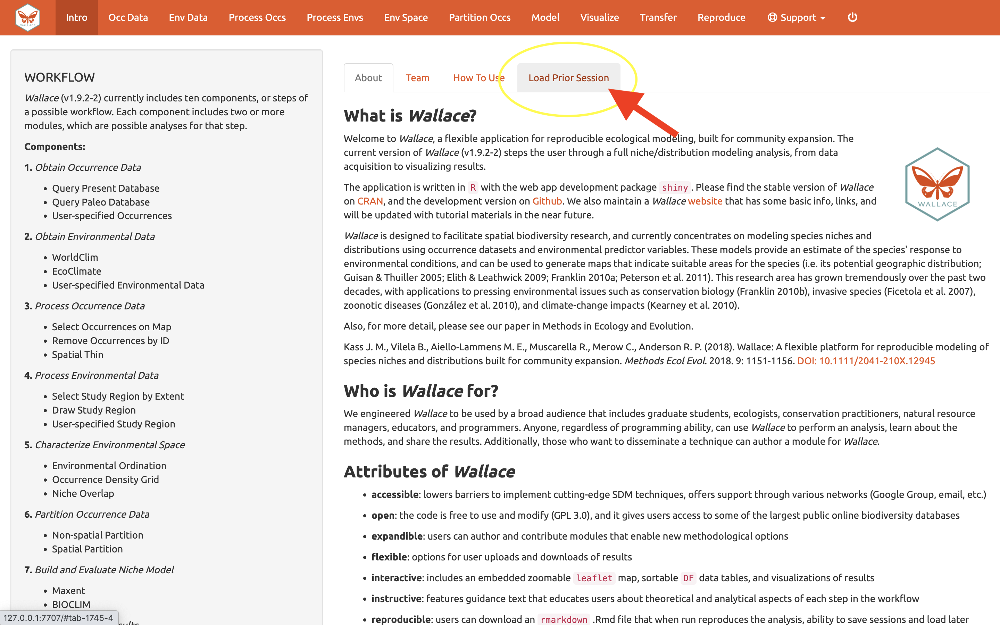
```

Una caja aparecerá – es un mensaje de alerta de *Wallace*, pero en este caso está indicando que la sesión fue cargada. Puede ser necesario volver a cargar las variables usando los componentes **Occ Data** y **Env Data**. Ahora puede continuar con los análisis previos.  

```{r, fig.align = 'center'}
knitr::include_graphics("vignette_img/save_2.png")
```

# <a id="Model"></a>Modelar {#model}

Estamos listos para construir un modelo de distribución. *Wallace v2.0* provee dos opciones de algoritmos; Maxent y BIOCLIM. Para esta viñeta, usaremos Maxent, un método de aprendizaje automático que puede ajustar un rango de funciones, desde simples (líneas rectas) hasta complejas (curvas o líneas que cambian de dirección; estas pueden volverse dentadas si la complejidad no se controla), a los patrones de los datos. Para más detalles sobre Maxent, por favor consulte la página web de <a href="https://biodiversityinformatics.amnh.org/open_source/maxent/" target="_blank">Maxent</a> y el texto guía.  

Maxent está disponible a través del paquete `maxnet` o a través de Java con la opción `maxent.jar`. Para no demorarnos más y evitar problemas relacionados con Java, aquí usaremos las siguientes opciones de modelado:

-   Escoja maxnet

-   Seleccione L, LQ, y H como “feature classes” [clases de características]. Estas son las formas que pueden ser ajustadas a los datos:

    -   L = Lineal, p.ej. temp + precip\
    -   Q = Cuadrática, p.ej.  temp^2^ + precip^2^\
    -   H = Hinge, e.g. funciones lineales por partes, como “splines” o ranuras (piense en una serie de líneas que se conectan las unas con las otras)\

-   eleccione “regularization multipliers” [multiplicadores de regularización] entre 0.5 y 4 con un “step value” [Valor de incremento] de 0.5.

    -   La regularización es una penalidad sobre la complejidad del modelo.\
    -   Valores más altos = modelos menos complejos, más suaves. Básicamente, todos los coeficientes de las variables predictoras se van disminuyendo hasta que algunos llegan a 0, ahí salen del modelo. Solo las variables con mayores contribuciones predictivas se quedan en el modelo.\

-   Deje “NO” seleccionado para las variables categóricas. Esta opción es para indicar si alguna de sus variables predictoras es categórica como por ejemplo clases de vegetación o suelos.

    -   Si usted hubiese cargado variables categóricas, marcaría esta casilla e indicaría cuál de los rásteres es categórico.

-   En “Clamping?”[extrapolación restringida] escoja “TRUE” [verdadero]. Esto va a restringir las predicciones del modelo (es decir que mantendrá los valores ambientales más extremos que los presentes en los datos de fondo dentro de los límites de los datos de fondo).

-   Si usted escoge la opción “TRUE” [verdadero]en la categoría “Parallel?” [Paralelo] puede indicar sobre cuántos núcleos quiere ejecutar en el procesamiento en paralelo.

Vamos a construir un modelo para *Bassaricyon neblina*, pero note que la opción Batch puede ser marcada para ejecutar esta selección para todas las especies cargadas.
Asegúrese de que *Bassaricyon neblina* esté seleccionada en el menú de especies y que la opción Batch no está marcada antes de dar clic en el botón **Run** [Ejecutar].  

Las 3 clases de características (L, LQ, H) * 8 multiplicadores de regularización (0.5, 1, 1.5, 2, 2.5, 3, 3.5, 4) = 24 modelos candidatos. Las clases de características Hinge (H) van a permitir cierta complejidad en la respuesta, por lo cuál estos tomarán un poco más de tiempo ejecutándose que otros modelos más simples.   

```{r, fig.align = 'center'}
knitr::include_graphics("vignette_img/model_1.png")
```

Los resultados aparecen en dos tablas de estadísticas de evaluación que facilitan la comparación entre los modelos que usted acaba de construir. La primera tabla muestra las estadísticas para el modelo completo y los promedios de las particiones. Esta tabla debe tener 24 filas, una para cada una de las combinaciones de clases de características y multiplicadores de regularización. En la primera tabla, las estadísticas de los modelos construidos a partir de los cuatro grupos de datos divididos (un grupo retenido para cada iteración) son promediados. En la segunda tabla, se muestran las estadísticas para cada grupo de las particiones que fueron promediadas en la primera tabla, por lo tanto esta contiene 96 filas (cada uno de los 4 grupos para cada uno de los 24 modelos).

```{r, fig.align = 'center'}
knitr::include_graphics("vignette_img/model_2.png")
```

¿Cómo escogemos el “mejor” modelo?\
Hay una gran cantidad de literatura al respecto de esto, y realmente no hay una sola respuesta para todos los conjuntos de datos. Las estadísticas de rendimiento del modelo, es decir, AUC (Area Under the Curve- Área bajo la curva), OR (Omission Rate - Tasa de omisión), y CBI (Continuous Boyce Index) fueron calculadas y promediadas sobre las diferentes particiones y el AICc (Criterio de información de Akaike corregido) fue calculado usando la predicción del modelo en el área de fondo completa (y todos los puntos de ocurrencia filtrados). Aunque AICc no incorpora los resultados de la validación cruzada, si penaliza explícitamente la complejidad del modelo—por lo tanto, modelos con más parámetros tienden a tener peores puntajes de AICc. Es realmente una decisión del usuario y el texto guía tiene algunas referencias que deberían ayudarle a aprender más sobre el tema.  

La tabla de métricas de evaluación se puede ordenar. Primero, vamos a priorizar los modelos que omitieron pocos puntos de ocurrencia en el área predicha durante la validación cruzada. Organice la tabla de resultados en orden ascendente a partir de la columna “or.10p.avg”, o la tasa de omisión promedio cuando se aplica un umbral del décimo percentil de las presencias de entrenamiento al conjunto de datos (retenido) de validación (vea el texto guía para más detalles). Estamos priorizando los valores bajos de “or.10p.avg” pues preferimos un modelo que no omita muchas de las ocurrencias retenidas al realizar una predicción del rango.  

```{r, fig.align = 'center'}
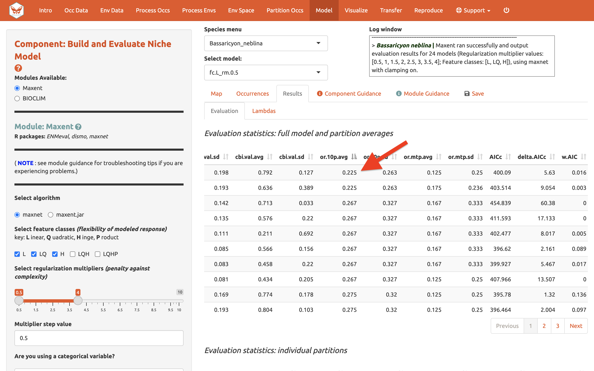
```

Vamos a mirar también los valores de AUC de validación promedio (dónde los valores más altos son mejores)...  

```{r, fig.align = 'center'}
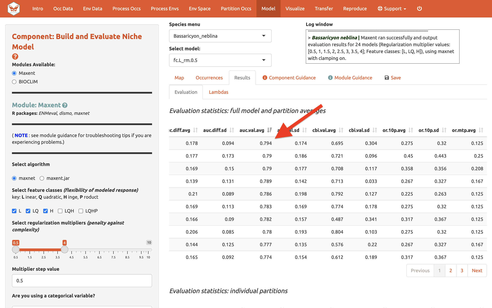
```

y AICc (dónde valores bajos son mejores)...

```{r, fig.align = 'center'}
knitr::include_graphics("vignette_img/model_5.png")
```

En nuestro ejemplo, si hubiésemos escogido el modelo con el puntaje de AICc más bajo, habríamos terminado escogiendo el LQ_2. Nota: Sus valores pueden ser diferentes.

Al lado de los resultados de **Evaluation** [Evaluación] usted puede acceder al archivo de **Lambdas** de Maxent (este archivo contiene los pesos para cada clase de característica y para cada variable) para cada uno de los modelos (puede cambiar el modelo candidato en la caja desplegable “Select model” [seleccionar modelo], cambiar el modelo aquí cambia la salida del archivo Lambda).  

```{r, fig.align = 'center'}
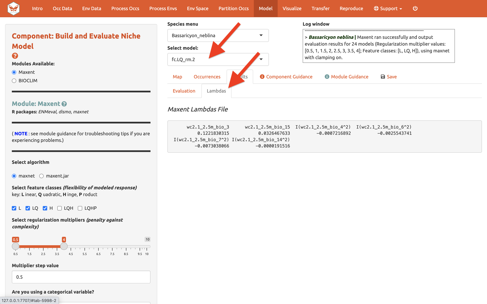
```

Utilice la pestaña “Save” [Guardar] para descargar las tablas de evaluación.  

# <a id="Vis"></a>Visualizar

Hay cuatro módulos para la visualización. Vamos a dejar el primero, **Map Prediction** [Mapear la predicción], para el final. Vamos a saltarnos el cuarto módulo, *BIOCLIM* Envelope Plot [Gráfica de sobre ambiental de BIOCLIM], dado que utilizamos Maxent en vez de BIOCLIM.  

El módulo *Maxent Evaluation Plots* [Gráficas de evaluación de Maxent], permite a los usuarios evaluar las estadísticas de rendimiento de los modelos. Las gráficas aparecen en la pestaña de Results [Resultados]. Abajo puede ver como las clases de características y los multiplicadores de regularización afectan los valores de AUC de validación promedio.

```{r, fig.align = 'center'}
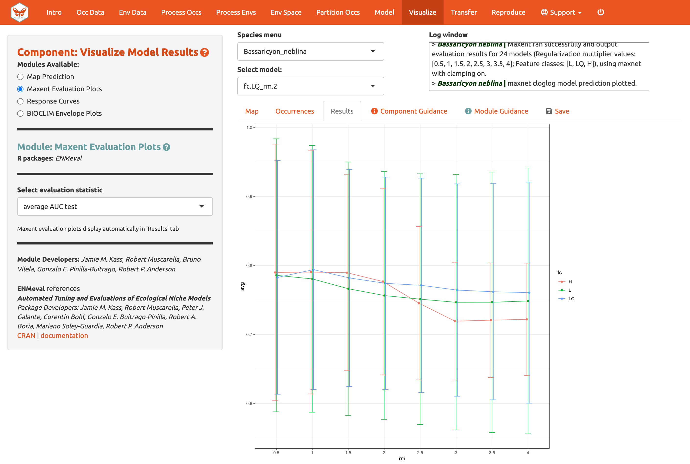
```

También deberíamos explorar las *Response Curves* [Curvas de respuesta], que muestran como la idoneidad de hábitat predicha (eje y) cambia con base a los diferentes valores de cada variable (eje x). Para estas curvas, se muestra la respuesta marginal de una variable  cuando las demás se mantienen en sus valores promedio. Si quiere ver los resultados para un modelo en particular, selecciónelo usando el menú desplegable bajo la caja de especies.  Aquí abajo puede ver una curva de respuesta para el modelo LQ_2 para la precipitación promedio del mes más seco(bio14).


```{r, fig.align = 'center'}
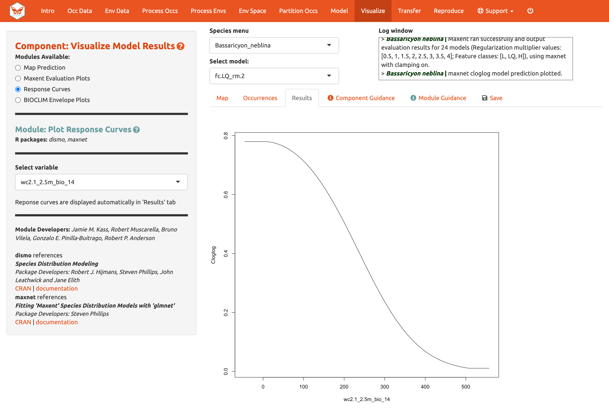
```

Por supuesto, puede visualizar también las predicciones del modelo en el mapa. Las predicciones de idoneidad de hábitat pueden ser continuas (un rango de valores desde bajo hasta alto) o binarias (cortadas con un umbral a dos valores: 0, no idóneo y 1, idóneo) . Estamos visualizando predicciones hechas con la transformación “cloglog”, esta convierte la salida cruda de Maxent (tasa de ocurrencia relativa) a una escala probabilística entre 0 y 1 para aproximarse a la probabilidad de presencia (dado supuestos claves). Por favor vea el texto guía del módulo para obtener información sobre los tipos de escalamientos en la salida de Maxent y los umbrales. Aquí está la predicción mapeada para el modelo LQ_2, sin umbral, con una salida de tipo cloglog.

```{r, fig.align = 'center'}
knitr::include_graphics("vignette_img/vis_3.png")
```

Aquí abajo está la predicción mapeada del mismo modelo, esta vez con un umbral del décimo percentil del valor de presencia en datos de entrenamiento (el valor de idoneidad que usamos para calcular las tasas de omisión arriba para seleccionar los modelos). Algunos de los puntos de ocurrencia van a caer fuera de las regiones azules que representan áreas idóneas para *Bassaricyon neblina*. Para el valor de presencia de entrenamiento del décimo percentil, dado que no representa la idoneidad más pequeña predicha, pero el valor que deja por fuera el 10% más bajo, la omisión esperada sería de 0.1 (es decir el 10% es omitido).

```{r, fig.align = 'center'}
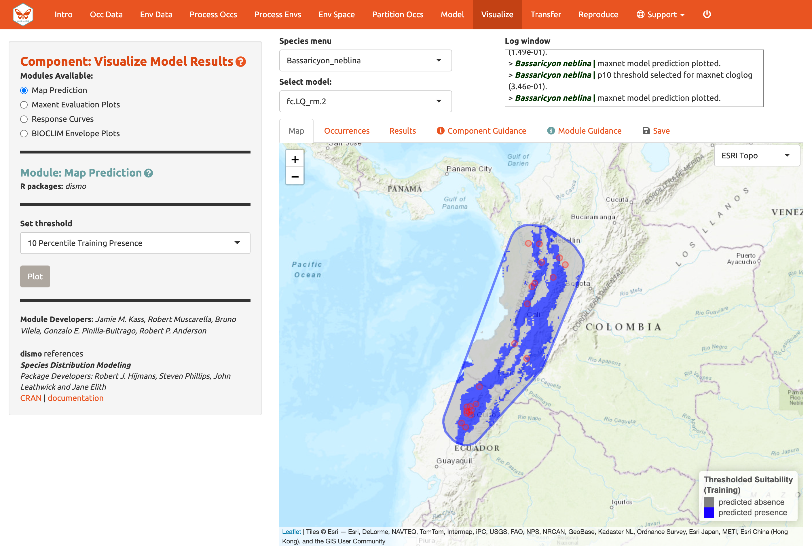
```

Intente mapear la predicción usando el umbral menos estricto de ‘minimum training presence’ [presencia de entrenamiento mínima] y note la diferencia. También puede usar un umbral basado en el cuantil de presencias de entrenamiento omitidas. Intente cambiar el valor del cuantil y note el cambio en la predicción.  

```{r, fig.align = 'center'}
knitr::include_graphics("vignette_img/vis_5.png")
```

Puede haber notado que la opción “batch” no está disponible para este componente. Los usuarios deben seleccionar modelos óptimos relativamente a cada especie, y por lo tanto las predicciones sólo pueden ser mapeadas individualmente. Puede descargar las gráficas de evaluación para Maxent o BIOCLIM, las curvas de respuesta, y mapas de predicciones en la pestaña ”Save” [Guardar]. Note que esto va a descargar la gráfica actual. Por ejemplo, si usted quisiera descargar el mapa de predicción continua, debe realizar el mapeo de nuevo dado que el último mapa está usando un umbral.  

# <a id="Transfer"></a>Transferencia del Modelo

A continuación, puede transferir el modelo a nuevas áreas o a escenarios climáticos pasados/futuros. “Transferir” significa simplemente hacer predicciones con el modelo seleccionado usando nuevos valores ambientales (es decir valores no usados para la construcción del modelo) y obtener predicciones de idoneidad para nuevos rangos de las variables. *Nota: Esto también se conoce como “proyectar” un modelo, pero no lo confunda con el término usado en SIG para cambiar el sistema de coordenadas de un mapa.*

Esto es potencialmente confuso porque en el paso de validación cruzada también hicimos transferencias a nuevas condiciones. El paso de validación cruzada forzó a los modelos a predecir a nuevas áreas de manera iterativa (y por lo tanto probablemente a nuevos ambientes), y las estadísticas de evaluación resumen la habilidad de una configuración particular del modelo para producir modelos que se transfieren de forma precisa. Sin embargo, el modelo final que usamos para realizar las predicciones que estamos visualizando se construyó con *todos* los datos (no excluyó ninguna de las particiones o de las áreas geográficas que les corresponden). Entonces los rangos de las variables asociados con todos los puntos de fondo en nuestro conjunto de datos fueron usados en el proceso de construcción del modelo.

Ahora estamos utilizando ese modelo y transfiriendolo a rangos de variables que pueden no haber sido usados en la construcción del modelo (es decir que no están representados en los datos de entrenamiento). Entonces, estos valores ambientales para diferentes áreas y periodos podrían ser completamente nuevos para nuestro modelo, incluso potencialmente tan diferentes que podemos no estar seguros sobre la precisión de nuestra predicción. Esto es porque aunque las variables de respuesta siguen siendo las mismas, predicciones para valores más extremos que los datos de entrenamiento pueden resultar en predicciones de idoneidad inesperadas. Por esta razón, frecuentemente se usa “clamping” [o la extrapolación restringida] para restringir las transferencias de los modelos (ver abajo). Por favor vea el texto guía para más información al respecto de estas “condiciones no-análogas”.

Empecemos con el módulo *Transfer to New Extent* [Transferir a un nuevo rango] y veamos si Perú tiene áreas idóneas para el olinguito. En el Paso 1, use la herramienta de dibujo de polígono para dibujar alrededor de Perú con una zona de amortiguamiento o buffer de 1-grado y haga clic en “Create” [Crear]. Alternativamente, usted puede cargar un shapefile o un archivo CSV con información sobre los vértices de un polígono con los campos “longitude, latitude” [longitud y latitud pero debe tenerlos en ese orden y con los nombres en inglés] para usar como región de estudio.

```{r, fig.align = 'center'}
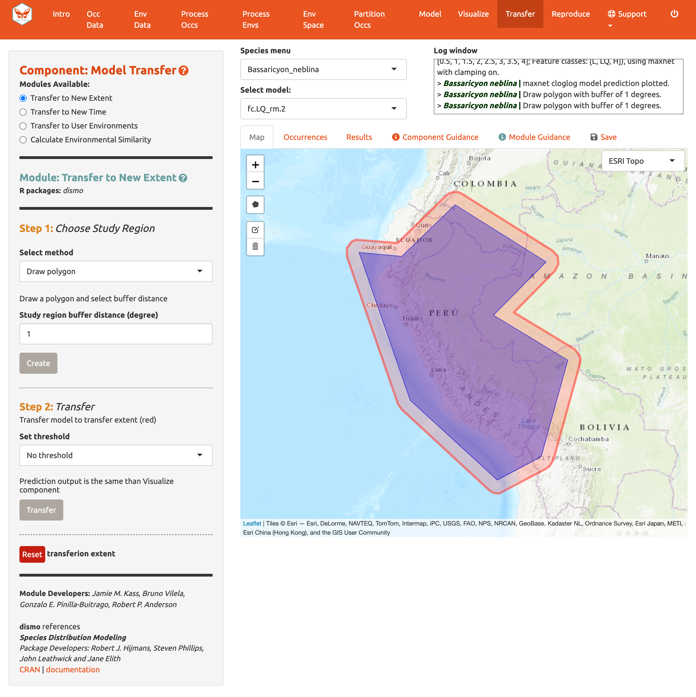
```

En el Paso 2, seleccione un umbral para hacer predicciones binarias o “no threshold” [sin umbral] para una predicción continua y haga clic en “Transfer”. Aquí, vemos una muy baja idoneidad para la mayor parte de Perú para el olinguito.  

Nota: Para remover el borde del polígono de la predicción, haga clic en el ícono de basura y “Clear all” [Limpiar todo].  

```{r, fig.align = 'center'}
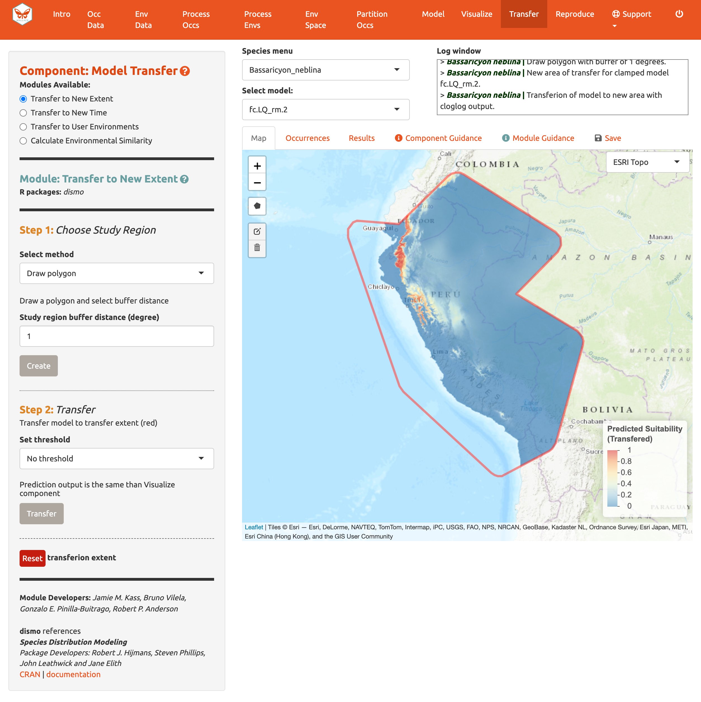
```

Si utilizó las variables de WorldClim o ecoClimate como variables ambientales, puede usar el módulo *Transfer to New Time* [Transferir a un nuevo periodo]. En el Paso 1, hay tres opciones para escoger una región de estudio: dibujar un polígono, usar la misma región del modelo, o cargar un polígono. En el Paso 2, usted tiene la opción de escoger WorldClim o Ecoclimate como fuente de las variables. Esta decisión depende de su selección inicial de variables ambientales en el **Componente: Env Data**. Para WorldClim, seleccione un periodo de tiempo, un modelo de circulación global (GCM por sus iniciales en inglés), una trayectoria de concentración representativa (RCP, por sus iniciales en inglés), y un umbral. Note que hay varios GCMs para escoger—estos representan diferentes esfuerzos para modelar el clima futuro. No todos los GCMs tienen datos en forma ráster para todos los RCPs. Vea el texto guía de este módulo para saber más sobre RCPs y GCMs. Nota: algunas bases de datos han retirado los RCPs y los han reemplazado con Trayectorias Socioeconómicas Compartidas (SSPs, por sus iniciales en inglés), entonces tenga en cuenta que en la literatura puede encontrar terminología relacionada a los SSPs en vez de los RCPs. Para ecoClimate, puede seleccionar un Modelo de Circulación General Atmosférico Oceánico (AOGCM, por sus iniciales en inglés), escenario temporal y umbral. 

El tercer módulo, *Transfer to User Environments* [Transferir a ambientes de usuario], le da a los usuarios la opción de proyectar su modelo a sus propias variables ambientales cargadas.  El primer paso es el mismo que el anterior (seleccionar la región de estudio), pero en el segundo paso los usuarios pueden cargar rásteres de un solo formato (.tif, .asc) para usar como nuevos datos para la proyección del modelo. Los rásteres deben tener la misma extensión y resolución (tamaño del píxel), y los nombres de los archivos deben corresponder a los de las variables ambientales usadas para el modelado. Para ayudarlo, hay un mensaje  “Your files must be named as: ...” [Sus archivos deben estar nombrados así: ...] indicando los nombres correctos a usar para los archivos.

Vamos a saltarnos los módulos *Transfer to New Time* [Transferir a nuevo periodo] y *Transfer to User Environments* [Transferir a ambientes de usuario] y pasar a *Calculate Environmental Similarity* [Calcular similitud ambiental].  

Al transferir un modelo, pueden existir áreas dentro de nuestro nuevo rango de valores que tienen alta incertidumbre porque son muy diferentes de los valores usados para construir el modelo. Para visualizar estas áreas, podemos usar el cuarto módulo, *Calculate Environmental Similarity*, [Calcular similitud ambiental] para graficar un mapa de MESS. Esta es una superficie de similitud ambiental multivariada (las siglas por sus iniciales en inglés: (M)ultivariate (E)nvironmental (S)imilarity (S)urface), y el mapa muestra en una escala continua las diferencias ambientales con los datos de entrenamiento usados para construir el modelo, donde valores más positivos son más similares (azul) y valores más negativos son más diferentes (rojo); por favor lea el texto guía de este módulo para más detalles. Podemos ver que los valores climáticos del futuro a grandes elevaciones son más similares a nuestros datos de entrenamiento que los de elevaciones bajas hacia la costa. Podemos interpretar que la idoneidad predicha en estas últimas tiene una incertidumbre más alta.  

```{r, fig.align = 'center'}
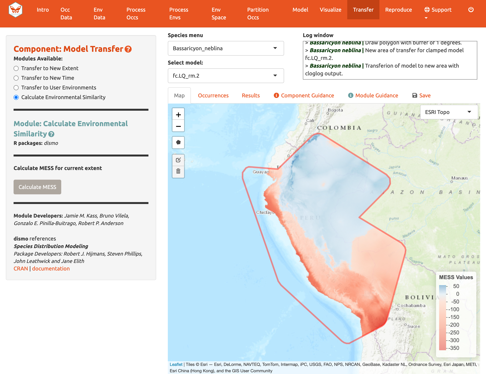
```

# <a id="Reprod"></a>Reproducir

Una gran ventaja de *Wallace* es la reproducibilidad. La primera opción dentro de este componente es la de descargar el código para ejecutar el análisis. Mientras estábamos usando *Wallace*, un código de `R` se ha estado ejecutando en el fondo, evidenciado por los mensajes que han aparecido en la consola de `R`. Esta opción le permite descargar una versión simplificada de este código como un script condensado y anotado de `R`. Este script sirve como documentación para el análisis y puede ser compartido. También se puede ejecutar para reproducir los análisis, o editar para cambiar algunos aspectos. El script puede ser descargado en diferentes formatos pero el R Markdown (.Rmd), es un formato conveniente para combinar código fuente de `R` y textos de anotación y, se puede ejecutar directamente en R. Para descargas en .pdf, el programa TeX debe estar instalado en su sistema. Por favor vea el texto en esta página para más detalles.  

Para descargar el script, seleccione Rmd y haga clic en Download [Descargar]. 

```{r, fig.align = 'center'}
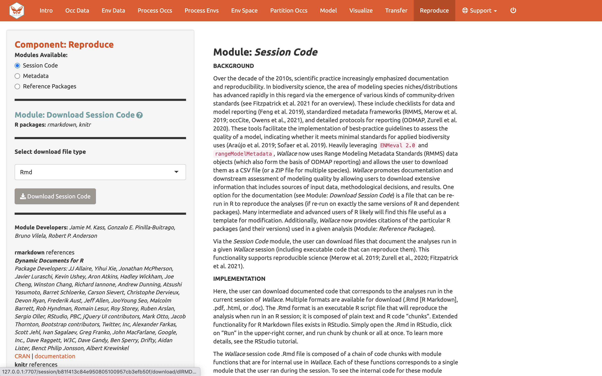
```

Ahora, debe tener un archivo .Rmd que contiene todo su análisis. Los módulos de Wallace son indicados como encabezados y marcados con los símbolos **\###**.

```{r, out.width="50%", fig.align = 'center'}
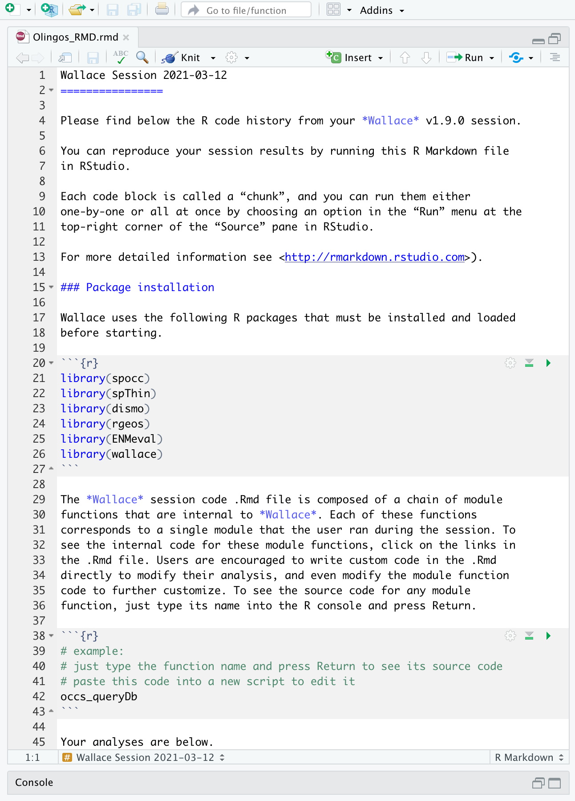
```

Tal vez quiera abrir una nueva ventana de `R` e intentar ejecutar una parte de este código. Recuerde que varias secciones de este código son dependientes de las primeras secciones, entonces puede que no ejecuten si se adelanta . Note que cualquier análisis del componente **Env Space** aparecerá al final del archivo. También recuerde que si cierra su sesión de *Wallace* perderá su progreso en el explorador web (pero su archivo .RMD no se verá afectado). Si usa RStudio, puede abrir este Rmd y hacer clic en **knit** [tejer] para compilar el flujo de trabajo en un archivo html que puede compartir.  

También puede descargar los Metadatos. *Wallace* genera y provee varios tipos de objetos de metadatos que facilitan la documentación y reproducibilidad registrando las decisiones metodológicas del usuario (p. ej., configuración de parámetros) y los guarda en un objeto “Range Model Metadata Standards” [Estándar de metadatos de modelos de rango]. Esto será descargado en un archivo comprimido (.zip) y contiene un archivo CSV(.csv) para cada especie. 

```{r, fig.align = 'center'}
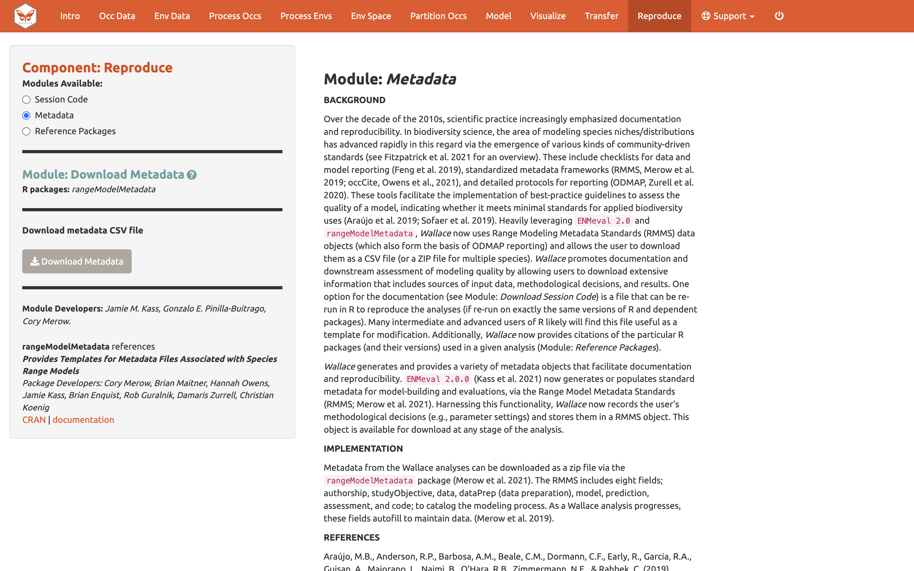
```

```{r, fig.align = 'center'}
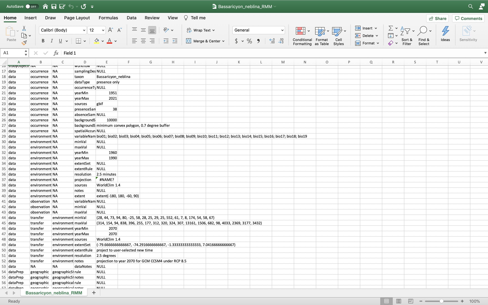
```

El último módulo disponible en el componente **Reproduce** [Reproducir] es *Reference packages* [Referenciar paquetes]. Aquí, puede descargar las citas para todos los paquetes de `R` utilizados en el análisis. Para darle crédito a las personas por los paquetes que hacen posible el funcionamiento de *Wallace* (y para documentar sus análisis correctamente), es crítico citar los paquetes y versiones. Recuerde, Wallace es modular y su objetivo es facilitar el acceso y uso de muchos paquetes de `R` que son producidos por la comunidad de investigadores en biogeografía. Por favor promueva esto citando los paquetes… ¡y piense en la posibilidad de crear uno propio y añadirlo a una futura versión de *Wallace* algún día!  

```{r, fig.align = 'center'}
knitr::include_graphics("vignette_img/reprod_3a.png")
```

```{r, fig.align = 'center'}
knitr::include_graphics("vignette_img/reprod_3b.png")
```

# <a id="Con"></a>Conclusión

Actualmente estamos trabajando con varios socios en nuevas adiciones, así que manténgase conectado para futuras versiones de *Wallace*. Hasta entonces, siempre puede trabajar en `R` después de la sesión modificando el .Rmd y construyendo sobre los análisis.  

Gracias por seguir el tutorial de *Wallace v2*. Esperamos que haya aprendido más sobre la aplicación actualizada, sus características, y el modelado de las distribuciones de especies y nichos en general. No nos gusta ser repetitivos, pero realmente lo alentamos a leer el texto guía, buscar las publicaciones recomendadas y ojalá dejar que estas lo lleven a otras publicaciones relevantes para más información. También, recuerde discutir estos tópicos con sus pares.  

Lo invitamos a unirse al <a href="https://groups.google.com/g/wallaceecomod" target="_blank">grupo de Google de Wallace</a>--nos encantaría escuchar sus opiniones y sugerencias sobre cómo hacer a Wallace mejor para todos los usuarios. Los miembros pueden publicar para toda la comunidad y recibir anuncios de actualizaciones. 
Si usted encuentra un problema con el software, puede reportarlo en la página de problemas de <a href="https://github.com/wallaceEcoMod/wallace/issues" target="_blank">GitHub</a> o usando el formato de <a href="https://forms.gle/UffoBCQnMZjWYjfk9" target="_blank">reporte</a>.  

# <a id="Ack"></a>Agradecimientos

*Wallace* fue reconocido como finalista en el Ebbe Nielsen Challenge of the Global Biodiversity Information Facility (GBIF) del 2015, y recibió fondos del premio. Este material está basado en trabajo apoyado por la National Science Foundation números de becas DBI-1661510 (RPA; Robert P. Anderson), DBI-1650241 (RPA), DEB-1119915 (RPA), DEB-1046328 (MEA; Matthew E. Aiello-Lammens), DBI-1401312 (RM; Robert Muscarella), y fondos de la National Aeronautics and Space Administration beca 80NSSC18K0406 (MEB; Mary E. Blair). Cualquier opinión, conclusiones o recomendaciones expresadas en este material son las de los autores y no reflejan necesariamente las de NSF o NASA.

# <a id="Res"></a>Recursos (en inglés)

Sitio web de Wallace <https://wallaceecomod.github.io/>

ENM2020 W19T2 Online open access Ecological Niche Modeling Course by A.T. Peterson, summary of modeling, includes Walkthrough of Wallace V1  <https://www.youtube.com/watch?v=kWNyNd2X1uo&t=1226s>

Saber más sobre Olingos y el Olinguito  <https://www.ncbi.nlm.nih.gov/pmc/articles/PMC3760134/>

Gerstner et al. (2018). *Revised distributional estimates for the recently discovered olinguito (Bassaricyon neblina), with comments on natural and taxonomic history.* <https://doi.org/10.1093/jmammal/gyy012>

# <a id="Ref"></a>References

Phillips, S.J., Anderson, R.P., Dudík, M., Schapire, R.E., Blair, M.E. (2017). Opening the black box: an open-source release of Maxent. *Ecography*, 40(7), 887-893. <a href="https://doi.org/10.1111/ecog.03049" target="_blank">https://doi.org/10.1111/ecog.03049</a>

Helgen et al Helgen, K., Kays, R., Pinto, C., Schipper, J. & González-Maya, J.F. (2020). *Bassaricyon neblina* (amended version of 2016 assessment). The IUCN Red List of Threatened Species 2020: e.T48637280A166523067. <a href="https://www.iucnredlist.org/species/48637280/166523067" target="_blank">https://www.iucnredlist.org/species/48637280/166523067</a>

Helgen, K., Kays, R., Pinto, C. & Schipper, J. (2016). *Bassaricyon alleni*. The IUCN Red List of Threatened Species 2016: e.T48637566A45215534. <a href="https://www.iucnredlist.org/species/48637566/45215534" target="_blank">https://www.iucnredlist.org/species/48637566/45215534</a>

Hijmans, R.J., Cameron, S.E., Parra, J.L., Jones, P.G., Jarvis, A. (2005). Very high resolution interpolated climate surfaces for global land areas. *International Journal of Climatology*, 25(15), 1965-1978. <a href="https://doi.org/10.1002/joc.1276" target="_blank">https://doi.org/10.1002/joc.1276</a>

Lima-Ribeiro, M.S., Varela, S., González-Hernández, J., Oliveira, G., Diniz-Filho, J.A.F., Terribile, L.C. (2015). ecoClimate: a database of climate data from multiple models for past, present, and future for Macroecologists and Biogeographers. *Biodiversity Informatics* 10, 1-21. <a href="https://www.ecoclimate.org/" target="_blank">https://www.ecoclimate.org/</a>

GBIF.org (2022). GBIF Home Page. Available from: <https://www.gbif.org> [19 April 2022].

Aiello-Lammens M.E., Boria R.A., Radosavljevic A., Vilela B., Anderson R.P. (2015). spThin: an R package for spatial thinning of species occurrence records for use in ecological niche models. *Ecography*, 38(5), 541-545. <a href="https://doi.org/10.1111/ecog.01132" target="_blank">https://doi.org/10.1111/ecog.01132</a>

Gerstner, B.E., Kass, J.M., Kays, R., Helgen, K.M., Anderson, R.P. (2018). Revised distributional estimates for the recently discovered olinguito (*Bassaricyon neblina*), with comments on natural and taxonomic history. *Journal of Mammalogy*, 99(2,3), 321-332. <a href="https://doi.org/10.1093/jmammal/gyy012" target="_blank">https://doi.org/10.1093/jmammal/gyy012</a>

Kass, J., Muscarella, R., Galante, P.J., Bohl, C.L., Pinilla-Buitrago, G.E., Boria, R.A., Soley-Guardia, M., Anderson, R.P. (2021). ENMeval 2.0: Redesigned for customizable and reproducible modeling of species' niches and distributions. *Methods in Ecology and Evolution*, 12(9), 1602-1608. <a href="https://doi.org/10.1111/2041-210X.13628"target="_blank">https://doi.org/10.1111/2041-210X.13628</a>

Merow, C., Smith, M.J., Silander, J.A. (2013). A practical guide to MaxEnt for modeling species' distributions: What it does, and why inputs and settings matter. *Ecography*, 36(10), 1058-1069. <a href="https://doi.org/10.1111/j.1600-0587.2013.07872.x"target="_blank">https://doi.org/10.1111/j.1600-0587.2013.07872.x</a>
