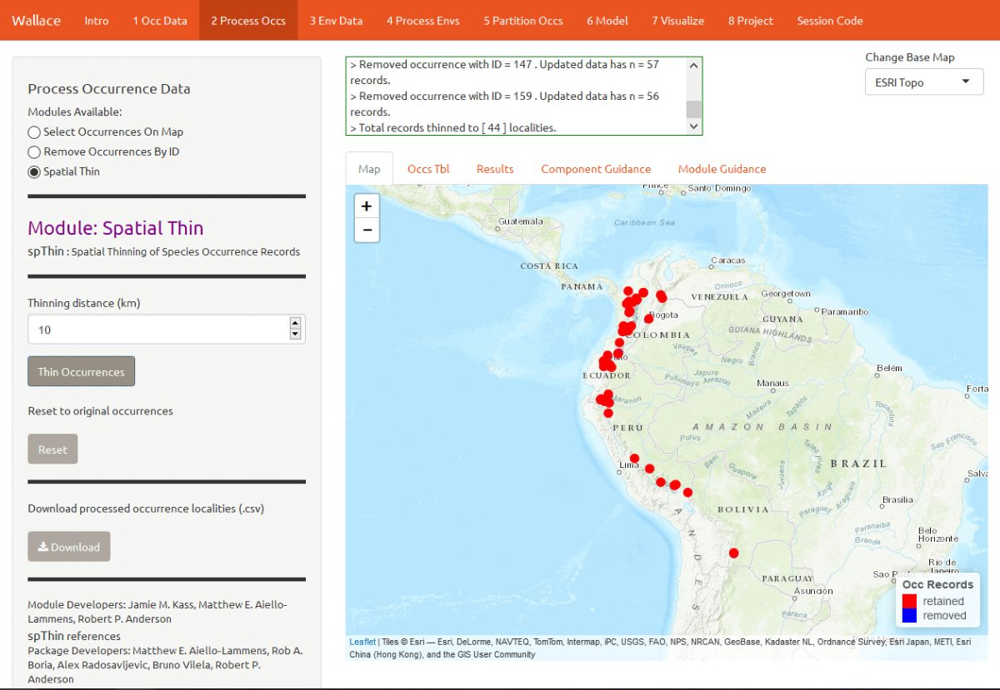
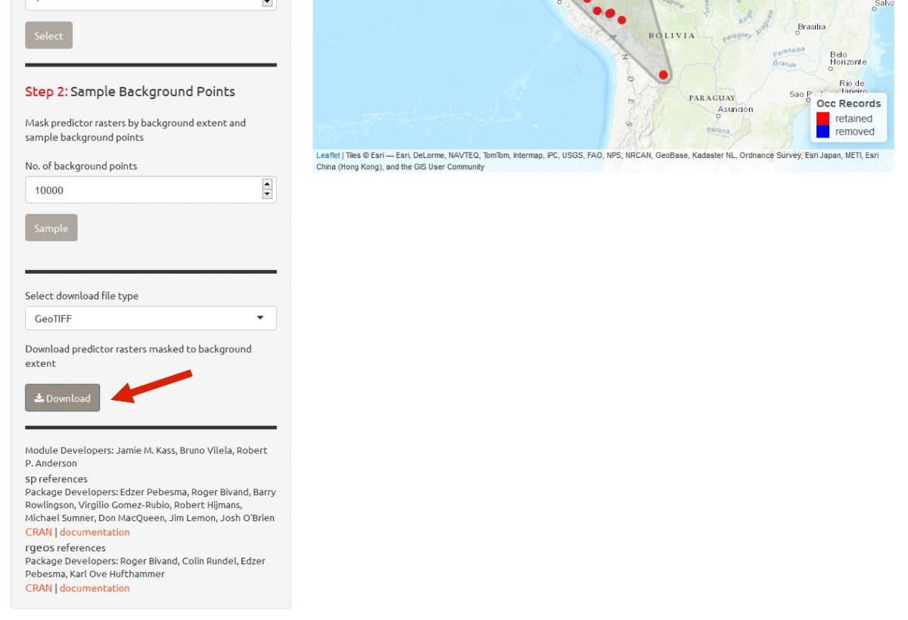

```{r setup, echo = FALSE, include=FALSE}
library(knitr)
knitr::opts_chunk$set(collapse=TRUE, message=FALSE, warning=FALSE, comment="#>",
                      out.width = "800px", echo = FALSE)
```

# Preface
This vignette was written for *Wallace* v. 1.0.5, so if you are using a different version, some things may not match up. Additionally, we anticipate that this vignette and any others in the `wallace` package will be updated regularly in accordance with ongoing development.

# Introduction
*Wallace* is an `R`-based GUI application for ecological modeling that currently focuses on building, evaluating, and visualizing models of species niches and distributions. We will refer to these models as species distribution models (SDMs), and we will not explain them at length here---as you read through, you will be pointed to some sources of detailed info within the application for reference.

*Wallace* has many qualities which we think make it a good example of next-generation scientific software: it's 1) open, 2) expandable, 3) flexible, 4) interactive, 5) instructive, and 6) reproducible. The application features a pannable/zoomable map and dynamic plots and tables. Data for the models can be downloaded from online databases or uploaded by the user. Most results can be downloaded, including the option to save R code that can reproduce your analysis. For more details, including on SDMs, please see our [publication](http://onlinelibrary.wiley.com/doi/10.1111/2041-210X.12945/full) in *Methods in Ecology and Evolution*. The citation is below:

Kass JM, Vilela B, Aiello-Lammens ME, Muscarella R, Merow C, Anderson RP. (2018). *Wallace*: A flexible platform for reproducible modeling of species niches and distributions built for community expansion. *Methods in Ecology and Evolution*. 9:1151-1156. https://doi-org.ezproxy.gc.cuny.edu/10.1111/2041-210X.12945

The *Wallace* project's [main page](https://wallaceecomod.github.io/) has links to the [Google Group](https://groups.google.com/forum/#!forum/wallaceecomod), the official [email](mailto:wallaceecomod@gmail.com), the [CRAN page](https://CRAN.R-project.org/package=wallace) hosting the stable version, and the [Github development page](https://github.com/wallaceEcoMod/wallace).

# Setup
For `wallace` to work, **you should be using the latest version of R** (or at least later than version 3.2.1). Download for
[Windows](https://cran.r-project.org/bin/windows/base/) or [Mac](https://cran.r-project.org/bin/macosx/).

Let's first install and load *Wallace*. Open either the base `R` software or RStudio and run the code below. It's the only code you'll have to run to use Wallace.
```{r, eval = FALSE, echo = TRUE}
# install the package
install.packages('wallace')
# load the package
library(wallace)
# run the app
run_wallace()
```

The *Wallace* GUI will open in your default web browser and the `R` console will be occupied. You can exit *Wallace* by hitting `Escape` while in the `R` console, or by closing the browser window. A note: if you close the browser window running *Wallace*, **your session will be over and all progress will be lost**.

```{r}
knitr::include_graphics("vignette_img/0_a_intro.jpg")
```

If you'd like to use the `R` console while running *Wallace*, open a terminal window (MacOS/Linux) or command prompt (Windows), initialize `R`, and then run the lines above. An example with Terminal in MacOS is below.

```{r}
knitr::include_graphics("vignette_img/0_b_intro.jpg")
```

Also, if you'd like to use Maxent in *Wallace*, please note the following. *Wallace* uses the `maxent()` function in the package `dismo`. This function requires the user to place the `maxent.jar` file in the `/java` directory of the `dismo` package root folder. You can download Maxent <a href="https://biodiversityinformatics.amnh.org/open_source/maxent/" target="_blank">here</a>, and locate `maxent.jar`, which is the Maxent program itself, in the downloaded folder. You can find the directory path to `dismo/java` by running `system.file('java', package="dismo")` at the R console. Simply copy `maxent.jar` and paste it into this folder. If you try to run Maxent in *Wallace* without the file in place, you will get a warning message in the log window that informs you what to do, but Maxent will not run. Also, if you have trouble installing `rJava` and making it work, there is a bit of troubleshooting on the *Wallace* Github repository <a href="https://github.com/wallaceEcoMod/wallace" target="_blank">README</a> that hopefully should help.

# Orientation
We'll begin with the "Obtain Occurrence Data" component, but first a little orientation. Please consult the schematic below showing the different parts of *Wallace*.

```{r}
knitr::include_graphics("vignette_img/0_c_intro.jpg")
```

You will notice tabs along the top of the *Wallace* interface: these are "components", which represent discrete steps of the analysis, and you will be stepping sequentially through them (*1*). First, click on "Occ Data". On the left side, there is a toolbar with all the user interface controls, like buttons, text inputs, etc. (*2*). You can see that the "module" called _**Query Database**_ is currently selected. "Modules" are discrete analysis options within each component, and can be contributed by other researchers. You'll see that another module exists for this component: _**User-specified Occurrences**_. This module lets you upload your own occurrence data. Try choosing this module instead and notice that the toolbar changes, then click back to _**Query Database**_. Within this toolbar, you can find the module name and the `R` packages it uses (*2a*) and the control panel for the selected module (*2b*).

On the right side is the visualization space (*3*), which has a log window (*3a*) and several tabs, including an interactive map, occurrence records table, results window, and guidance text windows for both the component and module levels (*3b*).

At this stage of the analysis, no results exist, and you have no data yet for the table, but you can view the guidance text now. This text was written by the developers to prepare users for each component and module *methodologically* (what the tools do) and *theoretically* (why we should use them). The guidance text also references scientific papers from the ecology literature for more detailed reading. Please get into the habit of consulting these before undertaking analyses, as they should give you a more solid foundation for moving forward.

# Obtain Occurrence Data

Begin by clicking on the guidance text first for the component **Obtain Occurrence Data**, and then for the modules. Let's read through these to get a better understanding of what is involved in obtaining occurrence data, and how *Wallace* implements it.

```{r}
knitr::include_graphics("vignette_img/1_a_occ_data.jpg")
```

```{r}
knitr::include_graphics("vignette_img/1_b_occ_data.jpg")
```

Now that we've educated ourselves, let's proceed to getting our occurrences. As an example, let's download occurrence records for *Tremarctos ornatus* (spectacled bear) from GBIF. This is a species of concern <a href="https://www.iucnredlist.org/species/22066/123792952" target="_blank">listed as "vulnerable" by the IUCN</a>, and has a range nicely delimited by the northern and central Andes mountains. Set the maximum number of occurrences to 200 and click the **Query Database** button. After the download is complete, notice the message in the log window. You searched for 200 records, but only found 66 records with coordinate information (latitude, longitude) that were not duplicates. If you wanted 200 or more records with this information that is crucial for SDMs, you could increase the maximum occurrences you search for and try again.

```{r}
knitr::include_graphics("vignette_img/1_c_occ_data.jpg")
```

Now click on the "Occs Tbl" tab to view more information on the records. The developers chose the fields that are displayed based on their general relevance to studies on species ranges. You can click the **Download** button to get a .csv file of these records, which has all the original database fields for every downloaded record (before any filtering).

```{r}
knitr::include_graphics("vignette_img/1_d_occ_data.jpg")
```

# Process Occurrence Data

The next component, **Process Occs**, gives you access to some data-cleaning tools. The data you downloaded is raw, and there will almost always be some erroneous points. Some basic knowledge of the species' range can help us remove the most obvious errors. We see that some occurrence points for *T. ornatus*, a South American species mostly occupying the Andes mountains, fall in California, Japan, and even off the coast of Africa and in the Antarctic. For databases like GBIF that accumulate lots of data from various sources, there are inevitably some dubious localities that may represent, for example, a museum location instead of the coordinates associated with the specimen, or have incorrect coordinates for some other reason. In order to eliminate these obviously erroneous records, select the points you want to keep for analysis by clicking on the module _**Select Occurrences On Map**_. Click on the polygon icon on the map and draw a polygon around the points found in South America.

```{r}
knitr::include_graphics("vignette_img/2_a_process_occs.jpg")
```

When you are done, click "Finish" on the polygon toolbar, then **Select Occurrences**. The map will zoom to the points you've selected.

```{r}
knitr::include_graphics("vignette_img/2_b_process_occs.jpg")
```

Alternatively, you can also remove occurrences by ID with the module _**Remove Occurrences by ID**_. *Tremarctos ornatus* typically inhabits mid- to high-elevation areas. By zooming in a bit, you can see that some occurrence points are in lowland areas and may have incorrect georeferences or fall beyond the species' accepted range. **Note**: for this vignette, we will disregard the possibility that these points represent true lowland sightings of *T. ornatus*, but for the purposes of research, these assumptions should not be made trivially and require investigation. To remove these points, click them to find their unique ID ("occID") and geographic coordinates, then enter the ID and click **Remove Occurrence** to remove it.

```{r}
knitr::include_graphics("vignette_img/2_c_process_occs.jpg")
```

Even after removing likely erroneous points, the points you have left may be clustered due to sampling bias. This often leads to artifactually inflated spatial autocorrelation, which can bias the environmental signal for the occurrence data that the model will attempt to fit. For example, there might be clustering of points near cities because the data are mostly from citizen scientists, and most citizen scientists live in and near cities. Or the points can cluster around roads because the field biologists who took the data were either making observations while driving or gained access to sites from these roads.

Let's click on the module _**Spatial Thin**_. This lets you attempt to reduce a presumed spatial bias by running a spatial thinning function on the points to make sure they're all a defined distance from one another. We will use 10 km as an example.

```{r}
knitr::include_graphics("vignette_img/2_d_process_occs.jpg")
```

We are now left with 44 points for our analysis (yours may be different). You can zoom in to see what the function did. Red points were retained, and blue points were removed. You can also download the processed occurrence dataset as .csv by clicking on the **Download** button.

```{r}

```

```{r}
knitr::include_graphics("vignette_img/2_f_process_occs.jpg")
```

# Obtain Environmental Data

Next, you will need to obtain environmental variables for your analysis. The values of the variables are extracted for our occurrence points, and this information is provided to the model. This data is in raster form, which simply means a big grid where each grid cell specifies a value. Rasters can be displayed as surfaces on maps (we'll see this later).

Click on the component "Env Data". The first module, _**WorldClim Bioclims**_, lets you download climatic data from [WorldClim](http://www.worldclim.org/), a global climate database of interpolated climate surfaces derived from weather station data at multiple resolutions. The coverage is better for areas with more weather stations (especially in developed countries), and more uncertainty exists in areas with fewer stations. The [bioclim](http://www.worldclim.org/bioclim) variables are summaries of temperature and precipitation that have been proposed to have general biological significance.

Choose the **2.5 arcmin** bioclim variable resolution and click the **Load Env Data** button. The first time you use *Wallace* these data are downloaded to your hard drive; after that they will simply be loaded from this local directory. Finer resolutions will take longer to download. The finest resolution data (**30 arcsec**) is served by tile, and thus the tile that corresponds to the map center will be downloaded. In addition to downloading the rasters, *Wallace* will also remove any occurrence points with no environmental values (i.e., points that did not overlap with the rasters). Notice the progress bar in the bottom-right corner.

```{r}
knitr::include_graphics("vignette_img/3_a_env_data.jpg")
```

After the rasters have loaded the "Results" tab will display some summary information about them (e.g. resolution, extent, cell number, etc.).

```{r}
knitr::include_graphics("vignette_img/3_b_env_data.jpg")
```

Note that you have the option to specify a subset of the total variables to use in the analysis.

```{r}
knitr::include_graphics("vignette_img/3_c_env_data.jpg")
```

# Process Environmental Data

Now you will need to choose the study extent for modeling. This will define the region from which "background" points are drawn for model fitting. Background points are meant to sample the total area available to the study species. Methods like Maxent are known as presence-background techniques because they compare the predictor variable values at background points to those at the occurrence points. In making decisions about the study extent, we want to avoid areas the species has historically been unable to move to---for example, regions beyond a barrier like a mountain range or large river that the species cannot traverse. If you include these areas, it may send a false signal to the model that these areas are not suitable. Please see the guidance text for more details.

You can explore the different options for delineating the study extent here. To begin, go to the module _**Select Study Region**_. There are two steps here: 1) choosing the shape of the study extent, and 2) sampling the background points. Under "Step 1", choose "Minimum convex polygon", and set the study region buffer distance to 1 degree. Click the **Select** button to plot this shape on the map.

```{r}
knitr::include_graphics("vignette_img/4_a_process_envs.jpg")
```

Next, complete "Step 2", which both clips the rasters by the study extent and samples the background points. Set the number of background points to 10,000 (bigger, more extensive, samples are better), and click the **Sample** button. Notice via the arrow the progress bar in the bottom-right corner.

```{r}
knitr::include_graphics("vignette_img/4_b_process_envs.jpg")
```

Click the **Download** button if you want a zip file of the clipped rasters.

```{r}

```

# Partition occurrences

We have not built any models yet, but before we do, we will make decisions on how to partition our data for evaluation. In order to determine the strength of the model's predictive ability, you theoretically need independent data to validate it. When no independent datasets exist, one solution is to partition your data into subsets that we assume are independent of each other, then sequentially build a model on all the subsets but one and evaluate this model on the left-out subset. This is known as *k*-fold cross-validation (where *k* is the total number of subsets), and it is quite prevalent in statistics, especially the fields of machine learning and data science. After this sequential model- building exercise is complete, *Wallace* summarizes (averages) the statistics over all of the partitions and then builds a model using **all** the data.

There's a whole literature on how to best partition data for modeling. One option is to simply partition randomly, but with spatial data we run the risk that the groups are not spatially independent of each other. An arguably better option is to partition using spatial blocking---for example, by drawing lines on a map to divide the data. Spatial partitioning with *k*-fold cross-validation forces the model to predict to regions that are distant from those used to train the model. For *Tremarctos ornatus*, environmental conditions in the Andes of Ecuador and southwestern Colombia may differ considerably from conditions in southern Peru. If the model has accurate predictions on average on withheld spatially partitioned data, it likely has good transferability, which means it can transfer well to new values of predictor variables (as distant areas are usually more environmentally different than close areas). Please refer to the guidance text for more details on all the types of partitioning offered in *Wallace*.

Here's an example of random *k*-fold, which randomly assigns each point to a partition group. Here, *k* = 4.

```{r}
knitr::include_graphics("vignette_img/5_a_partition_occs.jpg")
```

Here's an example of spatial blocking, which assigns each point to one of 4 spatially separate partition groups.

```{r}
knitr::include_graphics("vignette_img/5_b_partition_occs.jpg")
```

# Model

We are now ready to build a model. For this vignette, we'll use Maxent, a machine learning method that can fit a range of functions to patterns in the data, from simple (i.e. straight lines) to complex (i.e. curvy). For more details on Maxent, please consult the guidance text.

The example images show a more extensive modeling exercise, but in the interest of time, let's choose the following modeling options:

  - Select L, LQ, and H feature classes. These are the shapes that can be fit to the data:
    + L = Linear, e.g. temp + precip
    + Q = Quadratic, e.g. temp^2 + precip^2
    + H = Hinge, e.g. piecewise linear functions, like splines

  - Select regularization multipliers between 1-3 with a step value of 1.
    + Regularization is a way to reduce model complexity.
    + Higher values = smoother, less complex models. Basically, all predictor variable coefficients are shrunk progressively until some reach 0, when they drop out of the model. Only those variables with the greatest predictive contribution remain in the model.

The 3 feature class combinations (L, LQ, H) \* 3 regularization multipliers (1, 2, 3) = 9 models. The feature classes H will enable substantial complexity in the response, so it takes a bit longer to run than the simpler models.

```{r}
knitr::include_graphics("vignette_img/6_a_model.jpg")
```

The first time you run this, you may get an error message if the Maxent software is not in the `dismo` package folder. The `dismo` package is what *Wallace* uses to run Maxent through `R`. Fortunately, if this is the case, *Wallace* will notify you in the log window where you need to put the file (maxent.jar). This is due to the particular way `dismo` does things, and is out of our control. We are however working on alternative ways to approach this. Download the file via the link given and put it in the appropriate directory. Then click **Run** again.

The results appear in two tables of evaluation statistics, allowing comparison of the different models you just built. There should be 9 rows per table: one for each of the feature class / regularization multiplier combinations you selected (the images here will have more). In the first table, statistics from the models built from the 4 occurrence data partition groups are averaged---these are labeled with "test". In the second table, statistics from each of the 4 groups are displayed separately.

How do we choose the "best" model? There is a mountain of literature about this, and there is really no single answer. AUC and OR (omission rate) were calculated using our partitions, and AIC was instead calculated using the model prediction of the full calibration background extent (and all of the thinned occurrence points). Although AIC does not incorporate the cross-validation results, it does explicitly penalize model complexity---models with more parameters tend to have a worse AIC score. It's really up to the user to decide, and the guidance text has some references which should help you learn more.

For this vignette, we will use sequential criteria on cross-validation results. First, we will prioritize models that did not omit many of the occurrence points in the predicted area. Sort the results table by "or.10p.avg", or the 10 percentile training presence threshold applied to testing data (see guidance text for details). In our set of models, the model with the lowest or.10p.avg was H_1 (hinge features and regularization multiplier of 1).

```{r}
knitr::include_graphics("vignette_img/6_b_model.jpg")
```

If there had been a tie we could for example have chosen the model with the highest "auc.val.avg" (average test AUC), but in this case, model H_1 had the lowest OR. When we examine test AUC for this model, we see it is reasonably high relative to the other models.

```{r}
knitr::include_graphics("vignette_img/6_c_model.jpg")
```

You can also find the evaluation statistics for each individual partition in the table below, in comparison to the one above that only lists averages.

```{r}
knitr::include_graphics("vignette_img/6_d_model.jpg")
```

In our example, if we had chosen the model with the lowest AICc score, we would have ended up with H_3.5. Take a moment to find the model with the lowest AICc and compare it to the one you chose above.

# Visualize

The module "Maxent Evaluation Plots" enables users to evaluate the performance statistics across models. Below, see how regularization multiplier affects average test omission rate (using 10 percentile training presence threshold.)

```{r}
knitr::include_graphics("vignette_img/7_a_visualize.jpg")
```

We should also examine the **response curves**, which show how the predicted suitability (y-axis) changes based on different values of each variable (x-axis). If you want to see the results for a particular model, you can select it by using the dropdown menu under "Current Model". Below is one of the response curves for model H_1, mean temperature of the wettest quarter (bio8). The flat portion of the response curve indicates that suitability remains stable for lower temperatures, but above 20 degrees C (the WorldClim values are multiplied by 10, so 200 deg C on the x-axis is really 20 deg C), suitability for *T. ornatus* decreases sharply.  

```{r}
knitr::include_graphics("vignette_img/7_b_visualize.jpg")
```

You can also visualize model predictions on the map. Predictions of suitability can be continuous (a range of values) or binary (thresholded to just two values: 0 and 1). Please see the module guidance for information about Maxent model output scales and thresholding rules. Below is the mapped prediction for model H_1, no threshold. 

```{r}
knitr::include_graphics("vignette_img/7_c_visualize.jpg")
```

Below is the mapped prediction of the same model, this time with the threshold set to 10 percentile training presence. This is the stricter of the two thresholding rules currently available. Some of the occurrence points may fall outside the blue areas that represent suitable areas for *T. ornatus*. This thresholded prediction was used to calculate the 10 percentile training presence omission rate from the evaluation statistics. Try mapping the prediction with the threshold set to the less strict minimum training presence instead, and notice the difference.

```{r}
knitr::include_graphics("vignette_img/7_d_visualize.jpg")
```

# Project

Next, you can project the model to new locations and future climate scenarios (for years 2050 and 2070). "Projecting" simply means plugging in new environmental values to the model (i.e., those not used for model building) and getting a new response (i.e., suitability predictions for new variable ranges).

This is potentially confusing -- didn't the cross-validation step do this too? The cross-validation with spatial partitioning sequentially forced models to predict to new areas, and the evaluation statistics summarized their ability to transfer accurately. However, the final model that we used to make the predictions we are currently looking at was built with **all** the data (it did not exclude any partition groups). So the variable ranges associated with all of the background points in our dataset were used in the model-building process.

We are now taking this model and projecting it to variable ranges that were potentially never used in model-building. Thus, these values for different places and times might be completely new to our model, and could be so different that we may be uncertain in the accuracy of our projection. Please see the guidance text for details on these "non-analog conditions".

H_1 has a low omission rate (so it rarely fails to predict known occurrences) and a high average testing AUC (so it should have good transferability). Below, model H_1 has been projected to the year 2070 under a severe climate scenario: representative concentration pathway (RCP) 8.5. Notice also that there are several global circulation models (GCMs) to choose from---these all represent different efforts to model future climate. We used CCSM4 for this tutorial. See the module guidance text for more on RCPs and GCMs.

To project your model, draw a polygon using the draw toolbar and click "Finish". Then choose a year, GCM and RCP and click the **Project** button to build the new map. The rasters come from the WorldClim database, and not all GCMs have raster data for each RCP. Below is the continuous prediction. For our example, note that the northernmost suitable area in the present seems to be contracted southward, that suitability seems lower overall, and that it also becomes more confined to higher elevations.   

```{r}
knitr::include_graphics("vignette_img/8_a_project.jpg")
```

Below is the projection made binary by the 10 percentile training presence threshold. We can see some of these differences between present and future projection a bit more clearly now.

```{r}
knitr::include_graphics("vignette_img/8_b_project.jpg")
```

As we mentioned, there may be areas within our new ranges of values that have high uncertainty because they are very different from the values used in model-building. In order to visualize where these areas are, we can plot a MESS map. MESS stands for (M)ultivariate (E)nvironmental (S)imilarity (S)urface: please see the module guidance text for details. Below is the MESS for our projection. All the darker values correspond to areas similar to those used in model-building, while the lighter ones are much more different. We can see that future climate values at high elevation are similar, whereas those at lower elevations west towards the coast are very different in some places, especially in Colombia. We may therefore interpret that projected suitability in these areas has high uncertainty.

```{r}
knitr::include_graphics("vignette_img/8_c_project.jpg")
```

# Extracting the code

A major advantage of *Wallace* compared to other GUI-based software is that you can extract all the code used to run the analysis. While we were using *Wallace*, lots of `R` code has been running in the background. This option allows you to download a simplified version of all that code in the form of a condensed and annotated `R` script. You can use this script to rerun the analysis session, share it, or modify it. The script can be downloaded in several ways, but the **R Markdown** format, which is a convenient format for combining `R` code and text, can be run directly in `R`. For .pdf downloads, some version of TeX is necessary to be installed on your system. Please see the text on this page for more details.

To download the script, select Rmd and click Download.

```{r}
knitr::include_graphics("vignette_img/rmd_1.jpg")
```

Now, you should have an .Rmd file that contains your complete analysis. **R Markdown** files combine regular text with **code chunks**. Modules from *Wallace* are indicated as headers denoted by **###**. For a quick reference to Rmd syntax, see [here](https://www.rstudio.com/wp-content/uploads/2015/02/rmarkdown-cheatsheet.pdf)

```{r}
knitr::include_graphics("vignette_img/rmd_2.jpg")
```

You might want to open a new R window and try running some of this code. Remember that later sections of code may depend on things that were done earlier, so they may not all run if you skip ahead. Also remember that if you close your *Wallace* session you'll lose your progress in the web browser (but your .Rmd will be unaffected). If you use RStudio, you can open this Rmd and click **knit** to compile your workflow into a sharable html document.

Note that you can change anything you like in this code to build upon your workflow. We envision that future versions of *Wallace* will enable you to upload such modified .Rmds to *Wallace* to fill in all the options you chose and pick up where you left off in a previous analysis in the GUI.

Also, although we don't have anything built into *Wallace* for post-processing models in the present version, you can work in `R` after the session by modifying the .Rmd and build on the analysis. Examples of post-processing are stacking models to get estimates of species richness, or comparing models to estimate niche overlap. We are currently working with partners who specialize in this, and future versions of *Wallace* will likely include capabilities to engage in post-processing of models.


# Conclusion

Thus ends the *Wallace* vignette. We hope you learned more about the application, its features, and modeling of species distributions and niches in general. We hate to be repetitive, but we highly encourage you to read the guidance text, follow up on the recommended publications, and hopefully let those lead you to other relevant publications that can inform you further. 

Also, please reach out to us by email or through any of the websites mentioned in the Introduction. We'd love to hear your thoughts, opinions, or suggestions on how to make *Wallace* better for all users.


# Acknowledgments

*Wallace* was recognized as a finalist for the 2015 Ebbe Nielsen Challenge of the Global Biodiversity Information Facility (GBIF), and received prize funding.

This material is based upon work supported by the National Science Foundation under Grant Numbers DBI-1661510 (RPA), DBI-1650241 (RPA), DEB-1119915 (RPA), DEB-1046328 (MEA), and DBI-1401312 (RM). Any opinions, findings, and conclusions or recommendations expressed in this material are those of the author(s) and do not necessarily reflect the views of the National Science Foundation.

Additional sources of funding for JMK include a CUNY Science Scholarship and a CUNY Graduate Center Provost Digital Innovation Grant.

