```{r setup, echo = FALSE, include=FALSE}
library(knitr)
knitr::opts_chunk$set(collapse=TRUE, message=FALSE, warning=FALSE, comment="#>")
```

# Preface
This vignette and any others in the `wallace` package will be updated regularly in accordance with ongoing development. This vignette was written for *Wallace* v. 0.6.4, so if you are using a more updated version, some things will be different. We plan to update this vignette soon, and add more in the near future.

# Introduction
*Wallace* v1.0.0 is an `R`-based GUI application for modeling species niches and distributions, and evaluating the results. We will refer to these models as species distribution models (SDMs), and we will not explain them at length here: the purpose of this vignette is to show users how to use *Wallace*. As you read through, you will be pointed to some sources of detailed info within the application for reference.

*Wallace* has many qualities which we think make it a good example of next-generation scientific software: it's 1) open, 2) expandible, 3) flexible, 4) interactive, 5) instructive, and 6) reproducible. The application features an pannable/zoomable map and dynamic plots and tables. Data for the models can be download from online databases or uploaded by the user, and most results can be downloaded, including the option to save R code that can reproduce your analysis. For more details, including on SDMs, please see our publication here (will fill this in). 

The *Wallace* project has a main page [here](https://wallaceecomod.github.io/) that has links to the Google Group, the official [email](mailto:wallaceecomod@gmail.com), the [CRAN page](https://CRAN.R-project.org/package=wallace) hosting the stable version, and the [Github development page](https://github.com/wallaceEcoMod/wallace).

# Setup
For `wallace` to work, **you should be using the latest version of R** (or at least later than version 3.2.1). Download for 
[Windows](https://cran.r-project.org/bin/windows/base/) or [Mac](https://cran.r-project.org/bin/macosx/).

Let's first install and run *Wallace*. 
```{r, eval=FALSE}
# install the package
install.packages('wallace')
# load the package
library(wallace)
# run the app
run_wallace() 
```

The *Wallace* GUI will open in your web browser and the R command line will be occupied (you only get a prompt back by pushing 'escape'). If you'd like to use your typical R command line, open a terminal window, type `R` to start R, and then run the lines above in that window. This will tie up your terminal window but not your R command line (e.g. RStudio, or the R GUI). **You need to avoid exiting your browser window or closing the R window that initiated *Wallace* or you'll have to start over! Luckily that's pretty fast...** Using the terminal looks like this:  

```{r, out.width = "600px", echo = FALSE}
knitr::include_graphics("vignette_img/Wallace_Introb.png")
```

Typing `run_wallace()` will load *Wallace* in your web browser. 

```{r, out.width = "800px", echo = FALSE}
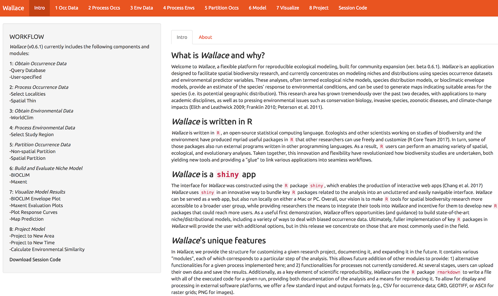
```

# Obtain Occurrence Data

You will notice tabs along the top: these are the "components", which represent discrete steps of the analysis, and we will be stepping sequentially through them. Let's click on the first one, called "Get Occs". On the left side, there is a control window where all the user interface controls are (buttons, text inputs, etc.). You can see we are currently using controls for the "module" called "Query Database". Modules are discrete analysis options within each component, and can be contributed by other researchers. You'll see that another module exists for this component: "User-specified Occurrences". This module lets you upload your own data. Try choosing this module instead by clicking on the radio button to select it, then click back to "Query Database".

On the right side is the interaction window, which has tabs repesenting the map, occurrence records table, results window, and guidance text windows for both the component and module levels. At this stage of the analysis, no results exist, and we have no data yet for the table, but you can at least view the guidance text now. This text was written by the developers to prepare users for each component and module both methodologically (what the tools do) and theoretically (why we should use them). The guidance text also references scientific papers from the ecology literature for more detailed reading. Please get into the habit of reading these before undertaking analyses, as they should give you a more solid foundation for moving forward.

Let's begin by downloading about 300 records of **Acer rubrum** (red maple) from GBIF. After the download is complete, notice the message in the log window, and click on the table tab to view more information on the records. The fields displayed were selected by the developers as those having most relevance to SDMs. The red arrow shows the button you can press to download a .csv file of these records, which has all the original database fields.

```{r, out.width = "800px", echo = FALSE}
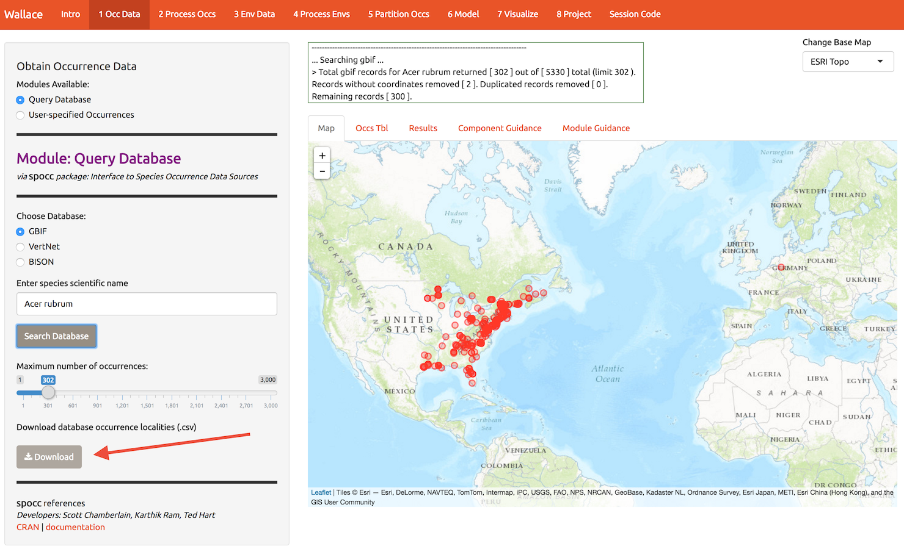
```

```{r, out.width = "800px", echo = FALSE}
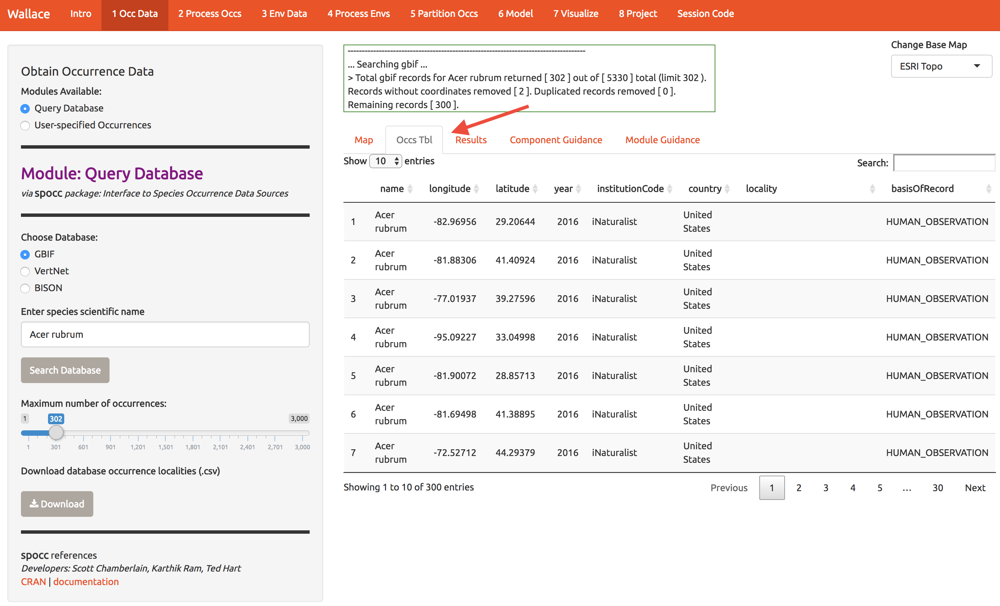
```

Let's also read the component and module guidance text by clicking on their tabs.

```{r, out.width = "800px", echo = FALSE}
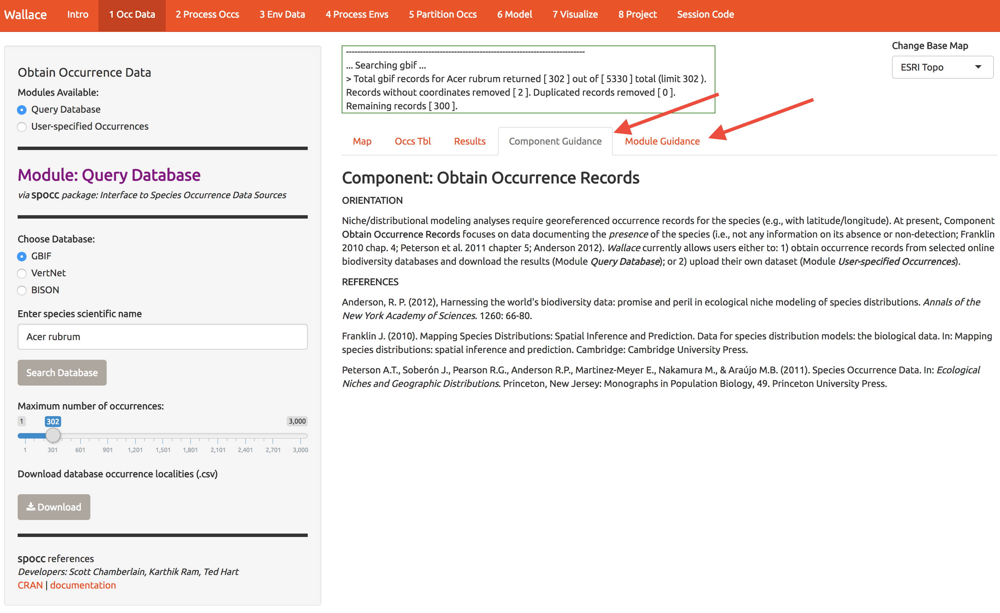
```

# Process Occurrence Data

Now let's clean the data a bit more in the next component "Process Occs". If we want to model the distribution of *A. rubrum* in the U.S., we can remove that odd point in Europe. Click the point to see its info and then enter the ID at the left to remove it.

```{r, out.width = "800px", echo = FALSE}
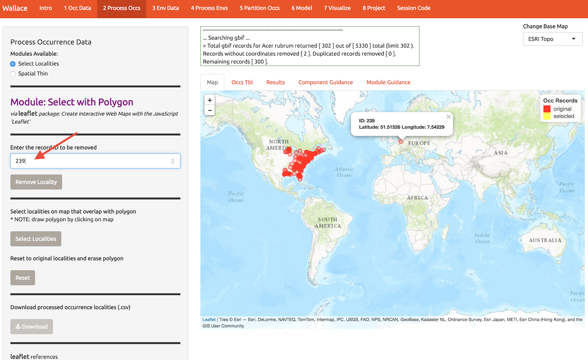
```

The samples may exhibit spatial autocorrelation, which is best to account for in the model or remove before modeling. For example, there might be a cluster of records near cities because these are mostly from iNaturalist (citizen science) and most citizen scientists live near cities. So let's spatially thin the points and make sure they're all at least 10 km from one another. That left us with 163 points for modeling (yours may be different).

```{r, out.width = "800px", echo = FALSE}
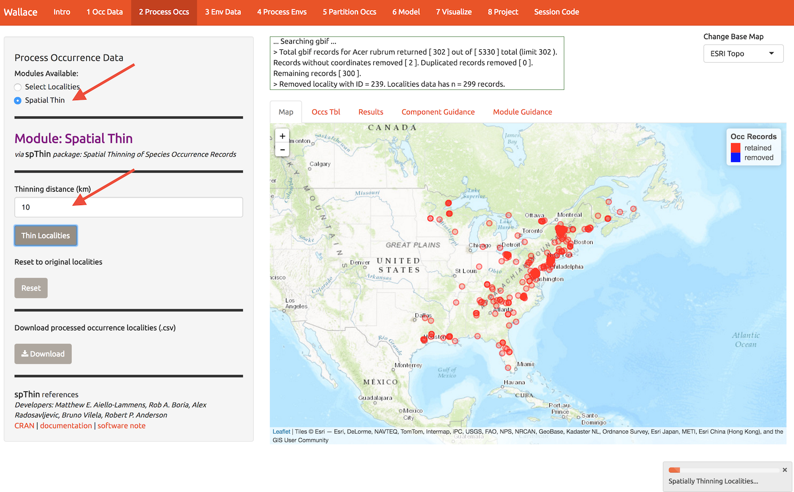
```

# Obtain Environmental Data

Now we need some variables for our model. Let's click on the component "Get Env Data". Worldclim is a global climate data base that is very popular because it is easily accessible at fine resolutions. The variables are based on interpolations of weather station data for temperature and precipitation, and the coverage is better for areas with more weather stations (basically, developed countries). The **bioclim** predictors are summaries of temperature and precipitation that have been determined to have some biological significance. They're all listed [here](http://www.worldclim.org/bioclim).

Let's choose the **10 arcmin** bioclimatic variables and press download. The first time you use *Wallace* these data are downloaded to your hard drive; after that they will simply be loaded from this local directory. Finer resolutions will take longer to download. 

```{r, out.width = "800px", echo = FALSE}
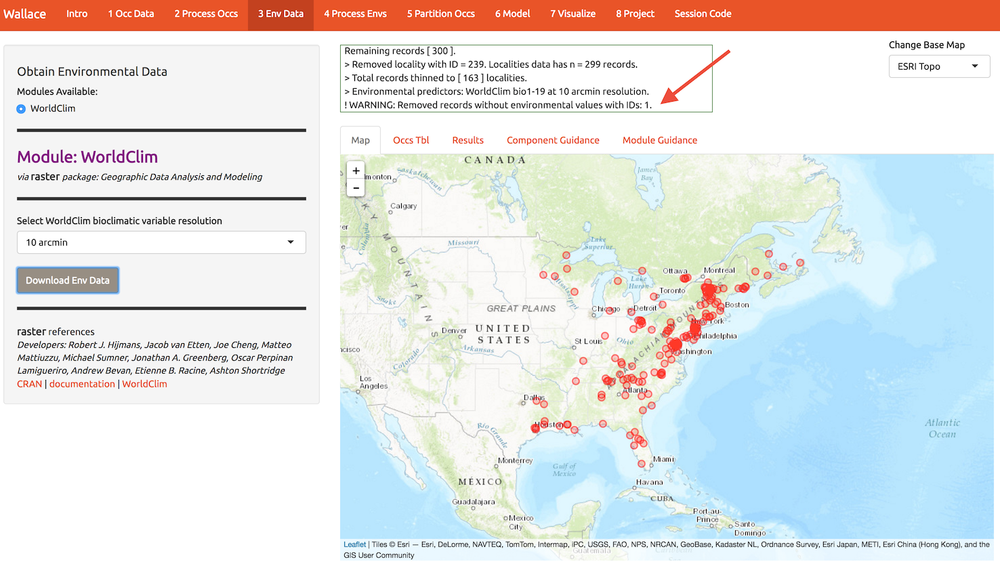
```

Notice that, for us, the log window notes that one point was discarded because environmental data were not available.

# Process Environmental Data

Now we need to choose the study extent for modeling. This simply means we have to define a region from which to draw "background" values for model fitting. Methods like Maxent are known as presence-background techniques because they compare the predictor variable values at background locations to those at the occurrence points. In making this decision, we want to try and avoid areas the species has historically been unable to move to, for example, regions beyond a barrier like a mountain range or large river that the species cannot traverse. If we were to include these areas, we'd be sending a false signal to the model that these areas are part of the "background" and thus not suitable -- they might be occupied if the species could move there. Please see the guidance text for more details.

We can explore the different options for delineating the study extent here. Press the **Mask** button to trim the environmental layers to this polygon.

```{r, out.width = "800px", echo = FALSE}
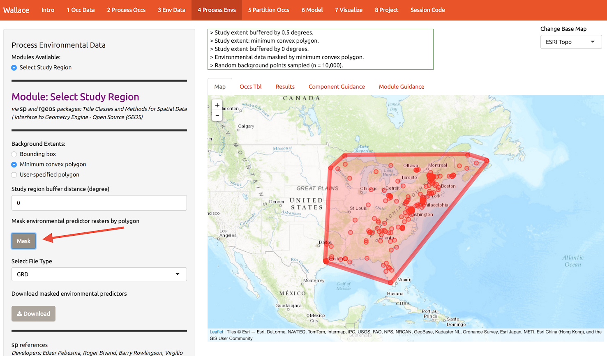
```

# Partition occurrences

In order to check whether you've built a model with strong predictive ability, you theoretically need independent data to validate it. When no independent datasets exist, one solution is to partition your data into subsets that we assume are independent of each other, then sequentially build a model on all the subsets but one and evaluate this model on the left-out subset. This is known as *k*-fold cross validation (where *k* is the total number of subsets), and it is quite prevalent in statistics, especially the field of machine learning. After this sequential modeling building exercise is complete, *Wallace* builds a model using **all** the data and summarizes the statistics for all the partitions.

There's a whole literature on how to best partition data for modeling. One option is to simply partition randomly, but with spatial data we run the risk that the groups are not spatially independent of each other. An arguably better option is to partition using spatial blocking -- for example, by drawing lines on a map to divide the data. Spatial partitioning with *k*-fold cross validation forces the model to predict to regions that are distant from those used to train the model. If the model has accurate predictions on average, we can determine that the model likely has good transferability, as it can transfer well to new values of predictor variables (as distant areas are usually more environmentally different than close areas). Please refer to the guidance text for more details on all the types of partitioning offered in *Wallace*.

Below, we show some options for spatial partitioning.

```{r, out.width = "800px", echo = FALSE}
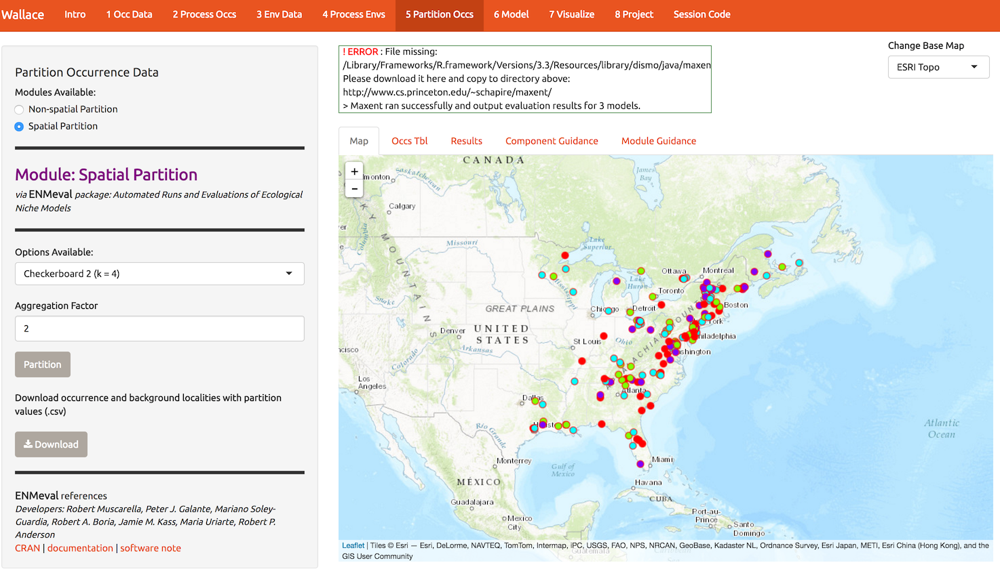
```

Take a moment to scroll through the log window at the top of the screen and review all the steps you've taken so far.

# Model

Let's now finally build a Maxent model. Maxent is a machine learning method that can fit complex (i.e. curvy) functions to patterns in the data. If you construct it with particular settings it can also become very similar to a generalized linear model (GLM). Thus, Maxent can conver a wide spectrum of complexity. For more details, please consult the guidance text.

Below, we've chosen some modeling options:

  - Select LQH features. These are the shapes that can be fit to the data: 
    + L = Linear, e.g. temp + precip
    + Q = Quadratic, e.g. temp^2 + precip^2
    + P = Product, e.g. interaction terms of the form temp*precip
    + H = Hinge, e.g. piecewise linear functions, like splines
    
Hinge features can fit all possible slopes between two data points, enabling a very flexible function, similar to a generalized additive model (GAM).

```{r, out.width = "800px", echo = FALSE}
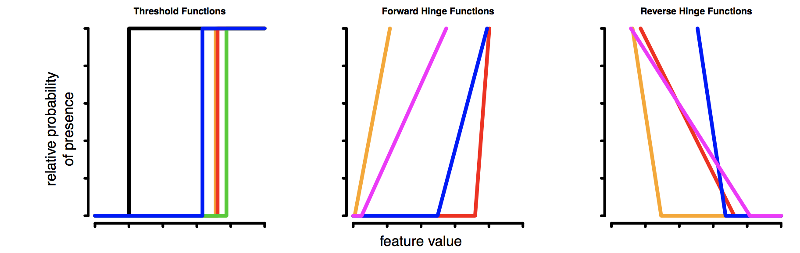
```

  - Select regularization multipliers between 1-3
    + Regularization is a way to reduce model complexity.
    + Higher values = smoother, less complex models. Basically, all predictor variable coefficients are shrunk progressively until some reach 0, when they drop out of the model. Only those variables with the greatest predictive contribution remain in the model.
  - RM Step Value = 1
    + This represents how large of step to take between values in the slide bar above.

The modeling takes about 2 minutes. We're building 1 feature class combination \* 3 regularization multipliers \* 4 data partitions = 12 models. Further, LQH will enable significant complexity in the response, which takes a bit longer than simpler models.

```{r, out.width = "800px", echo = FALSE}
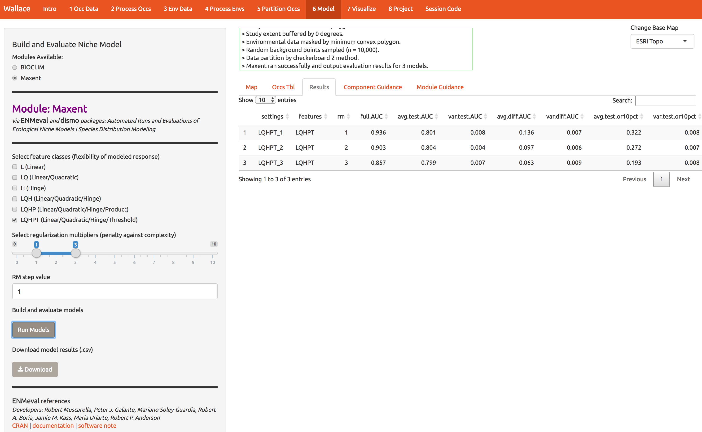
```

Notice that the first time we ran this we got an error, which you may get too. You need to put the maxent software (maxent.jar) in the directory where *Wallace* will look for it. This is due to the particular way the R package `dismo` was constructed, and out of our control. We are however working on alternative ways to approach this. As the log window indicates, download the file and put it in the appropriate directory. Then click **Run Models** again. 

The result is a table of evaluation statistics, courtesy of R package `ENMeval`, to compare the different models you just built. There should be 3 rows: one for each of the regularization multipliers. The statistics from the 4 models from our partitions were averaged -- these are labeled with "test". 

How do we choose the "best" model? There is a mountain of literature about this, and there is really no concrete answer. AUC and OR (omission rate) were calculated using our spatial partitions, and AIC was instead calculated using the model prediction of our background extent. Although AIC does not incorporate the cross validation results, it does explicitly penalize model complexity -- models with more parameters have a worse AIC score. It's really up to the user to decide, and the guidance text has some references which should help you learn more.

For illustrative purposes, we want to maximize transferability, and will choose the model with regularization mulitiplier 2. This model has the highest average testing AUC at 0.804 (note: current image is incorrect and will be fixed with next version).

```{r, out.width = "800px", echo = FALSE}
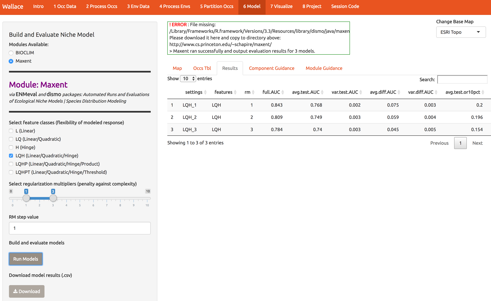
```

# Visualize
Now let's plot the performance statistics across models. Please explore the options a bit.

```{r, out.width = "800px", echo = FALSE}
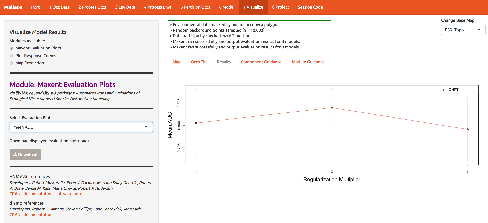
```

To evaluate whether the model makes biological sense, we can look at **response curves** that define how each predictor (x-axis) relates to suitability (y-axis). The shape of the response seems reasonable -- there are places where the temperature range is both too wide and too narrow for *A. rubrum*. The jagged parts intuitively seem like overfitting. Why would a species, over an evolutionary time span, have an abrupt dip in response to temperature range (as seen around 430)? (Note that the units are degrees C x 100; WorldClim serves the files this way to compress them.)

Below is the response curve for annual temperature range (bio7).

```{r, out.width = "800px", echo = FALSE}
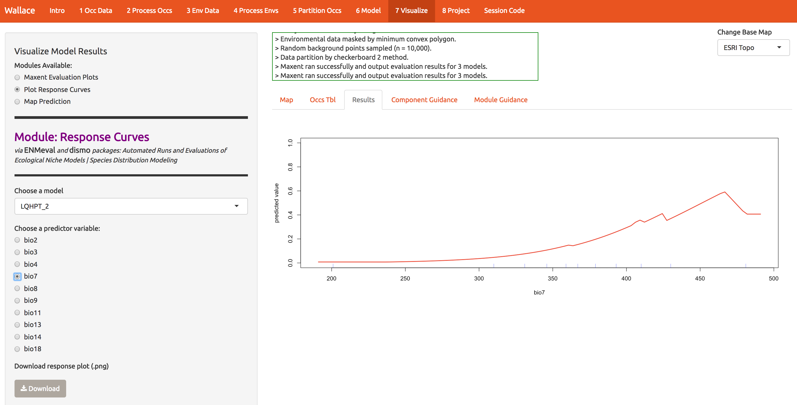
```

We can also map the predictions. At first glance it looks like a good model because the presence points correspond to regions of higher suitability. Also, as we chose a model with relatively good transferability, we can be more confident we have avoiding overfitting to some extent.

```{r, out.width = "800px", echo = FALSE}
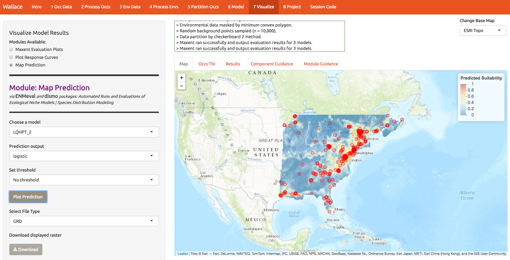
```

# Project

Next, we can evaluate the model's ability to project first to new locations (extending the domain) and new times (2070). "Projecting" simply means plugging in new values to our mathematical model and getting a new response. Think of it like drawing some new range on our response curves and finding the resulting suitability. This could possibly be outside the range we saw previously, and the lines would need to be extended (unless clamping is chosen -- see guidance text).

This is potentially confusing -- didn't the cross validation step do this too? The cross validation with spatial partitioning step sequentially forced models to predict to new areas, and the average testing AUC summarized their ability to transfer accurately. However, the model we selected was built with **all** the data. We are now taking this model and projecting it to predictor variable value ranges that were potentially never used in model training. Thus, these values for different places and times might be completely new to our model, and could be so different that we may be uncertain in the accuracy of our projection. Please see the guidance text for more details. 

First, let's draw a polygon like the one below. Next, press `Select` and then `Project` to build the new map.

```{r, out.width = "800px", echo = FALSE}
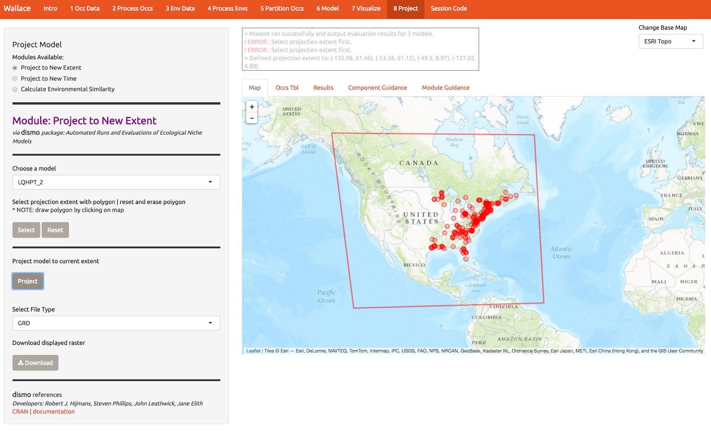
```

Below are the predictions to a much larger region. It looks like northern Canada should get ready for a red maple invasion... So it appears we've fit a response that doesn't generalize well to other regions. Although we tried to maximize transferability, the spatial partitions did not capture variable ranges that were wide enough to include those in northern Canada. This is not a failure in the analysis -- it's just the reality of uncertainty in modeling. 

One way to determine how that happened is to look back at the response curves to see which variables are contributing to high suitability in northern Canada. We could also construct MESS plots to see where the areas are that are most different from those used to train the model (will add with next version). Please see the guidance text for details.

We can also project to future climate scenarios. Select the options as below and forecast the future range of *A. rubrum* under an extreme climate change scenario.

```{r, out.width = "800px", echo = FALSE}
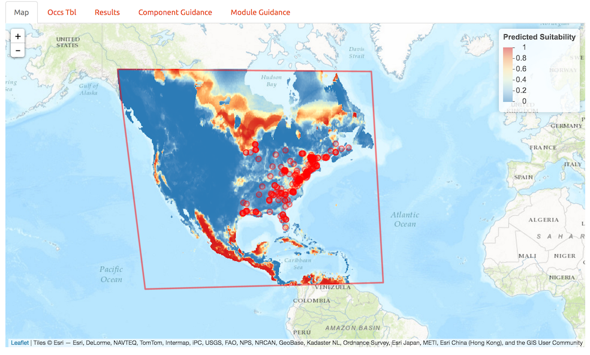
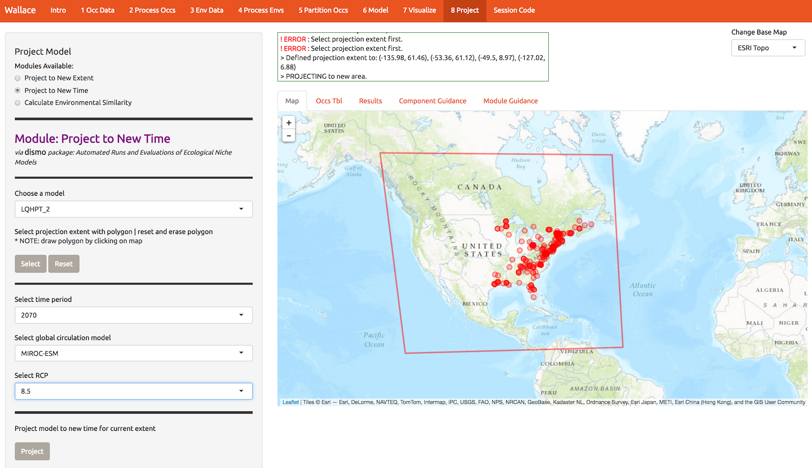
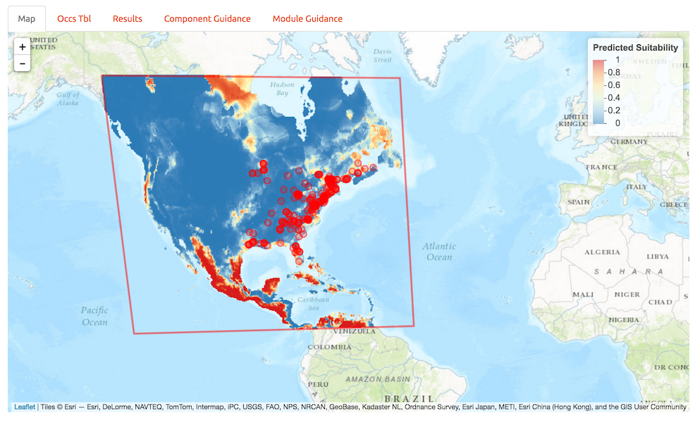
```

# Extracting the code

A major advantage of *Wallace* compared to other GUI-based software is that you can extract all the code used to run the analysis. This allows you to rerun the analysis session, share it, or modify it. The code can be downloaded in several ways, but the **R Markdown** format, which is a convienient format for combining R code and text, can be run directly in R. For .pdf downloads, some version of TeX is necessary. Please see the text on this page for more details.

To download the code, select Rmd and click Download.

```{r, out.width = "800px", echo = FALSE}
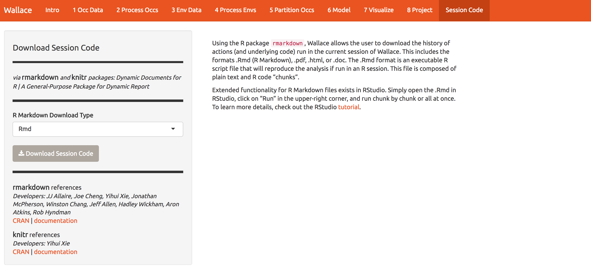
```

Now, you should have an .Rmd file that contains your complete analysis. Rmd files combine regular text with **code chunks**, shown by the red arrow below. Modules from *Wallace* are indicated as headers denoted by **###**. For a quick reference to Rmd syntax, see [here](https://www.rstudio.com/wp-content/uploads/2015/02/rmarkdown-cheatsheet.pdf)

```{r, out.width = "800px", echo = FALSE}
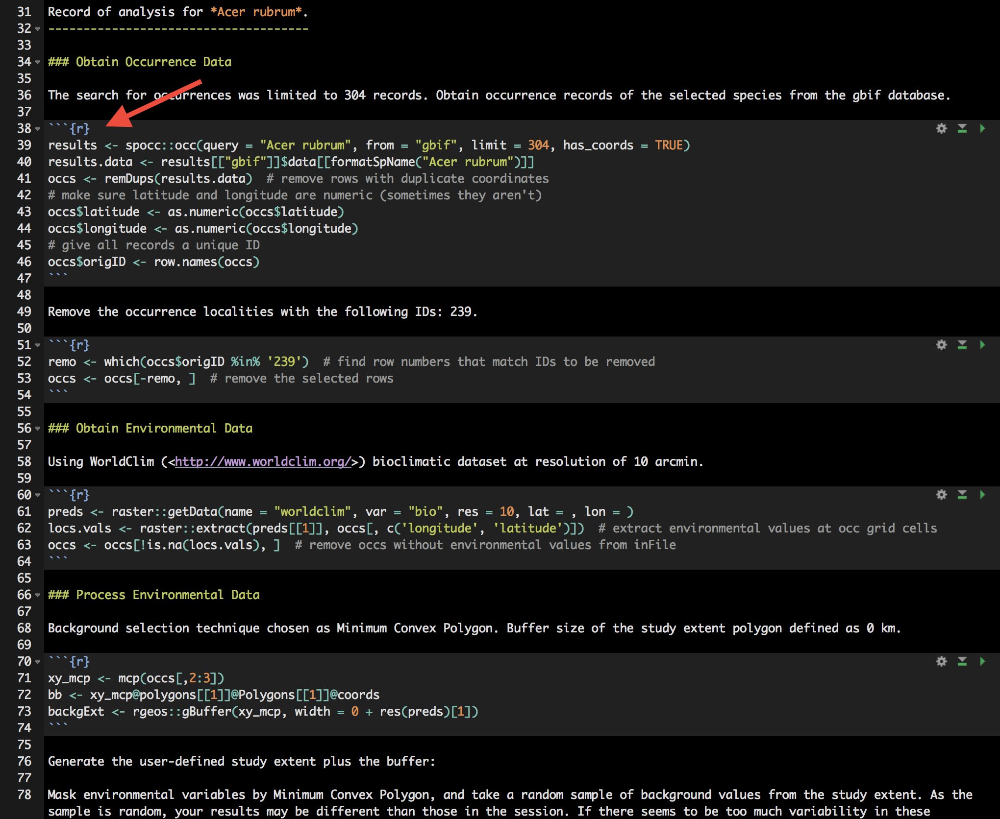
```

You might want to open a new R window and try running some of this code. Just note that if you close your *Wallace* session you'll lose your progress in the web browser (but your Rmd will be unaffected). If you use RStudio, you can open this Rmd and click **knit** to compile your workflow into a sharable html document. 

Note that you can change anything you like in this code to build upon your workflow. We envision that future versions of *Wallace* will enable you to upload such modified Rmds to *Wallace* to fill in all the options you chose and pick up where you left off in a previous analysis in the GUI.

At the moment we don't have anything built into *Wallace* for post-processing, so you can use R directly to build from the code created above.

# Improving the model

Let's revisit that uncertain prediction into northern Canada. This issue derived from a poor choice of modeling domain and an overfit model. Try rerunning the analysis by extending the domain to include many locations where the species does not occur (see below) and using a simpler model that includes only linear and quadtratic features.

```{r, out.width = "800px", echo = FALSE}
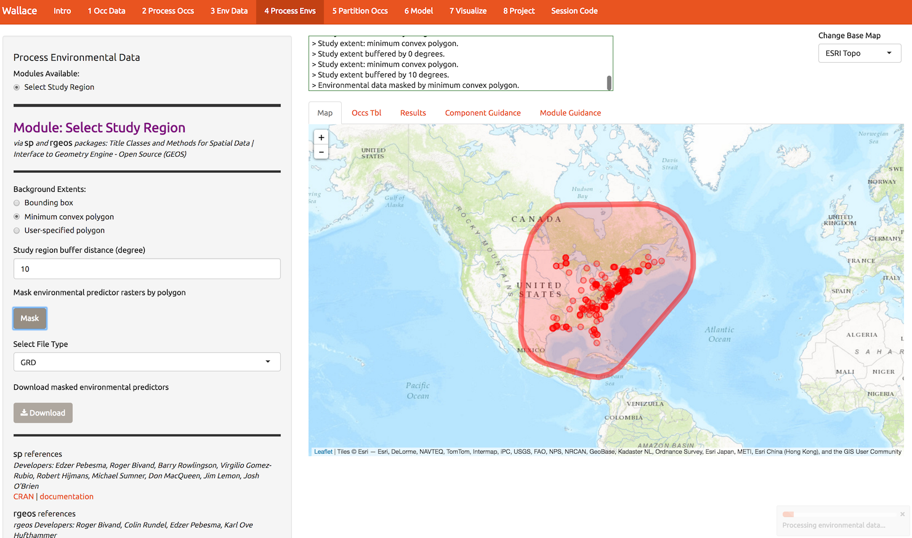
```

Here are the improved predictions that avoid prediction in northern Canada.

```{r, out.width = "800px", echo = FALSE}
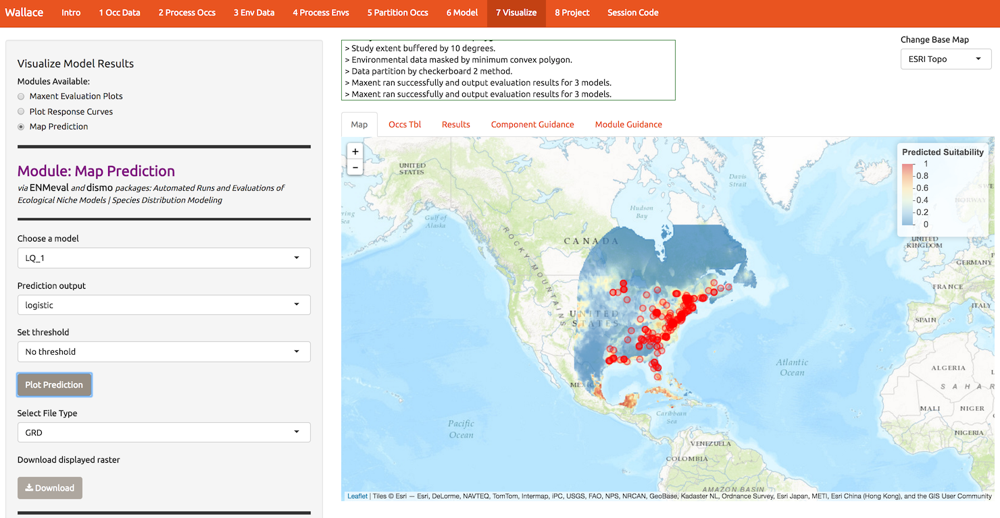
```
