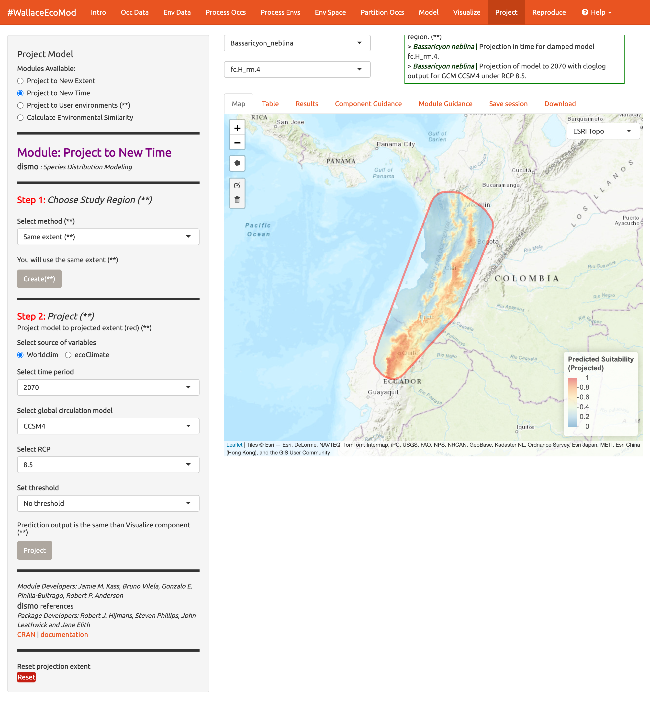
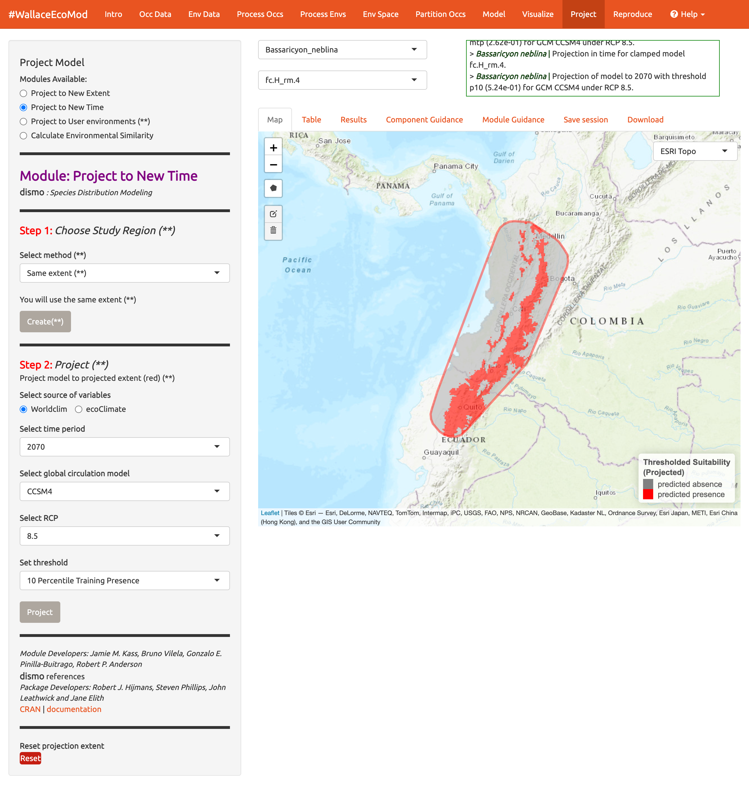
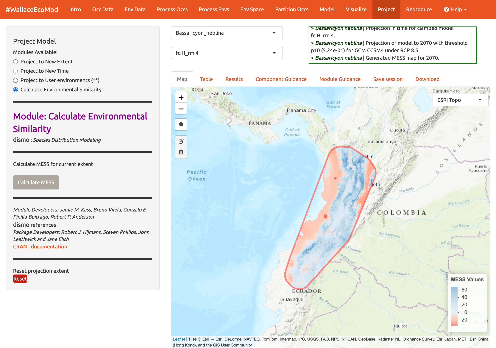

```{r setup, echo = FALSE, include=FALSE}
library(knitr)
knitr::opts_chunk$set(collapse=TRUE, message=FALSE, warning=FALSE, comment="#>",
                      out.width = "800px", echo = FALSE)
```

```{r, out.width="25%", fig.align='center'}
knitr::include_graphics("vignette_img/logo.png")
```

# Preface

Welcome to the *Wallace EcoMod v2.0* vignette. This vignette was written specifically for v2.0, so if you are using a different version, some things may not match up. Click <a href="https://wallaceecomod.github.io/vignettes/wallace_vignette.html" target="_blank">here</a> for the v1.0 vignette.  
Additionally, we anticipate that this vignette and any others in the `wallace` package will be updated regularly in accordance with ongoing development. 

### Outline
>
[Introduction](#Intro)\
[Setup](#Setup)\
[Orientation](#Orientation)\
[Obtain Occurrence Data](#Occ)\
[Obtain Environmental Data](#Env)\
[Process Occurrence Data](#Proc)\
[Process Environmental Data](#ProcEnv)\
[Characterize Environmental Space](#Espace)\
[Partition Occurrence Data](#Part)\
[Save & Load](#Save)\
[Build and Evaluate Niche Model](#Model)\
[Visualize Model Results](#Vis)\
[Model Transfer](#Transfer)\
[Reproduce](#Reprod)\
[Conclusion](#Con)\
[Acknowledgements](#Ack)\
[Resources](#Res)\
[References](#Ref)\


# <a id="Intro"></a>Introduction

*Wallace* is an `R`-based GUI application for ecological modeling that currently focuses on building, evaluating, and visualizing models of species niches and distributions. We will refer to these models as species distribution models (SDMs), and we will not explain them at length here---as you read through, you will be pointed to some sources of detailed information within the application (such as the **Component Guidance** and **Module Guidance** tabs) for reference.

*Wallace* has many qualities which we think make it a good example of next-generation scientific software: it's 1) accessible, 2) open, 3) expandable, 4) flexible, 5) interactive, 6) instructive, and 7) reproducible.\
The application features a pannable/zoomable map and dynamic plots and tables. Data for the models can be downloaded from online databases or uploaded by the user. Most results can be downloaded, including the option to save R code that can reproduce your analysis. For more details, including on SDMs, please see our <a href="http://onlinelibrary.wiley.com/doi/10.1111/2041-210X.12945/full" target="_blank">initial publication</a> in *Methods in Ecology and Evolution*^1^ and our <a href=" http://onlinelibrary.wiley.com/doi/10.1111/2041-210X.12945/full" target="_blank">followup publication</a>^2^ in *Name of publisher of v2*.

1.  Kass, J.M., Vilela, B., Aiello-Lammens, M.E., Muscarella, R., Merow, C., Anderson, R.P. (2018). *Wallace*: A flexible platform for reproducible modeling of species niches and distributions built for community expansion. *Methods in Ecology and Evolution*, 9(4),1151-1156. <https://doi.org/10.1111/2041-210X.12945>

2.  Kass JM, Pinilla-Buitrago GE, Paz A, Grisales-Betancur V, Johnson BA, Meenan SI, Attali D, Broennimann O, Galante PJ, Maitner BS, Owens HL, Varela S, Aiello-Lammens ME, Merow C, Blair ME, Anderson RP. Interactive and reproducible modeling of species niches and distributions with customizable workflows using the redesigned and expanded Wallace 2.0. In Prep.


The *Wallace* project's <a href="https://wallaceecomod.github.io/" target="_blank">main page</a> has links to the <a href="https://groups.google.com/forum/#!forum/wallaceecomod" target="_blank">Google Group</a>, the official <a href="mailto:wallaceecomod@gmail.com" target="_blank">email</a>, the <a href="https://CRAN.R-project.org/package=wallace" target="_blank">CRAN page</a> hosting the stable version, and the <a href="https://github.com/wallaceEcoMod/wallace" target="_blank">Github development page</a>. Wallace also has a <a href="https://www.youtube.com/channel/UCDSLCE5bmw12B7oqmlKk7rg" target="_blank">YouTube channel</a> with various tutorial videos and recorded seminars.  

# <a id="Setup"></a>Setup {#setup}

### Installing the package

For `wallace` to work, you should be using R version 3.5.0 or later. Download for <a href="https://cran.r-project.org/bin/windows/base/" target="_blank">Windows</a> or <a href="https://cran.r-project.org/bin/macosx/" target="_blank">Mac</a>.

To install and load *Wallace v2.0*, open either the base `R` software or RStudio and run the code below. It's the only code you'll have to run to use `wallace`.

```{r, eval = FALSE, echo = TRUE}
# Install Wallace from GitHub
install.packages("remotes")
remotes::install_github("https://github.com/wallaceEcoMod/wallace/tree/multiSp")
# Load Wallace
library(wallace)
# Run Wallace
run_wallace()
```

The *Wallace* GUI will open in your default web browser and the `R` console will be occupied while *Wallace* is running. 

The `R` console displays messages regarding R-package information or any error messages if complications arise, including valuable information for troubleshooting.  

If you'd like to use the `R` console while running *Wallace*, open a terminal window (MacOS/Linux) or command prompt (Windows), initialize `R`, and then run the lines above.

```{r, out.width="50%"}
knitr::include_graphics("vignette_img/setup_1.png")
```

An example with Terminal in MacOS  

To exit *Wallace*, hit 'Escape' while in the `R` console and close the browser window, or clicking the power button in the top right corner of the GUI will do both these steps. Note: If you close the browser window running *Wallace*, **your session will be over and all progress will be lost**.

### *Setting up Java version of Maxent*

*Wallace v2.0* includes two options to run Maxent models: maxnet and maxent.jar. The former, which is an `R` implementation and fits the model with the package `glmnet`, is now the default and does not require the package `rJava` (see Phillips et al. 2017). The latter, which is the Java implementation, runs the `maxent()` function in the package `dismo`. This function requires the user to place the maxent.jar file in the /java directory of the dismo package root folder. You can download Maxent <a href="https://biodiversityinformatics.amnh.org/open_source/maxent/" target="_blank">here</a>, and locate maxent.jar, which is the Maxent program itself, in the downloaded folder. You can find the directory path to dismo/java by running system.file('java', package="dismo") at the R console. Simply copy maxent.jar and paste it into this folder. If you try to run Maxent in Wallace without the file in place, you will get a warning message in the log window and Maxent will not run. Also, if you have trouble installing `rJava` and making it work, there is a bit of troubleshooting on the *Wallace* Github repository <a href="https://github.com/wallaceEcoMod/wallace/blob/master/README.md" target="_blank">README</a> that hopefully should help.  

# <a id="Orientation"></a>Orientation {#orientation}

```{r, fig.align = 'center'}
knitr::include_graphics("vignette_img/orientation_1.png")
```

We'll begin with an orientation of the *Wallace* interface. After running the code above, *Wallace* opens to the **Intro** page. The *Intro* tab contains background information about the program. The *Team* tab has details about the developers and collaborators who contributed to *Wallace*. The *How to Use* tab contains brief user manual; it is an abridged version of this vignette without a worked example. The *Load Prior Session* tab is for just that- loading a prior session, which we will get to [later](#Save).

Along the top in the orange panel are the **Components**, which represent the steps of analysis. Each of these component tabs open to the corresponding step. Within each component are several **Modules**, which are discrete analyses options within the components. To the left in the grey panel is the *Wallace* WORKFLOW, outlining the version number, components (numbered), and modules (bulleted) currently included.

Click on the component tab after Intro, **Occ Data**, select a module, and consult the schematic below showing the different parts of *Wallace*.

```{r, fig.align = 'center'}
knitr::include_graphics("vignette_img/orientation_2.png")
```

(**1**) These are the components. You will be stepping sequentially through them. We have newly added a Support button (**1a**), which links to the Google Group, email, website, and the Github page to report issues. Here is the quit button (**1b**), which will end the session.\
(**2**) This is the toolbar with all the user interface controls, like buttons, text inputs, etc. You can see that the "module" called *Query Database (Present)* is currently selected. You'll see that other two other modules exist for this component: *Query Database (Paleo)* and *User-specified*. This module lets you upload your own occurrence data. Try choosing this module instead and notice that the toolbar changes, then click back to *Query Database (Present)*.\
Both the Component and Module have '?' buttons at the end. Clicking these will link to the respective guidance texts. See "Component Guidance" and "Model Guidance" below.\
Within this toolbar, you can find the module name and the `R` packages it uses (**2a**) and the control panel for the selected module (**2b**). Modules can be contributed by other researchers and the developers, CRAN links, and documentation are at the bottom.\
(**3**) The right side is the visualization space. Any functions performed will be recorded in the log window (**3a**). This window will also display any error messages. Unlike previous versions, *Wallace v2.0* allows the user to load multiple species. If you have done so, the species drop-down menu (**3b**), lets you toggle between them.\
The visualization space includes several tabs (**3c**); including an interactive map, occurrence records table, results window, model and component guidance text windows, and a tab for saving outputs and the current session.\
  
*Note to Chrome users: If you find the map is loading incorrectly after downloading an object, specifically the corner tile loads but the rest of the map is grey, close the download bar at the bottom of the page should reset the map and fix the problem.*
  
At this stage of the analysis, no results exist, and you have no data yet for the table, but you can view the **Component Guidance** and **Module Guidance** text now. This text was written by the developers to prepare users for each component and module *methodologically* (what the tools do) and *theoretically* (why we should use them). The guidance text also references scientific papers from the ecology literature for more detailed reading. Please get into the habit of consulting these before undertaking analyses, as they should give you a more solid foundation for moving forward.\
The next tab in the visualization space, **Save Session**, is very useful. At any point along the workflow, selecting "Save session" within this tab will save the progress as a RDS (.rds) file. This file can be loaded back into `wallace` to resume analysis. If at any point during the vignette you need to pause, jump to [Save & Load](#Save) to learn how to save/load your Wallace session.

Let's begin our analysis.\

We'll be modeling two species of olingo:  

*Bassaricyon neblina*, the olinguito. Olinguitos are montane mammals of the raccoon family Procyonidae who gained species status in 2013. This is a species of concern listed as "near threatened" by the IUCN, and has a range in the Andes mountains of western Colombia and Ecuador (Helgen et al. 2020)

*Bassaricyon alleni*, the eastern lowland olingo. These olingos are listed as Least Concern and have a range throughout northern South America (Helgen et al. 2016). 

# <a id="Occ"></a>Obtain Occurrence Data

Make sure you are in the first component, **Obtain Occurrence Data**, and click to read the component guidance text. There are three modules available for obtaining occurrence data: *Query Database (Present)*, *Query Database(Paleo)*, and *User-Specified*. Choose a module and click on the module guidance text. Notice the module guidance texts change as you select between the three modules. Let's read through these to get a better understanding of what is involved in obtaining occurrence data, and how *Wallace* implements it.  

```{r, fig.align = 'center'}
knitr::include_graphics("vignette_img/occs_1.png")
```

```{r, fig.align = 'center'}
knitr::include_graphics("vignette_img/occs_2.png")
```

Let's proceed to getting occurrences. We'll be using present data and as such use the *Query Database (Present)* module. There are a selection of databases to choose from and the option to only return occurrences that contain information on coordinate uncertainty. If you have a GBIF User ID, checking the "Include Data Source" box will allow you to log in with your username and password and send the data source citations to your email. 

Choose GBIF, keep uncertainty unchecked, type in `Bassaricyon neblina` into the scientific name box, set the maximum number of occurrences to 200, and click **Query Database**. 

After the download is complete, the log window will contain information on the analysis performed. Your search returned 58** records, but after accounting for records without coordinate information (latitude, longitude) and removing duplicate records, 43** remain. This species has few records, so setting the maximum to 200 is sufficient, but for modeling with data-rich species, 200 may not be enough for capturing the whole range, and the maximum can be increased.

***Numbers may be different.*
```{r, fig.align = 'center'}
knitr::include_graphics("vignette_img/occs_3.png")
```

Now click on the "Occurrences" tab to view more information on the records. The developers chose the fields that are displayed based on their general relevance to studies on species ranges.

```{r, fig.align = 'center'}
knitr::include_graphics("vignette_img/occs_4.png")
```

Click the **Save** tab. The first save box allows you to download your session. It is available here in all the components and modules (See Save & Load section for more details). The download options below the save box change depending on which module is selected and the analysis run. Here, you can get a .csv file of the records just acquired. The first option will download the original database fields for every downloaded record (before any filtering). The second option downloads the current table. The third option, Download all data, is unavailable at this point but that will change after we include our second species.

```{r, fig.align = 'center'}
knitr::include_graphics("vignette_img/occs_5.png")
```

A major improvement in *Wallace* v2.0 from previous versions is the ability to model multiple species in the same session. Let's add another species to model.

Aside from GBIF, you can query the Vertnet (vertebrate data), BISON (biodiversity data within the U.S. and Canada), and newly added BIEN (botantical) databases for species occurrence records. In the second module *Query Database (Paleo)* you can query PaleoDB databases for fossil records by selecting a time interval and species.\
If you have our own data, you can import it using the third module, *User-specified*. Your occ data file must be a .csv with the columns "scientific_name", "longitude", and "latitude", explicitly named and in that order. It may have other columns, but those must be the first three. You also now have the option to specify the delimiter and separator of your file.

We'll continue with GBIF present data. Search the database for *Bassaricyon alleni* (eastern lowland olingo), keeping the max set at 200. This returns 81 records and cleans it to 42 records. You might have noticed the log window updated, but the map is the same. The map will not change automatically and because *Bassaricyon neblina* is still selected in the Species log, it is still showing that data. Toggle between species to show the map of *Bassarricyon alleni*.

```{r, fig.align = 'center'}
knitr::include_graphics("vignette_img/occs_6.png")
```
  
Click back to the **Save** tab. Notice the third option which was unavailable before is now available.

# <a id="Env"></a>Obtain Environmental Data

Next, you will need to obtain environmental variables for the analysis. The values of the variables are extracted for the occurrence records, and this information is provided to the model. These data are in raster form, which simply means a large grid where each grid cell specifies a value. Rasters can be displayed as surfaces on maps (we'll see this later). Click on the component **Env Data**. The first module, *WorldClim Bioclims*, lets you download bioclimatic variables from <a href="https://www.worldclim.org/" target="_blank">WorldClim</a>, a global climate database of interpolated climate surfaces derived from weather station data at multiple resolutions. The coverage is better for areas with more weather stations (especially in developed countries), and more uncertainty exists in areas with fewer stations. The <a href="https://www.worldclim.org/data/bioclim.html" target="_blank">bioclim</a> variables are summaries of temperature and precipitation that have been proposed to have general biological significance. You have the option to specify a subset of the 19 total variables to use in the analysis.

The second module, *ecoClimate*, is a newly added module that includes Paleo reconstructions. It accesses climatic layers from the PMIP3 -- CMIP5 projects from <a href="https://www.ecoclimate.org/" target="_blank">ecoClimate</a>. Users can select from Atmospheric Oceanic General Circulation Models and choose a temporal scenario to use. All ecoClimate layers have a resolution of 0.5 degrees, whereas WorldClim allows resolution options of 30arcsec, 2.5 arcmin, 5 arcmin, or 10 arcmin.

The third module, *User-specified*, is for uploading your own rasters into Wallace. They can be continuous, numerical, or categorical variables to provide to the model.  

We'll be using WorldClim. The first time you use Wallace these data are downloaded to a temporary folder in your hard drive; after that they will simply be loaded from this local directory. You have the option to save to memory for faster processing- this internally saves the data temporarily as a rasterbrick in your RAM for Wallace to access. Finer resolutions will take longer to download. The finest resolution data (**30 arcsec**) is served by tile, and thus a single tile that corresponds to the map center will be downloaded. Set the resolution to 30 arcsec and the latitudinal and longitudinal points of the map center will be given. To visualize how well the tile will encompass the points, click the **30 arcsec tile** box in the bottom left corner of the map. The points outside the tile will be excluded; you may need to zoom out to see fully.

```{r, fig.align = 'center'}
knitr::include_graphics("vignette_img/env_1.png")
```
  
Choose the 2.5 arcmin bioclimatic variable resolution and keep all 19 bioclimatic variables checked. Note that the selections made will be performed for only the species selected in the Species log box, unless the Batch box is checked.
  
The Batch button will perform the analysis you've set up in the module for all the species you have uploaded. You'll notice this option in many of the components. If you want to perform individualized analyses for each species, (in this case, different environmental variables), leave it unchecked. Note: The batch option is not available for 30arcsec resolution since different tiles may need to be accessed.\
Check Batch and Load Env Data.
Notice the progress bar in the bottom-right corner.  

```{r, fig.align = 'center'}
knitr::include_graphics("vignette_img/env_2.png")
```
  
After the rasters have loaded, the "Results" tab will display summary information about them (e.g. resolution, extent, cell number, etc.). In addition to downloading the rasters, Wallace will also remove any occurrence points with no environmental values (i.e., points that did not overlap with the rasters).

```{r, fig.align = 'center'}
knitr::include_graphics("vignette_img/env_3.png")
```

You can download your environmental variables from within the Download Data section of the Save tab.

# <a id="Proc"></a>Process Occurrence Data

The next component, **Process Occs**, gives you access to some data-cleaning tools. The data you retrieved from GBIF is raw, and there will almost always be some erroneous points. Some basic knowledge of the species' range can help us remove the most obvious errors. For databases like GBIF that accumulate lots of data from various sources, there are inevitably some dubious localities that may be represented; for example, a museum location instead of the coordinates associated with the specimen, or an inverse of the latitude and longitude. In order to eliminate these obviously erroneous records, select only the points you want to keep for analysis with the module *Select Occurrences On Map*. Alternatively, you can also remove specific occurrences by ID with the module *Remove Occurrences by ID*. Even after removing problematic points, the points you have left may be clustered due to sampling bias. This often leads to artifactually inflated spatial autocorrelation, which can bias the environmental signal for the occurrence data that the model will attempt to fit. For example, there might be clustering of points near cities because the data are mostly from citizen scientists who live in or near those cities. Or the points can cluster around roads because the field biologists who took the data were either making observations while driving or gained access to sites from these roads. The last module, *Spatial thin* will help reduce the effects of sampling bias. Unlike other components, in **Process Occs** the modules are not exclusive, and all can be used in any order.<br>

Make sure *Bassaricryon alleni* is in the species log.  
We will practice using the first two modules with this species. In the first module, we will use the polygon-drawing tool to select occurrences on the map. The polygon drawing tool is useful to draw extents and will be seen in other modules later on as well. 

Click on the polygon icon on the map toolbar. 

```{r, fig.align = 'center', out.width="50%"}
knitr::include_graphics("vignette_img/poccs_1.png")
```

This opens the drawing tool. Click to begin drawing- each click connects to the last with a line. Draw a shape around South America, omitting the record in Bolivia. If you make a mistake drawing, you can click "Delete last point" or Cancel to start over. To finish drawing, click on the first point you made, or click 'Finish' in the drawing tool. This finalizes the shape to use in analysis. Now click 'Select Occurrences' and you will see the point in Bolivia disappear. To remove the blue shaded polygon, click on the Trashcan icon in the map and hit 'Clear All'. If you are displeased or have made an error, the red Reset button will revert back to the original points. Since we arbitrarily removed the record in Bolivia, click reset to return to our original dataset. 
  
```{r, fig.align = 'center'}
knitr::include_graphics("vignette_img/poccs_2.png")
```
  
We will now remove it again, this time using the second module, *Remove Occurrences by ID*. With the pointer, click on the record in Bolivia. Information on the record will pop up, starting with the OccID. In this case it is OccID #18 (it may be a different number for you). Other information from the attribute table will be available. For example, the record has no information (NA) on the institution code, state/province, or basis. Since we know the OccID number, we can find the full information associated in the Occurrences tab. Click there and find the record. Here we can see it is a preserved specimen from the Museum of Southwestern Biology (MSB). Go back to the map. Enter "18" for the ID to be removed and remove occurrence. You will see the point disappear again. Click reset.


```{r, fig.align = 'center'}
knitr::include_graphics("vignette_img/poccs_3.png")
```
  
Click on the module **Spatial Thin**. This lets you attempt to reduce a presumed spatial bias by running a spatial thinning function on the points to make sure they're all a defined distance from one another. We will use "10 km" as an example and thin for both species by using the *Batch* option again.  

```{r, fig.align = 'center'}
knitr::include_graphics("vignette_img/poccs_4.png")
```

We are now left with 35 points for *Bassaricyon alleni* and 21 for *Bassaricyon neblina* (your numbers may be different). You can zoom in to see what the function did. Red points were retained, and blue points were removed. Download the processed occurrence datasets as a .csv by clicking on the button within the **Download** tab. Reminder: the data downloaded is only for the species currently in the species drop-down menu.
  
# <a id="ProcEnv"></a>Process Environmental Data

Now we will need to choose the study extent for modeling. This will define the region from which "background" points are drawn for model fitting. Background points are meant to sample the total area available to the study species. Methods like Maxent are known as presence-background techniques because they compare the predictor variable values at background points to those at the occurrence points (as opposed to presence-absence techniques, which require absence data). In making decisions about the study extent, we want to avoid areas the species has historically been unable to move to---for example, regions beyond a barrier like a mountain range or large river that the species cannot traverse. Including these areas may send a false signal to the model that these areas are not environmentally suitable. Please see the guidance text for more details.

You can explore the different options for delineating the study extent here. Each module has two steps here: 1) choosing the shape of the background extent, and 2) sampling the background points. To begin, go to the module *Select Study Region*.  Under "Step 1", try out the different options and see how each one draws the background shape. Try increasing and decreasing the buffer to see how the shape is affected.
Set the species to *B. neblina* and use *Select study region* to a minimum convex polygon with a 0.7° buffer distance. Then switch to *B. alleni* and use point buffers with a 0.7° buffer.

```{r, fig.align = 'center'}
knitr::include_graphics("vignette_img/penvs_1.png")
knitr::include_graphics("vignette_img/penvs_2.png")
```
  
Alternatively, you can draw your own polygon (using the same polygon drawing tool we tested in the previous component **Process occs**. 
If you have a file of the background extent, you can upload it into the *User-specified Study Region* module. This can accept a shapefile (must include each of the three .shp, .shx, and .dbf files) or a .csv file with the field order (longitude, latitude). Note that the polygon you draw or shape you upload needs to contain all the occurrence points.

Next, complete "Step 2", which both clips the rasters by the study extent and samples the background points. Set the number of background points to 10,000 (bigger, more extensive, samples are better; See component guidance text), check **Batch**, and click the **Sample** button.

```{r, fig.align = 'center'}
knitr::include_graphics("vignette_img/penvs_3.png")
```

You may find requesting 10,000 background points exceeds the amount in the background extent. The available number of points will be given in the log window, and that amount can be used instead of 10,000. 

Click the **Download** button if you want a zip file of the clipped rasters (e.g., the environmental data clipped to the extent of the background you just created). Make sure to toggle the species to download the file for each one.

# <a id="Espace"></a>Environmental Space

Before we begin the **Environmental Ordination** analysis, you need to select two species to work with. If you had more than two species uploaded, select two from the species log drop-down. Since we only have two uploaded, click in the species log box and select the second species. Both names will appear in the species log box simultaneously.

```{r, fig.align = 'center'}
knitr::include_graphics("vignette_img/espace_1.png")
```

Unlike the other components which let you perform the modules in any order, the modules within **Environmental Space** are progressive and need to be performed consecutively (i.e., you can't get an Occurrence Density Grid without first performing an Environmental ordination).

The first module *Environmental Ordination* is for calculating Principal Component Analysis (PCA). To perform PCA, select the variables available for both species by checking/unchecking the bioclimatic variables. Choose between "Occurrences Only" or "Occurrences & Background" for the plot selection and set the x- and y-axis components.
The PCA Scatterplot appears in the Results tab.

```{r, fig.align = 'center'}
knitr::include_graphics("vignette_img/espace_2.png")
```

You can also view the PCA correlation circle, PCA screenplot, and the PCA results summary. For more information on these statistics, consult the module guidance text.

```{r, fig.align = 'center'}
knitr::include_graphics("vignette_img/espace_3.png")
```

```{r, fig.align = 'center'}
knitr::include_graphics("vignette_img/espace_4.png")
```

```{r, fig.align = 'center'}
knitr::include_graphics("vignette_img/espace_5.png")
```

Next, run an Occurrence Density Grid...

```{r, fig.align = 'center'}
knitr::include_graphics("vignette_img/espace_6.png")
```

And calculate Niche overlap...

```{r, fig.align = 'center'}
knitr::include_graphics("vignette_img/espace_7.png")
```

Since we have yet to model, this overlap is calculated from the occurrence densities and the densities of the environmental conditions from the density grid results of the previous module. The overlap is quantified using Schoener's D metric.

Download the results of these analyses (PCA results, density grid, and overlap plot) from the **Download** tab.

# <a id="Part"></a>Partition Occurrences

We have not built any models yet, but before we do, we will make decisions on how to partition our data for evaluation. In order to determine the strength of the model's predictive ability, you theoretically need independent data to validate it. When no independent datasets exist, one solution is to partition your data into subsets that we assume are independent of each other, then sequentially build a model on all the subsets but one and evaluate this model on the left-out subset. This is known as k-fold cross-validation (where k is the total number of subsets), and it is quite prevalent in statistics, especially the fields of machine learning and data science. After this sequential model-building exercise is complete, *Wallace* summarizes (averages) the statistics over all the partitions and then builds a model using **all** the data.\
There's a whole literature on how to best partition data for modeling. One option is to simply partition randomly, but with spatial data we run the risk that the groups are not spatially independent of each other. The jackknife method is recommended for species with small sample sizes and has previously been used for modeling *Bassaricyon neblina* <a href="https://doi.org/10.1093/jmammal/gyy012" target="_blank">(Gerstner et al. 2018)</a> but may have long computational times <a href="https://jamiemkass.github.io/ENMeval/articles/ENMeval-2.0.0-vignette.html#jack" target="_blank">(Kass et al. 2021)</a>.

Another option is to partition using spatial blocking---for example, by drawing lines on a map to divide the data. Spatial partitioning with k-fold cross-validation forces the model to predict to regions that are distant from those used to train the model. For *Bassaricyon alleni*, environmental conditions in the Andes of Colombia and Ecuador may differ considerably from conditions in Bolivia. If the model has accurate predictions on average on withheld spatially partitioned data, it likely has good transferability, which means it can transfer well to new values of predictor variables (as distant areas are usually more environmentally different than close areas). Please refer to the guidance text for more details on all the types of partitioning offered in Wallace. <br> Here's an example of jacknife (k=n), which assigns each point to a its own partition group, so the number of bins equals the number of occurrences.

```{r, fig.align = 'center'}
knitr::include_graphics("vignette_img/part_1.png")
```

Here's an example of spatial blocking, which assigns each point to one of four spatially separate partition groups.

```{r, fig.align = 'center'}
knitr::include_graphics("vignette_img/part_2.png")
```

We'll use this method now for faster computation, but it is recommended to review the guidance text and other literature to make an informed decision on partition methods.

Partition both species with Spatial Partition module method Block (k=4).

# <a id="Save"></a>Save & Load Session

Before we go into Modeling, let's explore one of the great new features of Wallace v2.0, which is the ability to stop and save your progress to be continued later. If you want to skip this step, you can move on to [**Model**](#Model).  

Click "Save Session" within the **Save** tab. This tab is available from any of the Components. This will save your progress as an RDS (.rds) file. After it saved, you can hit the stop sign in the upper right corner or close the browser window and exit R/RStudio.
*Note: if the Wallace session is closed before saving, all work will be lost*.

When you are ready to resume, load Wallace again.

```{r, eval = FALSE, echo = TRUE}
library(wallace)
run_wallace()
```

In the **Intro** component, use the **Load** tab to import your .rds session file.

```{r, fig.align = 'center'}
knitr::include_graphics("vignette_img/save_1.png")
```

A box will pop up-- It looks like other *Wallace* warning messages, but in this case it is indicating the session is loaded. You can now carry on with the previous analysis.

```{r, fig.align = 'center'}
knitr::include_graphics("vignette_img/save_2.png")
```

# <a id="Model"></a>Model {#model}

We are now ready to build a model. *Wallace v2.0* provides two algorithm options; Maxent and BIOCLIM. For this vignette, we'll use Maxent, a machine learning method that can fit a range of functions to patterns in the data, from simple (i.e. straight lines) to complex (i.e. curvy). For more details on Maxent, please consult the <a href="https://biodiversityinformatics.amnh.org/open_source/maxent/" target="_blank">Maxent website</a> or guidance text.\
Maxent is available to run through `maxnet` package or through Java with the `maxent.jar` option.
In the interest of time, let's choose the following modeling options:

-   Choose maxnet

-   Select L, LQ, and H feature classes. These are the shapes that can be fit to the data:

    -   L = Linear, e.g. temp + precip\
    -   Q = Quadratic, e.g. temp\^2 + precip\^2\
    -   H = Hinge, e.g. piecewise linear functions, like splines\

-   Select regularization multipliers between 0.5-4 with a step value of 0.5.

    -   Regularization is a way to reduce model complexity.\
    -   Higher values = smoother, less complex models. Basically, all predictor variable coefficients are shrunk progressively until some reach 0, when they drop out of the model. Only those variables with the greatest predictive contribution remain in the model.\

-   Keep "NO" selected for categorical variables. This option is to indicate if any of your predictor variables are categorical.

    -   Had you loaded categorical variables, you would check here and then indicate which of the rasters is categorical.\

-   Set Clamping? to "TRUE". This will clamp the model predictions.\

-   If you set Parallel? to "TRUE", you can indicate the number of cores (e.g., max = 4) for parallel processing, if your machine can handle it. Otherwise, set it to "FALSE".

We will model for *Bassaricyon neblina*, but note the Batch feature can be checked to run these selections for any/all species you've uploaded.\
Make sure *Bassaricyon neblina* is in the species box and Batch is unchecked before hitting **Run**.\
The 3 feature class combinations (L, LQ, H) \* 8 regularization multipliers (0.5, 1, 1.5, 2, 2.5, 3, 3.5, 4) = 24 candidate models. The feature classes H will enable substantial complexity in the response, so it takes a bit longer to run than the simpler models.

```{r, fig.align = 'center'}
knitr::include_graphics("vignette_img/model_1.png")
```

The results appear in two tables of evaluation statistics, allowing comparison of the different models you just built. The first table is full model and partition averages statistics; There should be 24 rows: one for each of the feature class / regularization multiplier combinations you selected. In the first table, statistics from the models built from the 4 occurrence data partition groups are averaged. In the second table, statistics from each of the 4 groups are displayed separately, so it contains 96 rows (each of the 4 folds for each of the 24 models).

```{r, fig.align = 'center'}
knitr::include_graphics("vignette_img/model_2.png")
```

How do we choose the "best" model?  
There is a mountain of literature about this, and there is really no single answer. AUC (Area Under the Curve), OR (Omission Rate), and CBI (continuous Boyce Index) were calculated using our partitions, and AICc (corrected Akaike information criterion) was instead calculated using the model prediction of the full calibration background extent (and all of the thinned occurrence points). Although AICc does not incorporate the cross-validation results, it does explicitly penalize model complexity---models with more parameters tend to have a worse AICc score. It's really up to the user to decide, and the guidance text has some references which should help you learn more.

The evaluation metrics table can be sorted. First, we will prioritize models that did not omit many of the occurrence points in the predicted area. Sort the results table in ascending order by "or.10p.avg", or the 10-percentile training presence threshold applied to testing data (see guidance text for details).

```{r, fig.align = 'center'}
knitr::include_graphics("vignette_img/model_3.png")
```

Let's also look at AUC values.

```{r, fig.align = 'center'}
knitr::include_graphics("vignette_img/model_4.png")
```

And AICc...
```{r, fig.align = 'center'}
knitr::include_graphics("vignette_img/model_5.png")
```

In our example, if we had chosen the model with the lowest AICc score, we would have ended up with LQ_2.
Note: your values may be different.  

Next to the **Evaluation** results, you can access the Maxent **Lambda** files for each of the models (changing the candidate model in the drop-down box changes the output).

```{r, fig.align = 'center'}
knitr::include_graphics("vignette_img/model_6.png")
```

Use the  **Download** tab to download the evaluation tables.

# <a id="Vis"></a>Visualize

There are four modules for Visualization. We'll save the first, *Map Prediction*, for last. We'll skip the fourth module, *BIOCLIM Envelope Plot*, since we used Maxent instead of BIOCLIM.\
The module *Maxent Evaluation Plots*, enables users to evaluate the performance statistics across models. Graphs appear in the Results tab. 
Below, see how feature class and regularization multiplier affects AUC values.

```{r, fig.align = 'center'}
knitr::include_graphics("vignette_img/vis_1.png")
```

We should also examine the **response curves**, which show how the predicted suitability (y-axis) changes based on different values of each variable (x-axis). If you want to see the results for a particular model, select it by using the dropdown menu below the species box. Below is one of the response curves for model LQ_2 on mean precipitation of the driest month (bio14). 

```{r, fig.align = 'center'}
knitr::include_graphics("vignette_img/vis_2.png")
```

You can also visualize model predictions on the map. Predictions of suitability can be continuous (a range of values from low -- high suitability) or binary (thresholded to just two values: 0-unsuitable and 1-suitable). Please see the module guidance for information about Maxent model output scales and thresholding rules. Here is the mapped prediction for model LQ_2, no threshold, in cloglog output.

```{r, fig.align = 'center'}
knitr::include_graphics("vignette_img/vis_3.png")
```

Below is the mapped prediction of the same model, this time with the threshold set to 10-percentile training presence. Some of the occurrence points may fall outside the blue areas that represent suitable areas for *Bassaricyon neblina*. This thresholded prediction was used to calculate the 10-percentile training presence omission rate from the evaluation statistics.

```{r, fig.align = 'center'}
knitr::include_graphics("vignette_img/vis_4.png")
```

Try mapping the prediction with the threshold set to the less strict 'minimum training presence' and notice the difference. You can also threshold by a quantile of training presences. Try setting the quantile to different values and notice the change in prediction.

```{r, fig.align = 'center'}
knitr::include_graphics("vignette_img/vis_5.png")
```

You may have noticed the batch option is not available for this component. Users need to select optimum models relative to each species, therefor predictions can only be run individually.\
You can download your Maxent or BIOCLIM plots, response curves, and map predictions from the **Download**  tab. Note that this will download the current plot. For instance, if you wanted to download the continuous prediction, you'll have to plot again, since we last plotted the threshold map.

# <a id="Transfer"></a>Model Transfer

Next, you can transfer the model to new locations and past/future climate scenarios. "Transferring" simply means plugging in new environmental values to the model (i.e., those not used for model building) and getting a new response (i.e., suitability predictions for new variable ranges). 
**Note: This can also be referred to as "projecting" a model, but do not confuse this type of projecting with the GIS term for changing the coordinate reference system of a map.**

This is potentially confusing -- didn't the cross-validation step do this too? The cross-validation with spatial partitioning sequentially forced models to predict to new areas, and the evaluation statistics summarized their ability to transfer accurately. However, the final model that we used to make the predictions we are currently looking at was built with *all* the data (it did not exclude any partition groups). So the variable ranges associated with all of the background points in our dataset were used in the model-building process.  
We are now taking this model and projecting it to variable ranges that were potentially never used in model-building. Thus, these values for different places and times might be completely new to our model and could be so different that we may be uncertain in the accuracy of our projection. Please see the guidance text for details on these "non-analog conditions".\

Let's begin with *Project to New Extent* and see if Peru has suitable area for the olinguito. In Step 1, use the polygon drawing tool to draw around Peru with a 1-degree buffer and hit Create. Alternatively, you can upload a shapefile or CSV file with fields "longitude, latitude" to use as a study region.
(**)
```{r, fig.align = 'center'}
knitr::include_graphics("vignette_img/Proj_1.png")
```

In Step 2, choose a threshold or no threshold and Project.
(**)
```{r, fig.align = 'center'}
knitr::include_graphics("vignette_img/Proj_2.png")
```

Note: to remove the outline of the polygon from the prediction, click the Trashcan icon and "Clear all".\
Now let's try *Project to New Time*. There are three options to choose a study region, but we will use the same extent in which our model was built. Don't forget to hit Create after making your selection in Step 1. In Step 2, you have the choice of WorldClim or ecoclimate for source variables.\
Below, model H_4 has been projected to the year 2070 under a severe climate scenario: representative concentration pathway (RCP) 8.5. Notice also that there are several global circulation models (GCMs) to choose from---these all represent different efforts to model future climate. We used CCSM4 for this tutorial. Not all GCMs have raster data for each RCP. See the module guidance text for more on RCPs and GCMs. Note: some databases have phased out RCPs for Shared Socioeconomic Pathways (SSPs), so be advised some literature might use SSP terminology instead of RCP.
(**)
```{r, fig.align = 'center'}

```

Below is the projection made binary by the 10-percentile training presence threshold. We can see some of these differences between present and future projection a bit more clearly now.
(**)
```{r, fig.align = 'center'}

```

The third module, *Project to User environments*, gives users the option to project to their own uploaded environments. The first step is the same as before (select the study region) but in the second step they can upload single-format rasters (.tif, .asc) to use as the environment. Note: the rasters must have the same extent and resolution (cell size) and the names of the files must correspond to the environmental variables used in modeling. To assist, there is a message "Your files must be named as: ..." indicating the correct file names to use.  

When projecting, there may be areas within our new ranges of values that have high uncertainty because they are very different from the values used in model-building. In order to visualize where these areas are, we can use the fourth module *Calculate Environmental Similarity*, to plot a MESS map. MESS stands for (M)ultivariate (E)nvironmental (S)imilarity (S)urface: please see the module guidance text for details. Below is the MESS for our projection. All the blue values correspond to areas similar to those used in model-building, while the red ones are much more different. We can see that future climate values at high elevation are similar, whereas those at lower elevations west towards the coast are very different in some places. We may therefore interpret that projected suitability in these areas has high uncertainty.
(**)
```{r, fig.align = 'center'}

```

# <a id="Reprod"></a>Reproduce

A major advantage of *Wallace* compared to other GUI-based software is reproducibility. The first option within this component is extracting all the session code used to run the analysis. While we were using *Wallace*, lots of `R` code has been running in the background. This option allows you to download a simplified version of all that code in the form of a condensed and annotated `R` script. You can use this script to rerun the analysis session, share it, or modify it. The script can be downloaded in several ways, but the **R Markdown** format, which is a convenient format for combining R code and text, can be run directly in R. For .pdf downloads, some version of TeX is necessary to be installed on your system. Please see the text on this page for more details.\
To download the script, select Rmd and click Download.

```{r, fig.align = 'center'}
knitr::include_graphics("vignette_img/reprod_1a.png")
```

Now, you should have an .Rmd file that contains your complete analysis. R Markdown* files combine regular text with **code chunks**. Modules from *Wallace* are indicated as headers denoted by **\#\#\#**. For a quick reference to Rmd syntax, see <a href=" https://rstudio.com/wp-content/uploads/2015/02/rmarkdown-cheatsheet.pdf" target="_blank">here</a>.

(**)
```{r, out.width="50%", fig.align = 'center'}
knitr::include_graphics("vignette_img/reprod_1b.png")
```

You might want to open a new R window and try running some of this code. Remember that later sections of code may depend on things that were done earlier, so they may not all run if you skip ahead. Note that any **Env Space** analysis will appear at the end of the file. Also remember that if you close your Wallace session you'll lose your progress in the web browser (but your .Rmd will be unaffected). If you use RStudio, you can open this Rmd and click **knit** to compile your workflow into a sharable html document.

Note that you can change anything you like in this code to build upon your workflow. We envision that future versions of Wallace will enable you to upload such modified .Rmds to Wallace to fill in all the options you chose and pick up where you left off in a previous analysis in the GUI.\

You can also download the Metadata from Analysis. This will download as a zip and contain a CSV file (.csv) for each species.  

```{r, fig.align = 'center'}
knitr::include_graphics("vignette_img/reprod_2a.png")
```

```{r, fig.align = 'center'}
knitr::include_graphics("vignette_img/reprod_2b.png")
```

The last module available in the **Reproduce** component is *Reference packages*. Here, you can download the citations for all the R-packages used in the analysis.

```{r, fig.align = 'center'}
knitr::include_graphics("vignette_img/reprod_3a.png")
```

```{r, fig.align = 'center'}
knitr::include_graphics("vignette_img/reprod_3b.png")
```

# <a id="Con"></a>Conclusion

With the improvement of multispecies analysis, *Wallace v2* includes post-processing capabilities such as stacking models to get estimates of species richness, and comparing models to estimate niche overlap. We are currently working with partners, so stay tuned for future versions of *Wallace*. Until then, you can always work in `R` after the session by modifying the .Rmd and build on the analysis.

Thank you for following the *Wallace v2* vignette. We hope you learned more about the updated application, its features, and modeling of species distributions and niches in general. We hate to be repetitive, but we highly encourage you to read the guidance text, follow up on the recommended publications, and hopefully let those lead you to other relevant publications that can inform you further.\

We encourage you to join the Wallace Google Group- We'd love to hear your thoughts, opinions, or suggestions on how to make *Wallace* better for all users. Members can post to the community and be updated on any future announcements. 

# <a id="Ack"></a>Acknowledgments

*Wallace* was recognized as a finalist for the 2015 Ebbe Nielsen Challenge of the Global Biodiversity Information Facility (GBIF), and received prize funding.\
This material is based upon work supported by the National Science Foundation under Grant Numbers DBI-1661510 (RPA), DBI-1650241 (RPA), DEB-1119915 (RPA), DEB-1046328 (MEA), DBI-1401312 (RM), and funding from National Aeronautics and Space Administration grant 80NSSC18K0406 (MEB). Any opinions, findings, and conclusions or recommendations expressed in this material are those of the author(s) and do not necessarily reflect the views of the NSF or NASA.

# <a id="Res"></a>Resources

Wallace website <https://wallaceecomod.github.io/>

ENM2020 W19T2 Online open access Ecological Niche Modeling Course by A.T. Peterson, summary of modeling, includes Walkthrough of Wallace V1 <https://www.youtube.com/watch?v=kWNyNd2X1uo&t=1226s>

Learn more about Olingos and the Olinguito <https://www.ncbi.nlm.nih.gov/pmc/articles/PMC3760134/>

Gerstner et al. (2018). *Revised distributional estimates for the recently discovered olinguito (Bassaricyon neblina), with comments on natural and taxonomic history.* <https://doi.org/10.1093/jmammal/gyy012>

# <a id="Ref"></a>References

Phillips, S.J., Anderson, R.P., Dudík, M., Schapire, R.E., Blair, M.E. (2017). Opening the black box: an open-source release of Maxent. *Ecography*, 40(7), 887-893. <a href="https://doi.org/10.1111/ecog.03049" target="_blank">https://doi.org/10.1111/ecog.03049</a>

Helgen et al 
Helgen, K., Kays, R., Pinto, C., Schipper, J. & González-Maya, J.F. (2020). *Bassaricyon neblina* (amended version of 2016 assessment). The IUCN Red List of Threatened Species 2020: e.T48637280A166523067. <a href="https://www.iucnredlist.org/species/48637280/166523067" target="_blank">https://www.iucnredlist.org/species/48637280/166523067</a>

https://www.iucnredlist.org/species/48637566/45215534
Helgen, K., Kays, R., Pinto, C. & Schipper, J. (2016). *Bassaricyon alleni*. The IUCN Red List of Threatened Species 2016: e.T48637566A45215534. <a href="https://www.iucnredlist.org/species/48637566/45215534" target="_blank">https://www.iucnredlist.org/species/48637566/45215534</a>

Hijmans, R.J., Cameron, S.E., Parra, J.L., Jones, P.G., Jarvis, A. (2005). Very high resolution interpolated climate surfaces for global land areas. *International Journal of Climatology*, 25(15), 1965-1978. <a href="https://doi.org/10.1002/joc.1276" target="_blank">https://doi.org/10.1002/joc.1276</a>

Lima-Ribeiro, M.S., Varela, S., González-Hernández, J., Oliveira, G., Diniz-Filho, J.A.F., Terribile, L.C. (2015). ecoClimate: a database of climate data from multiple models for past, present, and future for Macroecologists and Biogeographers. *Biodiversity Informatics* 10, 1-21. <a href="https://www.ecoclimate.org/" target="_blank">https://www.ecoclimate.org/</a>

GBIF.org (2022). GBIF Home Page. Available from: https://www.gbif.org [19 April 2022].

Aiello-Lammens M.E., Boria R.A., Radosavljevic A., Vilela B., Anderson R.P. (2015). spThin: an R package for spatial thinning of species occurrence records for use in ecological niche models. *Ecography*, 38(5), 541-545. <a href="https://doi.org/10.1111/ecog.01132" target="_blank">https://doi.org/10.1111/ecog.01132</a>

Gerstner, B.E., Kass, J.M., Kays, R., Helgen, K.M., Anderson, R.P. (2018). Revised distributional estimates for the recently discovered olinguito (*Bassaricyon neblina*), with comments on natural and taxonomic history. *Journal of Mammalogy*, 99(2,3), 321-332. <a href="https://doi.org/10.1093/jmammal/gyy012" target="_blank">https://doi.org/10.1093/jmammal/gyy012</a>

Kass, J., Muscarella, R., Galante, P.J., Bohl, C.L., Pinilla-Buitrago, G.E., Boria, R.A., Soley-Guardia, M., Anderson, R.P. (2021). ENMeval 2.0: Redesigned for customizable and reproducible modeling of species’ niches and distributions. *Methods in Ecology and Evolution*, 12(9), 1602-1608. <a href="https://doi.org/10.1111/2041-210X.13628"target="_blank">https://doi.org/10.1111/2041-210X.13628</a> 

Merow, C., Smith, M.J., Silander, J.A. (2013). A practical guide to MaxEnt for modeling species' distributions: What it does, and why inputs and settings matter. *Ecography*, 36(10), 1058-1069. <a href="https://doi.org/10.1111/j.1600-0587.2013.07872.x"target="_blank">https://doi.org/10.1111/j.1600-0587.2013.07872.x</a> 
